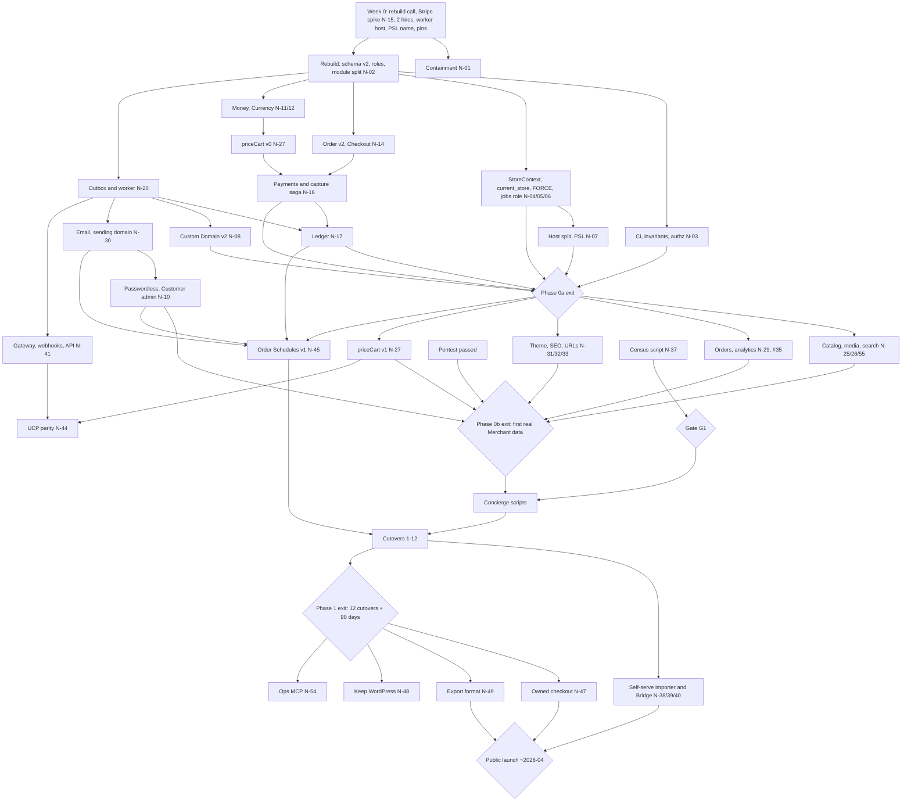

# shp0 strategy 2026–2028: the hosted way out of WooCommerce that keeps what Shopify makes you give up

*Strategy report, 2026-09-26. Ground truth is `main@21b98b1` (2026-07-05), the only branch. The verified code audit is [`docs/strategy/codebase-audit.md`](codebase-audit.md); its finding IDs (D, P, I, M, F, O, C, W) are used throughout. Vocabulary follows `CONTEXT.md`; proposed new terms are listed in §11.3.*

*ID legend: **N-xx** = proposed issue (Appendix B.4); **#nn** = GitHub issue; **A#** = competitive fact with source and date (Appendix A); **G1** = demand gate (§7.1); **K#** = kill criterion (§11.4); **R#** = risk (§11.1). Every external number carries a label and an A# row. `index.ts` means `packages/db/src/index.ts`.*

## TL;DR

shp0 cannot win on price or features today, and it cannot yet take a payment. On standard cards at Stripe's list rate it costs **$10–45 a month more** than Shopify on Shopify Payments at $5k–$30k GMV. That is roughly parity if about 20% of card volume is premium or Amex [assumption]. It costs **$115–480 more** at $50k–$150k [model on V~ rates, A5, A54; §6.4]. A forged cookie can read another Store's Customers (D1).

What it can win is one narrow flow, for which the evidence is directional [S, A21]: **WooCommerce Merchants on the standalone WooCommerce Stripe Gateway who are leaving Woo but will not give up what a move to Shopify costs them.** On Shopify they lose:

- their Stripe account and saved cards, so WooCommerce Subscriptions renewals need a card migration;
- their URL shapes and blog;
- their freedom from a gateway penalty.

That segment proves the product. It cannot fund the company alone (§5.3), so the segments that would fund it are measured from 2027.

**The answer in 10 bullets**

1. **Fix before you claim.**
   - Phase 0 takes about **32 weeks (range 24–40)** with 5 engineers (two added for Phase 0–1) and a named cut list. With 3 engineers it takes 40–73 weeks [model on the critics' estimates, §8]. The team size is a planning assumption, not a fact from the repository, so the dates and cash figures below should be re-run against real capacity.
   - Nothing is marketed until its gates pass.
   - The verified defects behind this:
     - D1: cross-Store Customer reads;
     - D2: anyone can terminate any Store;
     - D3: Custom Domain takeover;
     - M1: `db:push` disables RLS;
     - P1–P3: no Store can take payment;
     - I1: inventory goes negative;
     - I2: a pool deadlock.
2. **Reconcile the tracker and close the public window.**
   - #43–#60 are closed as "completed" but cite nine commits that do not exist. The repository is public, next to readable D1–D3 source [V].
   - Make the repository private until containment ships.
   - Reopen the issues with correction notes, and from now on close issues only through a merged PR with green CI.
3. **Beachhead.**
   - US, single-Currency Woo leavers on the standalone Stripe gateway, at $20k–$150k GMV a month.
   - The proof segment is WooCommerce Subscriptions users with at least 200 active subscribers.
   - Gate G1 is founder-led, needs no code and closes by 2026-12-07. It requires 15 conditional LOIs or refundable deposits, plus census thresholds (§7.1).
4. **The reason to switch is continuity that Shopify is paid not to offer.**
   - The same Stripe account, so `cus_`/`pm_` ids and renewals keep working [V, A33; U Stripe policy].
   - Woo-shaped URLs with no redirect (full-import mode).
   - Blog and pages carried across.
   - A tested exit.

   For a Merchant selling through WooCommerce Subscriptions, a card migration that loses more than about 0.5% of subscribers costs more than a year of shp0's premium over Shopify [model, §5.4]. Against managed Woo hosting, continuity is no edge. The pitch there is no plugins, no PCI script duties and no patching (§4.2).
5. **Pricing.**
   - 0% Commission on the Merchant's own traffic.
   - Tiers: Starter $49, Pro $129, Scale $349, with per-Order overage on captured Orders.
   - Price protection.
   - No live Free Tier at launch.
   - The card is tested before any price lock (§6).
6. **Charge model.**
   - Direct charges on a Merchant-owned Stripe account, created on Accounts v2.
   - Set `dashboard: 'full'` and `defaults.responsibilities: {fees_collector: 'stripe', losses_collector: 'stripe'}` explicitly, because v2 has no defaults for them [V-types, A58].
   - Connect existing accounts where Stripe allows it [U; a go/no-go by week 4].
   - No destination charges, no Express accounts, no custody and no merchant-of-record role.
7. **Remove the migration blockers:**
   - themes, pages and a blog import (or keep WordPress for content);
   - a consented tag allowlist;
   - an API gateway, webhooks and key integrations;
   - feeds that preserve item IDs;
   - analytics and storefront search;
   - built-in **Order Schedules**: recurring renewals, each creating an Order. This is a new term, distinct from Subscription.
8. **Agents get parity, not a headline.**
   - A per-Store UCP endpoint priced by the same engine as the web checkout.
   - Discovery is on by default; AI-agent checkout is opt-in.
   - Freeze at parity if AI-agent Orders stay under 1% of design-partner GMV.
9. **Privacy over network.**
   - Keep ADR-0003 and close #23/#24 as wontfix.
   - Open-source only the export format and CLI.
   - No self-host product for 24 months.
10. **Honest economics [model].**
    - Wedge ARPU is about $60–105.
    - Break-even needs about **1,300–3,100 paid Stores** (about 1,850 at $85 ARPU) at $110k a month of steady-state burn.
    - Cash to the Phase 1 exit (2027-11) is about $2.0–2.3M, to public launch (2028-04) about $2.7–2.9M, and to break-even (around 2030) about **$5–7M** including acquisition, or up to about $10M if ARPU stays near $60.
    - Stripe's platform revenue share is the only upside tied to GMV that is compatible with 0% Commission. It exists [V~ undated, A56]; its terms are [U].

---

## 1. Scope, method and confidence

**Question.** How should shp0 improve, extend and position itself so that Shopify and WooCommerce Merchants would build on it or migrate to it?

**Method.**
1. **A four-area code audit** (`docs/strategy/codebase-audit.md`). The areas were data and tenancy; the commerce engine; web surfaces; and identity, billing and operations.
   - An adversarial verifier re-checked every critical or high claim.
   - Most claims were reproduced with live probes on throwaway Postgres 16 clusters (2,000 Stores, 200k Products, 600k Variants), on scratch `next build` output, and against the installed `stripe@22.3.0` typings.
   - The repository was never modified.
2. **Five research streams**, each fact-checked: Shopify, WooCommerce, challengers, agentic commerce and migration economics.
3. **Seven strategy lenses**, each attacked by a market critic and a feasibility critic. All fourteen verdicts were "partial". This report adopts the strongest core, grafts in the surviving pillars, and records what was rejected (§10.2).
4. **Two editorial reviews** of the draft, whose corrections are applied here.

**Confidence labels.** Anything marked [S] or [U] stays out of customer-facing material.

| Label | Meaning |
|---|---|
| [V] | Verified against code at `21b98b1`, probes, SDK typings, vendor repositories, npm or git |
| [V~] | Primary document read via a dated mirror or capture (e.g. Shopify and Stripe pricing captured 2026-09-08) |
| [S] | Secondary sources only |
| [U] | Unverified, from memory, or UNVERIFIABLE |
| [C] | Corrected by a verifier; the corrected value is used |
| [model] | Arithmetic on labelled inputs |
| [assumption] / [inference] | A planning input chosen here, or reasoning that is not sourced |

**Limitations.**
- **Access.** The web-search budget ran out, and most vendor sites were egress-blocked. 2026 facts come from GitHub, dated mirrors and secondary compilations.
- **Market flows are directional.** The key flow figure (9,368 stores moved Woo→Shopify against 4,242 the other way in 90 days) is from a commercial third party [S, UNVERIFIABLE, A21].
- **The largest external unknowns [U]:**
  - whether Stripe lets a new platform connect *existing* accounts;
  - whether Stripe's agentic payment rails work for Connect platforms;
  - the terms of Stripe's revenue share;
  - how Shopify imports Stripe payment methods for subscriptions.
- **Probe timings** come from one local machine. Read shapes and ratios, not absolute milliseconds.
- **Team size, burn, dates and funding** (§6.6, §8, §12) are planning assumptions. The repository does not record headcount; the model assumes 3 engineers plus the founder.

---

## 2. Where shp0 stands today

### 2.1 Strengths worth building on

| Strength | Status | Caveat that must travel with it |
|---|---|---|
| DB-enforced tenant isolation: a transaction-local GUC (`packages/db/src/index.ts:73-93`), fail-closed policies, a `store_id` stamp trigger, and no tenant grants on the 9 platform tables | [V] | Defence in depth, not a guarantee. The GUC can be switched mid-transaction (D6); FKs bypass RLS (D7); RLS is not FORCEd; and the app passes unauthorised storeIds (D1). **Never** give Apps or AI agents SQL. |
| Integer minor-unit Money (ADR-0004) | [V] partial | Float maths in Discounts (I4); bigints reach TypeScript as strings |
| A Variant-centric catalog that maps to Shopify, Woo, ACP and UCP | [V] | No option axes yet |
| An oversell fence inside the payment transaction (`index.ts:1301-1357`) | [V] partial | It runs after capture (P6), duplicate lines bypass it (I1), and it deadlocks (I3) |
| Pure decision modules (Discounts, Order FSM, Usage policy, domain and Store FSMs; 82 tests) and one Trigger/Reward/Conditions Discount model | [V] | [C] Bypassed at runtime: Discounts are never applied at checkout (C4) |
| Per-Store Customers (ADR-0003); Memberships across Stores | [V] partial | Cross-Store separation is policy, not structure [C]. There are no invites. |
| A small client bundle (about 2.3 KB product chunk); a Node proxy that can route by host | [V] | Nothing is cached. Hydrogen has a Next.js template on its preview branch [V, A15], so the stack is not a differentiator. |
| `CONTEXT.md`, 5 ADRs and a labelled workflow; typecheck in about 10 s | [V] | The tracker contradicts the code (§2.4) |

**Cheap seams.**
- `tenantClient` is the single tenant path.
- The uniform `store_id` plus the stamp trigger makes import, export and purge straightforward.
- The `markOrderPaid` fence.
- The host-resolution seam.
- `processed_events` can become the outbox.
- `buildCheckoutSessionParams` can become a `PaymentProvider` interface.
- **The one missing seam** is a pure `priceCart` pipeline whose output is persisted on the Order.

### 2.2 What is broken: the top verified defects

Full table, with fixes and issue mapping: `docs/strategy/codebase-audit.md`.

| ID | Sev | Defect | Evidence |
|---|---|---|---|
| **D1** | Critical | A forged cookie renders `/dashboard/<victim>/customers` with another Store's Customer names and emails | `apps/web/app/dashboard/[storeId]/customers/page.tsx:10-11` → `index.ts:1918-1925`; `apps/web/proxy.ts:14-23` [V] |
| **D2** | Critical | The operator guard is a TODO, so any Merchant can list, suspend or terminate every Store. #52 is "closed" citing a commit that does not exist. | `apps/web/app/actions/admin.ts:17-21` [V] |
| **D3** | Critical | Custom Domain takeover: the unauthenticated verify step hard-codes `dns_ok`; hosts are first-come, and they resolve before Subdomains | `apps/web/app/actions/domains.ts:20-27`; `apps/web/lib/current-store.ts:52-60` [V] |
| **M1** | Critical | `pnpm db:push` disables RLS on 14 tables, drops 14 policies and 5 uniques, and reports `hasDataLoss=false` | `packages/db/package.json:15` [V-probe] |
| **P1/P2** | Critical | The storefront never charges. The Connect account id is discarded, and accounts are created as Express with `business_type:'company'`. | `apps/web/app/(storefront)/checkout/checkout-button.tsx:16-17`; `apps/web/lib/stripe.ts:22-42` [V] |
| **I1** | Critical | Duplicate Cart lines: 37 of 40 concurrent adds were duplicated, and stock went from 1 to −1 | `index.ts:1089-1113,1328-1348` [V-probe] |
| **I2** | Critical | About 10 concurrent add-to-cart calls hang every tenant query in the process (a nested `tenantClient`, a pool of 10, no timeouts) | `index.ts:1094-1095` [V-probe] |
| **P3** | High | Invalid Session params: a top-level `application_fee_amount` plus `transfer_data`, sent alongside the direct-charge header. An `as` cast and a test hide it. | `packages/db/src/payments.ts:102-106`; `packages/db/tests/payments.test.ts:74-79` [V-types] |
| **P4–P7** | High | A flat 250 bps would be charged while 3/2/1% is shown (latent: there is no working charge path). Orders are marked paid without checking `payment_status` or the amount. The fence runs after capture. There is no ledger. | `apps/web/app/actions/stripe.ts:50`; `apps/web/app/api/stripe/webhook/route.ts:55-95` [V] |
| **I4** | High | Float Money: 2,500¢ at 1.14% gives 28, not 29, and `formatMoney(-150)` gives `"$-2.-50"` | `packages/db/src/discounts.ts:52-55,76,101`; `packages/db/src/money.ts:72-83`; `apps/web/app/actions/discounts.ts:34,36,73,80,82` [V-probe] |
| **D10** | High | Customer auth: a 1.5 ms vs 42 ms timing oracle, synchronous scrypt, 1-character passwords, plaintext tokens | `packages/db/src/customer-auth.ts:14-31` [V-probe] |
| **I7** | High | A Store cannot be deleted, so there is no erasure and ADR-0003:39 is false | `index.ts:158,171-186` [V-probe] |
| **D6/D7** | High | The GUC can be switched inside the transaction, and FKs bypass RLS: one Store's delete cascaded into another | `index.ts:81-82,260` [V-probe] |
| **F1** | High | The RLS predicate from ADR-0001:21 defeats every index (timings in §9.2) | `index.ts:148,292-300` [V-probe] |
| **M2/M4** | High | An empty DB cannot be bootstrapped; there is no CI; 12 of 21 test files fail on a fresh DB; tests enshrine bugs | `index.ts:154-161` vs `:190-200` [V-probe] |

**What a Merchant sees [V]:**
- Multi-Variant Products cannot be bought.
- The Cart shows UUIDs.
- `/account` returns 404.
- Every page is titled "shp0".
- Prices show as "$19.9".
- Five dashboard pages are unlinked.
- Storefront inputs have no labels, and text contrast is about 2.5:1.

### 2.3 Parity gaps that block any migration

Fifteen blockers, [V] on the code side:
1. A working payment path.
2. Product and Variant **edit**, and restock. The only `UPDATE variants` is the payment decrement (`index.ts:1346`).
3. Media.
4. Option axes.
5. Shipping. Orders store no address.
6. Tax.
7. Order management. No DB function lists a Store's Orders.
8. Refunds with a ledger.
9. Email.
10. Store Currency. USD is hard-coded, contrary to ADR-0004:20.
11. Custom Domains that really verify.
12. SEO and redirects.
13. Import and export.
14. Customer accounts.
15. **Theme, branding, navigation and CMS pages.**

Blocker 15 was missing from most lens plans. Only the zero-loss-switch lens scheduled theme tokens, branding, navigation and CMS pages. The critics flagged the gap as a migration blocker for the engineering-plan and segment-wedge lenses.

**High-priority gaps:**
- Discounts applied at checkout;
- Merchant analytics and sales reports;
- storefront search;
- Customer admin with per-Customer export and erasure;
- staff invites and Merchant 2FA;
- webhooks and an API;
- digital goods;
- historical Order import. The Order schema holds no address, tax, shipping, Discount, Currency, source number or guest Customer.

### 2.4 The tracker contradicts the code

**What the tracker says.** #43–#60 were closed as "completed" on 2026-07-13/14. Between them they claim refunds, CI, the operator guard, the buy loop, multi-currency, Tier Subscriptions, agent endpoints, DNS verification, Apps and a Marketplace Account.

**What the code shows [V-GH].**
- `main@21b98b1` predates all of them.
- There are 0 PRs.
- All nine cited SHAs return "No commit found".
- ADR-0006…0012 are cited but absent.
- #50, #51 and #53 closed within the same second.
- PRD slices #6–#8, #10 and #12–#16 are also contradicted by the code.
- Pricing disagrees three ways: the code, the charge path and a phantom "ADR pricing" (P15).

**Why it matters.**
1. **Trust.** The repository is public [V, GitHub API, 2026-09-26]. A diligent prospect would find issues closed as "completed" whose cited commits do not exist, next to readable D1–D3 source.
2. **Process.** This looks like unsupervised agent output accepted as done [inference]. Agent-assisted speed must therefore be priced as a *verification* cost:
   - CODEOWNERS two-person review on RLS, authorization, payments and migrations;
   - a failing test first in every fix PR;
   - issues close only through a merged PR with green CI, enforced by an Action.
3. **ADR numbering.** New ADRs start at **0013**.
4. **Source of truth.** `main` is ground truth, so every hole the tracker calls "fixed" is still open.

---

## 3. The 2026 competitive landscape

### 3.1 Shopify: the default destination, and paid to keep Merchants

**What matters.**
- **Scale.** Q1-26 GMV was $100.7B (+35%) and revenue $3.17B, with 76% of revenue from merchant solutions [V~, A1]. Payments penetration is 67% [V~, A1]. Shop Pay handled $35B (+59%), and Plus is 35% of MRR [V~, A2].
- **Take rate.** Shopify earns about 3.1% of GMV [S, A3], so its third-party-gateway fee is **structural**: 2 / 1 / 0.6 / 0.2% by plan, and no fees are returned on refunds [V~, A6].

**Moats not to fight [S unless marked]:**
- Shop Pay and Sign in with Shop, with 150–250M+ users [S, A4];
- default AI distribution:
  - Agentic Storefronts on by default for about 5.6M stores since 2026-03-24 [S, A12];
  - a Catalog of 1B+ products [V~, A2];
  - UCP identity linking on about 7,355 stores through Shop accounts [S, A13];
- 13–18k apps [S, A4];
- POS, B2B (moved below Plus in Spring '26 [S, A17]) and Capital;
- about $1.5B of R&D, shipping 150–237 changes per Edition [S, A4].

**Pains:**
- **The third-party-gateway penalty** [V~, A6].
- **The Plus cliff.** Plus starts at $2,300 a month [V~, A5] on 1–3-year terms [S, A7]. Custom-app Functions [S], checkout UI extensions on the information, shipping and payment steps [V~], and expansion stores [S] all need Plus (A18).
- **Forced 2026 migrations:**
  - Scripts stopped on 06-30, after migrations of 8–14 weeks [S, A16];
  - non-Plus Thank-you and Order-status pages were auto-upgraded on 08-26, deleting Additional Scripts and pixels [S, A16];
  - legacy customer accounts were deprecated [V~/S, A16].
- **Payout holds** and AI-first support [S].
- **Rigid URLs:** fixed `/products/` and `/collections/` prefixes [S, A18].
- **One shipping address per checkout** [V, A18].
- **Lock-in on the way out:**
  - payment methods can be imported but never exported [S, A9];
  - analytics cannot be exported [S].

  Order history is *not* locked: a merchant can export it as CSV or bulk data, or through a custom app they create. What is gated is third-party importers, which need Shopify's approval to read more than 60 days of orders [V~, A8].

**Parity point.** For a Merchant on Shopify Payments, cost is the plan plus about 2.5–2.9% + 30¢ on standard cards and 3.1–3.5% + 30¢ on premium and Amex cards [V~, A5]. **Above about $25–50k GMV a month, processing decides, not the platform fee** (§6.4).

### 3.2 WooCommerce: a real outflow, a weak migrator, fast-moving plumbing

**What matters.**
- About 4.15M live stores, down 8% a year [S, directional, A22].
- In 90 days, 9,368 stores moved Woo→Shopify against 4,242 the other way [S, UNVERIFIABLE, A21].
- Merchants choose Woo for ownership, no platform fee, gateway choice, and WordPress content and SEO [S].
- **They leave over:**
  - maintenance: 58 plugins on average, 66 at $1M+ [S, A23];
  - updates that break checkout [V/S];
  - plugin security: 91% of 11,334 vulnerabilities, and a median of 5 hours to first exploit [S, A24];
  - PCI DSS 4.0 script duties [S];
  - performance: 31% pass Core Web Vitals, against 52% on Shopify [S, UNVERIFIABLE, A25].
- **Where they go:**
  - mostly Shopify [S];
  - managed Woo hosting, from about $25–50 a month [S, A26];
  - WordPress.com Commerce at $45/$70 [S low, A26];
  - "keep WordPress, replace Woo" products (SureCart, FluentCart) [S, A38].

**Releases [V].**
- `wp wc migrate` moves **products only** [A27].
- 11.2-beta.1 removes the experimental abandoned-cart recovery and the off-by-default Agentic Checkout API, and moves the GraphQL API to a separate plugin [A28].
- The PHP 8.1 floor for WC 11.6 is an **undated draft** PR [A29].

**Agentic reality [V].**
- Woo's in-agent path is the Stripe gateway's Agentic Commerce module. It rejects discounted sessions, and 10.9.0 added a **redirect-to-store** mode [A30].
- The Store API already returns 409 when the total does not match [A31].
- So the agent gap is **one plugin release, not architecture**.

**Payments [V].**
- WooPayments accounts are connected accounts run by the WooPayments service, so leaving needs a card migration [A32].
- The **standalone** Stripe gateway stores `_stripe_customer_id` and `_stripe_source_id` on users, orders and subscriptions [A33]. Renewals therefore point at `cus_`/`pm_` objects **in the Merchant's own Stripe account**. This is the technical root of the thesis.

### 3.3 Challengers: what the evidence says

- **"No fees, more built in" does not win by itself.**
  - Commerce.com (BigCommerce) grew FY25 revenue 2.8%, with NRR at 95.2% [V~, A39].
  - BigCommerce for WordPress ("WordPress on the front-end and BigCommerce on the back end") did not reverse the Woo→Shopify flow, and it is tested only up to WordPress 6.7 [V, A40].
- **Headless and open source win developers, not SMB GMV.** Medusa went open-core on 2026-08-11 [V, A41]. A headless replatform costs $50–500k+ [S low, A42].
- **AI store building is table stakes.**
  - Shopify's Vibe Partner template and Claude connector are live [V, A14]; the Claude app can reportedly create or claim a store [S, A14].
  - AI-built stores carry their own risks (CVE-2025-48757 [V, A44]).
- **A GMV-based platform fee needs demand or liability behind it.** Gumroad Discover charges 30% [V, A43].
- **No challenger has shown it can win a Shopify cohort.** The flows with evidence are Woo→Shopify [S, UNVERIFIABLE, directional, A21] and enterprise→Shopify [V~, A45].

### 3.4 Agentic commerce, 2026-09-26

- **UCP is the protocol to implement first** [V, A46].
  - Apache-2.0; discovery at `/.well-known/ucp`; REST, MCP and embedded transports; RFC 9421 signatures.
  - v2026-08-25 was a breaking release, and the next is expected Dec-26 or Jan-27 [S].
  - Every Shopify store serves UCP [V, A11]. Across 14 platforms, about 17.8k stores are verified by UCP Checker [S, A47].
  - `@ucp-js/sdk` makes a per-Store endpoint cheap.
  - Google holds proxies for the open governance seats until Dec-2028. **shp0 can implement UCP but cannot steer it.**
- **ACP is slowing.** It has had no commits since 07-17, and Meta is now lead maintainer [V, A48].
- **In-chat checkout as a product failed** [S], but in-channel checkout lives on in AI Mode, Gemini and Copilot [C].
- **Agent verification is becoming a CDN commodity.** Cloudflare blocks "Agent" and "Training" bots by default on ad-supported pages for new domains, customers and Free zones, and offers Web Bot Auth on Free and Pro [S, A49].
- **Anthropic's blueprint stages Merchant writes for approval** [V, A50]. The Claude connector directory has no Woo, BigCommerce or Medusa entry [V, A51].
- **Demand is real but small.** AI-referred traffic converted 42–54% better in March–May 2026 [S, A52], but Shopify calls AI orders "still small" [S, A3].

### 3.5 What is already table stakes in 2026

> **Table stakes** (needed to be considered, never a reason to switch):
> - hosted, isolated Stores with PCI handled and no plugin maintenance;
> - passwordless Customer sign-in;
> - clean 301s and SEO primitives;
> - a UCP endpoint plus Google and Meta feeds;
> - wallets and Link;
> - checkout recovery, back-in-stock and native A/B tests;
> - B2B basics below Plus;
> - an AI builder and assistant;
> - a Next.js-class storefront.
>
> **Still open:**
> - keeping the Merchant's own payments account, cards and renewals *with no gateway penalty* **and** no plugin maintenance;
> - serving a migrating Store's **exact** URL shapes;
> - carrying WordPress content across, or coexisting with it;
> - a reconciled, reversible switch;
> - a tested exit that includes the payments account;
> - all-in pricing with no platform fee proportional to GMV.

---

## 4. Why Merchants switch, and why they don't

### 4.1 Lessons

1. **Merchants switch destinations, not features.**
   - A Woo Merchant who has decided to leave compares shp0 with **Shopify on Shopify Payments**. That means hosted, no plugins, no third-party fee [V~, A6], plus Shop Pay, themes, apps and AI distribution.
   - A Woo Merchant who wants to stop *maintaining* compares shp0 with **managed Woo hosting**.
   - Against Shopify, shp0 at Stripe list (2.9% + 30¢ [V~, A54]) comes within $10–25 a month at $5k–$25k GMV and falls further behind above that (§6.4).
   - So the reason to switch must be something Shopify **charges for or takes away**, or something managed Woo **cannot remove**.
2. **"Cheaper" and "more built in" are not enough.** BigCommerce has run that play for years [S] and grew 2.8% in FY25 [V~, A39]. The Tier is about 2–7% of a Merchant's bill at $20k+ GMV; processing is 93–98% [model].
3. **Checkout conversion outweighs platform savings.**
   - At $50k GMV a month and 50% margin, a 1% relative conversion drop costs about $250 a month of gross profit [model]. That exceeds the whole saving against DIY Woo.
   - Payment-method coverage (PayPal, BNPL, Shop Pay [U terms]) is part of this.
4. **Loss aversion delays moves; it does not create them.** Fear of migration loss is not on the ranked list of reasons to leave Woo [S].
5. **Distribution sits with incumbents.**
   - WordPress.org can delist a plugin at its discretion (guideline 18 [V, A37]).
   - Shopify's API License requires partners to sync order data back when data taken off Shopify facilitates an order [V~, 2023 mirror, A10].
   - Agencies earn more from Shopify projects than from a $6-a-month revenue share [model].

### 4.2 Switching-cost anatomy (Woo → destination)

| Cost of moving | To Shopify | To managed Woo hosting | To shp0 (target) | Edge |
|---|---|---|---|---|
| Customer passwords | Passwordless codes [V~/S, A16] | Kept | Passwordless, per Store | Managed Woo; shp0 = Shopify |
| Saved cards and renewals | Card migration to Shopify Payments: timing and loss rate [U]; Stripe's own PAN import takes about 10 business days [V~, A59]; adds 3–4 weeks and risks failed renewals [S, A9]. Or keep Stripe and pay 0.6–2% by plan [V~, A6]. | Kept | **Same Stripe account**; renewals continue with no Customer action [V, A33; U Stripe policy] | **shp0 vs Shopify, structural** (standalone-Stripe only); a tie with managed Woo |
| URLs | Fixed prefixes plus 301s; a 2–4-week dip [S, A62] | Kept | Woo shapes served with no hop in full-import mode; cross-host 301s in keep-WordPress mode (§5.5) | Managed Woo, then shp0 |
| Blog and pages | Re-created, and the URLs change [inference] | Kept | Imported with slugs preserved, or WordPress keeps the apex | Managed Woo, then shp0 |
| Theme and apps | Rebuilt in a large ecosystem | Kept | First-party themes; fewer integrations | Shopify and managed Woo |
| Plugin maintenance, PCI script duties, plugin CVEs | Removed | **Remain.** Hosts sell update testing [U, A66]. | Removed | **shp0 and Shopify vs managed Woo** |
| Payment-method mix; AI distribution | Shop Pay, PayPal; default-on channels | Unchanged | Link, wallets, BNPL; own UCP endpoint | Shopify |
| Leaving again | Payment methods never leave [S, A9]; analytics cannot be exported [S] | Portable (self-hosted software) | Tested export; the Stripe account leaves with the Merchant | shp0 and managed Woo |
| Platform cost a month | Plan (§6.4) | About $25–50 of hosting [S, A26], plus plugins | Tier (§6.2) | Managed Woo |

**Implication.** shp0 wins in two places:
- **against Shopify**, where continuity outweighs the ecosystem;
- **against managed Woo**, where escaping plugins, PCI script duties and patching outweighs staying on WordPress.

Against managed Woo, continuity is **not** an edge, so the sales answer to "why not just move hosts?" is "because the plugins, the CVEs and the checkout breakage stay with you" [S, A23–A24]. The Merchants who want both, and who do not depend on Shop Pay or a long tail of apps, are the target. **The size of that intersection is unmeasured [U], and measuring it is the plan's first gate.**

---

## 5. The differentiation thesis

### 5.1 How the thesis was chosen

All fourteen critiques rated their lens **partial**. What survives from each (§10.2 lists what was killed and why):

| Lens | What survives into this plan |
|---|---|
| Engineering plan | Almost all of Phase 0 (§8), the architecture moves in §9, and its ADR discipline |
| Zero-loss switch | Woo-first sequencing; Order schema v2; `route_style` plus redirects; same-account Stripe; the Switch Report; passwordless claim; an honest fit check |
| Ownership economics | The charge model; 0% Commission; open export; honest pricing |
| Trust/performance/essentials | The RLS fix; host routing and caching; URL continuity; fail-closed Custom Domains; narrow essentials |
| Agent-native | One `priceCart` for every channel; UCP parity; `agent_visible`; Order provenance |
| Builder platform | A principal-scoped API gateway and webhooks; publishable and secret keys; configurable URLs; first-party sections |
| Segment wedge | "One Store per market" under ADR-0004; Portfolio billing as a Phase 3 option |

**The synthesis.** The engineering programme is the prerequisite, and zero-loss switching removes objections. The **reason to switch** is the one thing every market critic found both valuable and structurally hard for Shopify to copy: **continuity of the Merchant's own payments account, renewals, URLs, content and data, with no penalty and no plugins.**

### 5.2 Positioning statement

> **For WooCommerce Merchants on the WooCommerce Stripe Gateway who are done maintaining plugins but won't give up what they built, shp0 is the hosted store you can move to without losing your Stripe account, your saved cards and renewing Customers, your URLs, your content or your data. No penalty for using your own Stripe account, no plugins, and a tested way out.**

The line is qualified to the Stripe Gateway so that it does not attract WooPayments Merchants, who fail the fit check. It says "no penalty for using your own Stripe account" rather than "0% Commission" because Shopify Payments also charges no transaction fee, so "0%" reads as parity to a Shopify Merchant.

**Claims ledger.** Each clause may be used only once its row is met:

| Claim | Prerequisite | Earliest | Evidence required |
|---|---|---|---|
| "Captured only after stock is confirmed" | N-16 manual-capture saga | Phase 0a exit (~2027-03) | 40-way concurrency gate (§8.1) |
| "No plugins"; "no penalty for your own Stripe account" | 0b floor; N-18 0-bps snapshot | Phase 0b exit (~2027-05) | Live Staff-paid Order on a Custom Domain |
| "Keep your Stripe account" | N-15 written Stripe answer (K2b); N-16 | First concierge Switch (~2027-05) | Same `acct_` before and after, reconciled |
| "Your renewals keep charging, with no Customer action" | N-45 Order Schedules v1 | First Cohort 2 cutover (~2027-06) | Two renewal cycles at ≥98% of the source baseline |
| "Your URLs, with no redirects" | N-33 in **full-import mode** only | Phase 0b exit | 404 watch; organic clicks at week 8 |
| "Your content" | N-39 import (Phase 1); N-48 keep-WordPress mode (Phase 2) | ~2027-06 / ~2028-Q1 | Reconciled page and post counts |
| "A tested way out" | N-49 Export Format with round-trip tests | Phase 2 (~2028-Q1) | Published round-trip test run |

**Proof points,** used on the pricing page only after the Phase 0b exit:
- one pricing engine for web, API and AI-agent checkouts;
- card payments captured only after stock is confirmed;
- Stores sealed by principal-bound access plus database policies;
- a public status page;
- at least 5 published before-and-after case studies from the concierge Switches (§7.5).

**Never say:**
- "cheaper than Shopify";
- "AI-native";
- "provably secure", until an external pentest and six months without an incident;
- "zero-loss" without its scope: Orders, balances and Customers reconciled; rankings not guaranteed.

### 5.3 Beachhead segment

**Primary: Woo leavers on the standalone WooCommerce Stripe Gateway.**
- **Profile:**
  - US, USD, single Currency;
  - $20k–$150k GMV a month (about 270–2,000 Orders at $75 AOV);
  - up to about 5k Variants;
  - physical goods;
  - no POS, B2B catalogues or marketplace plugins.
- **Proof sub-segment (recruited first after the rehearsal cohort):** WooCommerce Subscriptions users with at least about 200 active subscribers [assumption on the threshold].

**Why this cut.**
- **For WooCommerce Subscriptions users,** continuity is hard value. Renewals keep charging the same `pm_` ids [V, A33; U Stripe policy], while Shopify forces either re-vaulting or a 0.6–2% penalty below Plus [V~, A6].
- **For standalone-Stripe Merchants without subscriptions,** Shopify Payments carries no penalty and re-vaulting barely matters. What they would lose on Shopify is their URL shapes, their content and their Stripe history (rates, risk record). That loss is real but smaller.
- **US-first** avoids iDEAL and SEPA, which cannot be captured manually [V-types, A58], along with the EAA, EU withdrawal rules and VAT in year one. US bank account (ACH) also lacks manual capture [V-types, A58], so it is not offered in v1.

**Size: unknown [U], and probably small.** The funnel below is a [model] on an S/UNVERIFIABLE input plus four assumptions:

| Step | Low | High | Label |
|---|---|---|---|
| Woo→Shopify movers a year (9,368 per 90 days) | 37,500 | 37,500 | [S, UNVERIFIABLE, A21] |
| × in the $20k–$150k band (5–12%) | 1,875 | 4,500 | [assumption] |
| × pass the fit check (≈56%) | 1,050 | 2,520 | [assumption] |
| × on the standalone Stripe gateway (20–40%) | 210 | 1,000 | [assumption; desk-check in week 1] |
| × using WooCommerce Subscriptions (10–25%) | 20 | 250 | [assumption] |

These counts are before any US-only cut. The critic's earlier 2,100–4,200 figure was for a wider $5k–$250k band.

**Who fills break-even, and when.** The milestones need 400–600 paying Stores by the end of 2028 and about 1,850 at break-even (§6.6). If shp0 captures 10–25% of the standalone-Stripe pool, it gains about 20–250 Stores a year. The other ~350–1,600+ must come from segments that are unvalidated today:

| Segment | When it is tested | Pool | What must be true |
|---|---|---|---|
| Beachhead (above) | 2027 | 210–1,000 exits a year [model] | 10–25% capture |
| In-band Woo Merchants **not yet leaving**, pitched against managed Woo | 2028-H1 | A slice of about 4.15M live Woo stores [S, A22]; the in-band share is unmeasured | "No plugins" beats "cheaper hosting" (§4.2) |
| Shopify third-party-gateway payers | Demand test and legal read in Phase 1 (N-53, 2027-H2); importer in 2028 | [U] | They save about $475–2,900 a month (§5.4) |
| WooPayments leavers without subscriptions (who re-enter cards once) | 2028 | [U] | Card re-entry is acceptable without renewals [assumption] |
| Multi-Store operators | 2028-H2, behind a gate (§8.5) | [U] | A sister-Store rate of 25% or more |

**So:** do a week-1 desk estimate of the standalone-Stripe versus WooPayments share (WordPress.org active installs, StoreLeads, BuiltWith). Add census thresholds to G1 (§7.1). Move the cheap Shopify demand test into Phase 1.

**Secondary segments are measured, not assumed:**
- Content-heavy Woo Merchants, served through "keep WordPress for content".
- Shopify Merchants on a third-party gateway (box in §5.4).

**Declined by the published fit check:**
- Shopify-Payments Merchants with no continuity need;
- POS, enterprise and cross-border merchant-of-record Merchants;
- multi-currency Stores;
- Stripe-restricted categories;
- WooPayments Merchants with subscriptions, until a PAN runbook exists;
- PayPal-billed subscriptions (marked "re-collect"), and Stores with more than about 5% of volume on PayPal during the beta;
- Stores that depend on digital downloads or WooCommerce Memberships (v1 is physical goods);
- Woo stores heavy on page-builder or LMS plugins, until the content path is proven.

### 5.4 Why switch, quantified

All figures are monthly USD at $75 AOV unless stated. The full cost table and its sensitivities are in §6.4 [model on V~ A5, A6, A54 and S/U Woo inputs].

**For the beachhead Woo Merchant** (numbers from §6.4):
- **Against DIY Woo:** $21–161 a month cheaper at $5k–$500k before tax, and it removes 5–30 developer-hours a month of patching if a $500–3,000 retainer goes [S, A26; the hours are an assumption]. Multi-state automated tax (Stripe Tax at 0.5%, $45–250 a month at $30k–$50k) can erase that saving, so single-nexus Stores default to free manual rates.
- **Against Shopify on Shopify Payments:** $10–45 a month dearer at $5k–$30k, $115–125 at $50k, $450–480 at $150k on standard cards. At a 20% premium and Amex mix [assumption], it is at parity up to $30k. Say so.
- **Against managed Woo:** hosting is cheaper and keeps everything; shp0's case is removing plugins, CVEs and PCI script duties (§4.2).

**The WooCommerce Subscriptions Merchant: why the premium pays [model on stated assumptions]**

Take a $50k-GMV Store with 600 active subscribers at $45 a month, i.e. $27k of recurring revenue [assumption]. On Shopify it has two options:

| Option | Monthly cost vs shp0 | What it risks |
|---|---|---|
| Keep Stripe on Shopify Grow | About **$475 more** (the 1% gateway fee) | Nothing on renewals |
| Move to Shopify Payments, plus Shopify's subscriptions app (reportedly free [U, A61]; Recharge from $99 [S, A60]) | About **$115–125 less** than shp0 (standard cards), i.e. $1.4–1.5k a year | Cards must move through `customerPaymentMethodRemoteCreate` or a PAN migration [S, A9]; mechanics, timeline and loss rate are [U] |

- If the card move involuntarily loses 3–10% of subscribers [assumption, to be measured], the Merchant loses $810–2,700 of monthly recurring revenue, or $9.7–32k a year.
- **Break-even is an involuntary loss of about 0.5% of subscribers** (0.2% at a 20% premium-card mix).

**So:**
- The Switch Report computes this per Merchant from real subscriber counts, card-brand mix and effective Stripe rate.
- Week-0 research verifies Shopify's import mechanics and the app's price.
- Kill trigger K8 fires if Shopify moves subscriptions with no Customer action in under 14 days.

**SEO continuity.** In full-import mode, Woo URLs return 200 with no hop, and blog and pages come across. Coverage is guaranteed; rankings are not.

> **For a Shopify Merchant: the honest box [model; rates V~ A5, A6, A54]**
>
> Example: $80k GMV a month, 1,067 Orders.
> - **On Shopify Payments:** shp0 costs **$180–210 a month more** on standard cards, or $84–114 more at a 20% premium and Amex mix. Parity needs the Merchant's own Stripe rate at or below about 2.67% + 30¢. The Merchant would also give up Shop Pay, apps and themes.
> - **On a third-party gateway** (paying Shopify's 0.6–2% fee): shp0 saves about **$650–680 a month**.
>
> Across the cost table (§6.4), gateway-fee payers save about $475 a month at $50k, $1,020–1,050 at $150k and $2,910–2,980 at $500k. Those who also keep Shop Pay avoid the 1.25% premium on its transactions [V~, A6].
>
> **Verdict:** there is no pitch for Shopify-Payments Merchants before 2028. Gateway-fee payers get a demand test in Phase 1 (N-53); an importer follows only after legal review of the API License [V~, A10].
>
> **What would change this:**
> - Merchants with negotiated card rates;
> - checkout extensibility below the Plus cliff, which is rejected for now (§10.2) and would revive with 10 or more paid agency LOIs.

**Calculator caveats.**
- International cards cost +1.5% on Stripe against +1% on Shopify [V~, A5, A54].
- Stripe's capture lists no premium or Amex surcharge on domestic cards [V~, A54; confirm in the Stripe spike], which may favour Amex- or commercial-card-heavy Stores.
- Losing Shop Pay has a conversion cost [U].
- Low-AOV Stores that sell through WooCommerce Subscriptions pay more overage (§6.4).

### 5.5 The six pillars

Effort assumes engineers working with AI agents: S ≤ 1 week, M 2–4 weeks, L 1–3 months, XL > 3 months. Issue scopes are in Appendix B.4.

#### Pillar 1: The keep-everything switch from WooCommerce (L core + M content)

**What it is:**
- **Switch Report.** A no-code census for G1. The Bridge plugin follows in Phase 1, after an external security audit.
- **Woo importer** (Bridge export plus the REST API). It carries:
  - Products with variations mapped to option axes, and media;
  - categories as Collections;
  - Customers, claimed passwordlessly;
  - guest and historical Orders, with snapshots and continued numbering;
  - coupons mapped to Trigger/Reward/Conditions, with gap verdicts;
  - reviews, and Yoast or Rank Math SEO fields.
- **`route_style=woo`:** `/product/<slug>/`, `/product-category/<path>/` and the trailing slash, plus a redirects table.
- **Reconciliation** in four classes (§7.2).
- **Cutover:** a pre-verified domain, a 5–15-minute freeze, and a one-shot rollback within 30 days.

**Edge.**
- Woo's migrator moves products only [V, A27].
- Shopify's importer brings orders [S] but cannot keep Woo URL shapes, because its prefixes are fixed [S, A18].
- Import fidelity itself is table stakes. What is defensible is URL-shape preservation [inference] and the combination with Pillars 2 and 4.

**Issues:** #36 epic; N-37–N-40. Guests become credential-less Customers. The Bridge exports the Customer role only, makes each transfer opt-in (guideline 7 [V, A37]), and ships as a signed direct download first.

#### Pillar 2: Your Stripe account, your cards, your renewals (L payments + L Order Schedules)

**What it is:**
- **Direct charges on a Merchant-owned account,** created on Accounts v2 with `dashboard: 'full'` and `defaults.responsibilities: {fees_collector: 'stripe', losses_collector: 'stripe'}` set explicitly. These were `controller` defaults on v1 (`Accounts.d.ts:2504-2531`), but v2 has no defaults and the responsibilities are required (`V2/Core/Accounts.d.ts:3451,4360-4372`) [V-types, A58]. Stripe points new platforms to v2 [V~ undated, A56].
- **Existing accounts.** Standalone-Stripe Woo Merchants connect the account they already have, keeping `cus_`/`pm_` ids, rates and risk history. OAuth is in the SDK [V]. Whether Stripe allows it for a new platform is [U], and a go/no-go (N-15).
- **0% Commission**, so there is no application fee.
- **Manual capture** where the method supports it [V-types, A58].
- **A webhook-built ledger** covering shp0-created **and imported** charges (§9.6).
- **Order Schedules,** built in-house (§5.6):
  - WooCommerce Subscriptions imported with zero Customer action;
  - off-session PaymentIntents on the saved `pm_` (or legacy `card_`/`src_`) with manual capture, so a renewal short on stock is voided;
  - a Customer portal, dunning, reminders and online cancellation;
  - v1 scoped to the features the LOI Merchants actually use (census, §7.1).
- **A money-ownership protocol at cutover** (§7.3).

**Edge.** **Structural against Shopify.**
- Shopify offers Shopify Payments, or a 0.6–2% penalty below Plus plus 1.25% on mixed gateways [V~, A6].
- Its subscriptions bill only Shopify-vaulted methods, and payment methods never leave [S, A9].
- Merchant solutions are 77.6% of its revenue [S, A3]; K8 covers a change of course.
- WooPayments accounts are bound to that platform [V, A32].
- For standalone-Stripe Woo this is parity, but it comes with maintenance.

**Issues:** N-15–N-17, N-45; ADRs 0015, 0016 and 0028. Code changes:
- delete the Express, `business_type` and `transfer_data` code (`apps/web/lib/stripe.ts:29-30`; `packages/db/src/payments.ts:102-106`);
- return 200 for events shp0 neither created nor imported (today `apps/web/app/api/stripe/webhook/route.ts:58-63` returns 400);
- add an `authorized` status (`packages/db/src/order.ts:15`).

#### Pillar 3: Your brand, content and marketing stack keep working (XL, across Phases 0b–2)

**What it is:**
- **First-party sectioned themes** with brand tokens, navigation, pages and policies, meeting WCAG 2.2 AA. One theme ships at the 0b exit and a second in Phase 1. There is no page builder.
- **Blog and pages imported** with slugs preserved (full-import mode).
- **"Keep WordPress for content"** (Phase 2):
  - **Default:** shp0 serves `shop.brand.com` while WordPress keeps the apex. Product and category URLs **change host** with cross-host 301s, so "no redirects" does not hold in this mode.
  - **Option:** a same-host origin fallback. shp0 serves commerce paths on the apex and proxies the rest to WordPress. It keeps every URL, but it needs an ADR-0005 amendment (§11.3) and weakens the SAQ A script-integrity position [U]. The Owner decides on Switch Report evidence (§11.2).
- **A consent manager and an allowlisted tag layer:** GA4, Meta, TikTok, Klaviyo forms and one chat widget. Server-side conversions go through the outbox.
- **Integrations:** an API gateway, signed webhooks, a read API with App keys, and label and email-marketing connectors (Phase 1).
- **Feeds:** Merchant Center and Meta feeds that preserve item IDs.
- **Analytics v1 and storefront search** at the 0b exit.
- **Narrow essentials:** transactional email, checkout recovery, reviews with import, back-in-stock.

**Edge.** Mostly **parity that unblocks migration** (blocker 15).
- Against Woo, content and marketing come without the plugin treadmill.
- Against Shopify, a moved blog changes its URLs, and non-Plus Merchants who relied on Additional Scripts just lost pixels [S, A16].
- BigCommerce for WordPress shows that WordPress coexistence is a feature, not a pitch [V, A40].

**Issues:** N-31–N-33, N-36, N-39, N-41–N-43, N-48, N-55, #35. Imported HTML is sanitised on import and render, and the PSL domain lands before the importer, because it is stored XSS while Stores are same-site.

#### Pillar 4: Leave any time with everything (M)

**What it is:**
- **A published shp0 Export Format:** NDJSON, JSON Schema and a signed manifest, under Apache-2.0, with a CLI. It is round-trip tested and includes Woo CSV/WXR export.
- **The Stripe account leaves with the Merchant.** Otherwise there is a PAN export to a PCI Level 1 processor [V~, A59].
- **A Store closure saga** with Merchant-elected retention and atomic ownership transfer (fixes I7).

**Edge.**
- Shopify never exports payment methods or analytics [S, A9]; Woo's native export is weak [S].
- For Shopify this is hard to copy, because lock-in is part of its model.
- The pull at signup is low, but it works as risk reversal ("what if you disappear?").

**Issues:** N-22, N-49; ADR-0025. Change tracking comes first: today the stock decrement never touches `updated_at` (`index.ts:1344-1347`), and Products are hard-deleted (`index.ts:898`) [V]. No credentials are ever exported.

#### Pillar 5: Correct, sealed and stable by construction (proof points; L, mostly Phase 0)

**What it is:**
- principal-bound tenancy, FORCE RLS, composite FKs, a CI invariant and generated isolation tests;
- one `priceCart`, persisted on every Order;
- the manual-capture fence and ledger reconciliation;
- **Canary Stores** that place live $1 Orders on every deploy;
- **Store Health** showing outcomes, not internal invariants;
- a scoped **Stability Contract** v0, with carve-outs for Stripe, card networks, UCP and ACP, security and law.

**Edge.**
- Structural against Woo: plugins run with full database privileges [S], and updates break checkout [V/S].
- Parity against Shopify, plus no forced rewrites in a year full of them [S, A16].
- It supports the pitch; it never leads it.

**Issues:** Phase 0 (§8) and §9.

#### Pillar 6: Agent-ready on the Merchant's terms (M in Phase 1 + M in Phase 2)

**What it is:**
- **A per-Store UCP endpoint:** `/.well-known/ucp`, catalog, cart, checkout by `continue_url` handoff, and order. It is built on `@ucp-js/sdk` [V, A46], **priced by `priceCart`**, and sits behind the gateway.
- JSON-LD, a sitemap, and a Merchant feed with `FREE_LISTINGS_UCP_CHECKOUT` [V, A53].
- **Discovery on by default**, with `agent_visible` independent of `seo_indexable`. **AI-agent checkout is opt-in.**
- `order_origin` plus a provenance row on each Order.
- **Abuse controls from day one:** trust tiers; per-IP, per-ASN and per-key budgets; Radar; no inventory holds; unknown agents get handoff only.
- **Phase 2+:**
  - RFC 9421 / Web Bot Auth verification;
  - native in-agent payment, only after Stripe confirms support for Connect [U];
  - a Merchant operations MCP with Role-approved, staged **Change Sets**.

**Edge.**
- Parity with Shopify [V, A11], and a small edge over Woo that one plugin release could close [V, A30].
- Merchant control answers complaints about default-on channels [S], and there are no agent-channel fees [S].
- Only Merchant-owned, exportable provenance is structural.

**Issues:** N-41, N-44, N-51, N-54; ADR-0023. **No SQL for agents, ever** (D6).

### 5.6 The hard calls, and what would change them

| Decision | Call | Reasoning | What would change my mind |
|---|---|---|---|
| **Beachhead** | US Woo leavers on the standalone Stripe gateway, $20k–$150k GMV; WooCommerce Subscriptions users with ≥200 subscribers as the proof segment | The only segment where continuity is hard value **and** Shopify cannot match it | G1 fails (§7.1): test Shopify gateway-fee payers, then multi-Store operators |
| **Pricing and Commission** | 0% Commission on own traffic; $49 / $129 / $349; overage per captured Order; price protection; no live Free Tier at launch | Any Commission of 1% or more loses at every band [model]. The Tier is 2–7% of the bill, so underpricing buys no deals and halves survival. | A $29-shaped card converts materially better in the validation test (for example 2× the LOI rate) |
| **Charge type and liability** | Direct charges; Accounts v2 `full`; Stripe collects fees and carries losses (set explicitly); connect existing accounts where allowed | "Stripe doesn't charge your platform in this model"; Stripe-liable is "the best default choice" [V~ undated, A56]. Platform pricing would cost about $124 a month at $50k [S/U, A57]. | No written Stripe terms: K2 fallback. Existing-account connect refused: K2b. |
| **Order Schedules** | Build in-house, scoped to LOI Merchants' features, starting at the 0a exit | It is the only structurally hard edge. Stripe Billing would add 0.7% [V~ listing, A55], which is more than the Tier on $27k of recurring revenue. No partner app exists for shp0. | The census shows most LOI Merchants need features beyond v1, or 8–12 engineer-weeks slips past 0b + 6 weeks |
| **Agents versus parity** | Parity first; no agent headline | Every Shopify store serves UCP [V, A11]; AI orders are "still small" [S, A3]; Woo's gap is one release [V, A30] | AI-agent Orders above 5% of design-partner GMV fund Phase 2 agent work earlier. Below 1% at the Phase 2 exit, freeze. |
| **Privacy versus marketplace** | Keep ADR-0003; #23/#24 wontfix | Email auto-linking is an account-takeover risk [V spec]; identity linking is consolidating on Shop [S, A13] | Over 30% of Merchants opt into a shp0 discovery surface with incremental Orders, **and** Customers ask for a cross-Store account |
| **Open source and self-host** | Apache-2.0 export format and CLI only | The wedge is *leaving* self-hosting | 30% or more of lost deals cite self-host or survival risk |

---

## 6. Pricing and business model

### 6.1 Principles

1. **shp0 is never the switching penalty.**
   - The coded flat 2.5% makes shp0 dearer than the comparable Shopify plan and Woo at every GMV band. It is cheaper only than plans mis-sized for the band, such as Advanced at $5k [model on V~ and S/U inputs].
   - The 3/2/1% the dashboard displays copies Shopify's most-resented fee (P4, P15).
   - **Commission is 0% on every Order from the Merchant's own traffic**, whether it arrives through the storefront, the API or an AI-agent channel.
2. **Price on value, not against Shopify's plan price.**
   - The Tier is about 2–7% of the bill at $20k+ GMV [model].
   - The critics' $29-shaped cards put wedge ARPU at about $25–40 and break-even at 3,100–8,100 paid Stores [model].
3. **Bill only what can be proven.** The calculator shows the Tier, Usage, processing at the Merchant's own rate and card mix, tax, and the apps replaced. The one guarantee shp0 offers covers **its own charges only**.
4. **Usage cannot be inflated by strangers.** Today Usage counts every Order, including pending ones (`index.ts:2046-2047`) [V]. Checkout creates an Order before payment, so scripts or AI agents could push a Store into overage. **Usage counts captured Orders, net of full refunds.**

### 6.2 Tier proposal

This is a hypothesis to test in the validation phase. There is no price lock until after the beta.

| Tier | Monthly (annual) | Commission | Included captured Orders | Overage | Seats | Service |
|---|---|---|---|---|---|---|
| **Starter** | **$49** ($39) | 0% | 300 | $0.15 | 3 | Async support; all essentials; Custom Domains; Order Schedules; full export; self-serve Switch |
| **Pro** | **$129** ($99) | 0% | 1,500 | $0.10 | 10 | Business-hours human support; "keep WordPress" mode |
| **Scale** | **$349** ($279) | 0% | 6,000 | $0.06 | Unlimited | Priority support; concierge Switch included on an annual Subscription; continuous export; Preview Stores; higher API limits |
| Custom | Above about $1M GMV a month | 0% | — | — | — | Only after two quarters of measured SLOs |

**Rules**
- **The Merchant chooses the Tier.** A Subscription stays "a Store's active choice of Tier" (CONTEXT.md:95).
- **Price protection.** No month ever costs more than the next Tier would have cost for the same Usage. The Store keeps its own Tier's features and is prompted to upgrade, never moved automatically. This replaces "best-Tier billing", which conflicted with CONTEXT.md:95 and :137.
- **Usage limits are captured Orders and seats only.**
  - There are no Product or bandwidth limits; bandwidth falls under a fair-use policy [proposal; CONTEXT.md:103 amendment].
  - Imported historical Orders never count.
  - **Order Schedule renewals count at half weight** (Owner decision, §11.2): a $30k Store at $35 AOV where 70% of Orders are renewals pays $78–88 instead of $99–129 [model].
- **No live Free Tier at launch.** Instead there is a 14-day trial (a Subscription in a trialing state), plus unlimited **Sandbox Stores**: Stripe test mode, noindex, on a non-Store domain, and holding no Subscription.
  - A Free Tier would earn nothing, would attract phishing Stores onto the shared domain (D12), and could be denial-of-serviced through its hard cap.
  - It returns with its hard cap in Phase 3, once the PSL domain, velocity limits and an abuse desk exist.
- **Pass-throughs at cost:** Stripe Tax (0.5% [V~ listing, A55]; manual rates are free), labels and SMS.
- **No SLA credits** until two quarters of measured SLOs. A 12-month price lock applies to annual Subscriptions only, from launch.

**Tier boundaries [model]:** Starter is cheapest up to about 830 Orders (about $62k GMV), Pro up to about 3,700 (about $280k), then Scale.

**Wedge ARPU [model]:**
- $61–106 across $10k–$250k GMV, and $76–96 across the $20k–$150k beachhead;
- inputs: 40% on annual billing; the low end assumes a Pareto (α = 1.2) GMV distribution, the high end a log-uniform one.

### 6.3 Commission model

- **0% on Merchant-originated Orders on every Tier.** The fee resolver still snapshots `commission_bps = 0` on each Order (fixes P4).
- **No agent-channel fee, ever.** Shopify and Square charge 0% [S, A12, A65].
- **A fee on demand that shp0 itself originates** (for example a discovery surface) is **deferred**:
  - it needs a glossary amendment and tax counsel (marketplace facilitator, DAC7, EU deemed supplier [U]);
  - it would be evadable on Merchant-owned accounts.
- CONTEXT.md:98-100, :137 and :151 must be amended (§11.3).

### 6.4 Cost comparison against Shopify and WooCommerce

Monthly USD, platform fee plus processing, at $75 AOV and 100% standard cards. Apps, tax, surcharges and chargebacks are excluded here and covered in the sensitivities below.

- **shp0** [model]: the §6.2 card at Stripe's 2.9% + 30¢ [V~, A54].
- **Shopify** [V~, A5–A6]: "Payments" columns use Shopify's standard card rates. "Own Stripe" columns use Stripe's rate plus Shopify's third-party-gateway fee.
- **Woo** [S/U, A26]: hosting $30 / $50 / $300 / $1,000, extensions $40 / $100 / $250 / $400 and a retainer of $0 / $500 / $2,000 / $3,000 at $5k / $50k / $500k / $2M, on WooPayments list rates.

| GMV (Orders) | **shp0** monthly (annual) | Basic | Grow (annual) | Advanced (annual) | Cheapest on Shopify Payments | Grow + own Stripe | Cheapest keeping own Stripe | Woo DIY | Woo + retainer |
|---|---|---|---|---|---|---|---|---|---|
| $5k (67) | **$214** ($204) | $204 | $260 ($234) | $544 ($444) | $194 | $320 | $294 | $235 | $235 |
| $10k (133) | **$379** ($369) | $369 | $415 ($389) | $689 ($589) | $359 | $535 | $509 | — | — |
| $25k (333) | **$879** ($869) | $864 | $880 ($854) | $1,124 ($1,024) | $854 | $1,180 | $1,154 | — | — |
| $50k (667) | **$1,754** ($1,744) | $1,689 | $1,655 ($1,629) | $1,849 ($1,749) | $1,629 | $2,255 | $2,229 | $1,800 | $2,300 |
| $100k (1,333) | **$3,429** ($3,399) | $3,339 | $3,205 ($3,179) | $3,299 ($3,199) | $3,179 | $4,405 | $4,199 | — | — |
| $150k (2,000) | **$5,129** ($5,099) | $4,989 | $4,755 ($4,729) | $4,749 ($4,649) | $4,649 | $6,555 | $6,149 | — | — |
| $500k (6,667) | **$16,889** ($16,819) | $16,539 | $15,605 ($15,579) | $14,899 ($14,799) | $14,799 | $21,605 | $19,799 | $17,050 | $19,050 |
| $2M (26,667) | **$67,589** (custom) | $66,039 | $62,105 ($62,079) | $58,399 ($58,299) | $58,299 (Advanced annual [V~]); Plus ≈ $60,000 with its variable fee [S, A7] | $86,105 | ≈ $77,000 (Plus variable fee + 0.2% [S]); $78,299 Advanced annual + 0.6% [V~] | $67,400 | $70,400 |

**Sensitivities [model]**

| Case | $30k GMV | $50k GMV | $80k GMV |
|---|---|---|---|
| shp0 vs cheapest Shopify Payments, standard cards | +$35–45 | +$115–125 | +$180–210 |
| Same, with 20% premium and Amex cards at 3.1–3.5% [V~, A5; assumption on mix] | −$1 to +$9 | +$55–65 | +$84–114 |
| Automated tax on 30–100% of volume: Stripe Tax 0.5% [V~ listing, A55] vs Shopify Tax 0.35% [S, A19] vs Woo's free automated tax [U] | +$45–150 vs +$32–105 vs $0 | +$75–250 vs +$52–175 vs $0 | — |
| $35 AOV (renewal-heavy Stores): shp0 Tier fee; gap to Shopify Payments | $99–129 (vs $54–64 at $75); +$80–110 (+$44–74 at 20% premium) | $99–129; +$120–150 (+$60–90) | — |

**What sales may say**
- **Versus Shopify Payments.** shp0 costs $10–45 more at $5k–$30k and $115–125 more at $50k, and the gap widens with volume: +$450–480 at $150k and +$2.0–2.1k at $500k. At a 20% premium-card mix it is at parity up to about $30k [assumption on mix]. **Never market "cheaper than Shopify."** Processing parity above that needs the Merchant's own negotiated rate [U].
- **Versus Shopify with the Merchant's own Stripe.** shp0 saves $80 at $5k, about $475 at $50k, $1,020–1,050 at $150k and $2,910–2,980 at $500k.
- **Versus Woo** (at $5k–$500k, before tax): shp0 is $21–161 cheaper than DIY Woo and $21–2,161 cheaper than a retainer. At $2M it is about $190 a month *dearer* than DIY Woo. **Woo DIY is the calculator's default comparison,** with the Merchant's tax setup and card mix filled in from the Switch Report.

### 6.5 Charge type and liability

| Question | Answer | Label |
|---|---|---|
| Charge type | **Direct charges.** The webhook already resolves the Store from `event.account` (`apps/web/app/api/stripe/webhook/route.ts:65-72`), so fixing P3 is a deletion. | [V] |
| Account | **Accounts v2 with `dashboard: 'full'`, set explicitly** (v2 documents no default; `V2/Core/Accounts.d.ts:3451`). Immutable once created, and portable. Existing standalone-Stripe accounts are connected where Stripe allows. | [V-types, A58; V~ undated, A56; U policy] |
| Stripe fees | `defaults.responsibilities.fees_collector: 'stripe'` (required on v2, with no default; `:4360-4372`). Stripe sets the fees and the Merchant's account pays them ("Stripe doesn't charge your platform"). Negotiated rates stay. | [V-types; V~ undated, A56] |
| Refunds, disputes, dispute fees | The Merchant: $15, plus $15 if countered | [V~, A54] |
| Negative balances | `defaults.responsibilities.losses_collector: 'stripe'`, set explicitly (required, with no default on v2; on v1 `controller.losses.payments` defaulted to `stripe`, `Accounts.d.ts:2504-2531`). Stripe calls this "the best default choice" for SaaS. Market it as "your account, your terms", never as "no liability". | [V-types, A58; V~ undated, A56] |
| Custody | None. No merchant-of-record role, no destination charges. | Decision |
| Connect cost to shp0 | About $0 under Stripe-owned pricing. Platform pricing would cost about $124 a month per $50k Store, which is why Express is rejected. | [V~ undated, A56; S/U, A57] |
| shp0's own billing | Stripe Billing (0.7% [V~ listing, A55]) or the Accounts v2 customer configuration [V]. Decided in the spike. | — |
| Revenue upside | Stripe's SaaS revenue share, paid "when connected accounts meet product activation targets". It is not Commission. | [V~ undated exists, A56; U terms] |
| Safeguards | Payment-account changes are Owner-only, with step-up, a cooldown and an Owner email. Deauthorisation fails checkout closed and pauses Order Schedules. | Decision |

### 6.6 Unit economics and funding [model]

**Contribution** is ARPU minus about **$25 per Store a month** [assumption; the components sum to $16–30]:
- Stripe invoice cost, $2–4;
- infrastructure including the remote cache, email and the worker, $4–8;
- support, $10–18.

**Break-even** at a steady-state burn of about **$110k a month** [assumption; team size assumed, §8]. That covers 3 engineers, the founder, a part-time designer and a migration specialist; the two added Phase 0–1 engineers are on contracts that end at launch (§8).

| ARPU | Contribution | Paid Stores to break even | ARR at break-even |
|---|---|---|---|
| $110 | $85 | About 1,300 | About $1.7M |
| $85 | $60 | About 1,850 | About $1.9M |
| $60 | $35 | About 3,100 | About $2.3M |

If the team stays at 5 engineers after launch (about $145k a month), break-even rises to about 1,700–4,100 Stores.

**Cash and ARR by gate** (week 0 = 2026-09-28). Burn is $110k a month to week 8 and about $145k a month from the two contract engineers until launch [assumption].

| Gate | Date (approx.) | Cumulative operating cash (excl. one-time costs and acquisition) | Paying Stores | ARR |
|---|---|---|---|---|
| G1 | 2026-12-07 | About $0.27M | 0 | 0 |
| Phase 0a exit | 2027-03-01 | About $0.67M | 0 | 0 |
| Phase 0b exit | 2027-05-10 | About $1.0M | 0 | 0 |
| **Phase 1 exit** (first fundable signal) | 2027-11-29 | About **$2.0M** | About 12 | About $0.01M |
| **Public launch** | 2028-04-03 | About **$2.6M** | ≥ 60 | About $0.06M |
| Launch + 6 months (K7) | 2028-10 | About $3.3M, plus acquisition spend | ≥ 250 | About $0.26M |
| End of 2028 | 2028-12-31 | — | 400–600 | About $0.4–0.6M |

**One-time costs before launch [assumption]:**
- two pentests, $40–100k;
- a PCI service-provider assessment, $15–40k;
- a legal pack, $30–80k;
- an external security audit of the Bridge, $10–30k;
- cyber insurance, $10–25k a year.

In total, about **$0.1–0.25M**.

**Acquisition budget [assumption]:**
- G1 and the beta: $30–60k;
- the first 300 post-launch Stores: about $0.3M at about $1k blended CAC.

**Slip.** Each 3-month slip before launch adds about $0.43M; 6 months adds about $0.87M.

**Honest reading.**
- Cash to the Phase 1 exit is about **$2.0–2.3M**, and to launch **$2.7–2.9M**.
- Break-even lands around 2030 (2029-H2 to 2030-H2), after about **$5–7M of net burn** including acquisition [model: $85 ARPU, 60–130 net new Stores a month after launch, 2% monthly churn, about $1k CAC]. If ARPU stays near $60, it takes up to about $10M. Estimates that leave out acquisition spend and assume a 26-week Phase 0 give $2.5–4M, which is too low.
- ARR of about $0.5M at the end of 2028, after roughly $4M of burn, is a **hard Series A story**.
- The fundable signal is the Phase 1 exit: renewals kept, zero double charges, and conversion held. The funding choice is an Owner decision (§11.2).

**Pool constraint.** The beachhead supplies at most about 20–250 Stores a year (§5.3). Break-even therefore depends on the 2028 segments.

### 6.7 Migration offers and CAC

| Offer | Terms | Why |
|---|---|---|
| Billing starts when the 30-day rollback window closes | Every Switch | Replaces stacked free months |
| **Concierge Switch fee** | $750–1,500. **Half is credited** against the first year of an annual Subscription, and the other half is non-refundable once the cutover runs. It is included only on annual Scale. | Funds 3–10 hours of human QA [assumption] and screens out tyre-kickers. A fully credited fee is a prepayment, not QA funding. |
| Partner bounty | $300–750 per completed cutover, paid at +60 days [assumption] | 20% of a $29 Tier is $5.80 a month, against a lost $500–3,000 retainer [S, A26] |
| Fidelity credit | Fix within 2 business days, plus 1 month of credit; capped at 3 months per Switch; defined per entity class | Uncapped "per loss" credits are either trivial or open-ended |
| LOI protection | Deposits refundable until the cutover date; the G1 price is locked for 12 months after cutover | G1 LOIs wait 5–9 months for a cutover, or about 13 months beyond the first 12 slots (§7.1) |
| Not offered | Buyout credits; a processing-cost guarantee; a Speed Pledge | Uncapped or unprovable (§10.2) |

**CAC by channel [model on assumptions]:**

| Channel | CAC |
|---|---|
| Concierge, partner-sourced: 10 specialist hours at $50–75, plus a $300–750 bounty, plus about $25 to serve the free month | About $0.8–1.5k |
| Concierge, founder-sourced | About $0.5–0.8k |
| Self-serve importer (2028): content, community and ads | About $0.3–0.6k |

At $35–80 of contribution, concierge payback is about 6–43 months (mid about 18). Counting the non-credited half of the Switch fee ($375–750) brings the mid case to about 10 months.

**KPI:**
- CAC payback of 18 months or less for concierge cohorts, and 12 months or less for self-serve;
- count only the non-credited half of the fee.

---

## 7. The zero-loss switching programme

Zero-loss is the **objection handler, not the growth engine**. Pillars 2 and 3 supply the reason to move; this programme makes moving safe. It re-scopes **#36** as the epic "Keep-everything Switch (WooCommerce first)".

### 7.1 Measure, then do it by hand, then automate

#### Step 1. Gate G1: a founder-led, no-code demand probe (weeks 1–10, alongside Phase 0)

The engineers are on Phase 0, so G1 is run by the founder with no plugin:
- structured interviews;
- a read-only WP-CLI or REST census script, run with the Merchant on a call, or a structured form;
- the calculator (§6.4).

The Bridge plugin is deferred to Phase 1 and ships only after an external security audit.

**The census records counts only:**
- gateway, and the share of volume on standalone Stripe, WooPayments and PayPal;
- WooCommerce Subscriptions: active subscribers, features used (synchronised renewals, sign-up fees, trials, switching between subscriptions) and payment-method id prefixes (`pm_`, `card_`, `src_`);
- card-brand mix and effective Stripe rate, read from the Merchant's Stripe account with their consent;
- tax setup: nexus count, WooCommerce Tax or TaxJar;
- product types (physical, digital, downloadable) and membership or LMS plugins;
- HPOS, permalinks, post, page and page-builder counts;
- multi-currency and multichannel plugins, and must-keep plugins;
- the hosting provider.

Hashed identifiers are still personal data, so the census runs under consent and, where needed, a DPA.

**Channels and budget** (about $15–30k [assumption]):
- WooCommerce Subscriptions communities;
- Woo freelancers and agencies, on bounties;
- the Stripe partner directory;
- targeted ads.

§10.1 bans *claims* before the Phase 0 exit, not discovery.

**LOIs** are worded conditionally on the week-4 Stripe answer ("if shp0 can connect your existing Stripe account"), or collected after it. Deposits stay refundable until the cutover date (§6.7).

**Gate G1 (decision 2026-12-07) passes only if all five hold:**
1. at least 15 signed conditional LOIs or refundable deposits from in-segment Merchants;
2. at least 20% of census Stores on the standalone Stripe gateway;
3. at least 30% ranking "keep my Stripe account / renewals / URLs / content" in their top three;
4. at least 25% of in-segment Stores running WooCommerce Subscriptions with ≥200 active subscribers [assumption];
5. at least 50% of census Stores passing the fit check [assumption].

If G1 fails, Phase 0 is still needed by every strategy: re-segment (K1).

#### Step 2. Concierge Switches from the Phase 0b exit

Switches are run by script with manual reconciliation. Log hours per step and how often each edge case occurs, and **automate only what consumed the time**.
- **Cohort 1: a technical rehearsal.** About 4 standalone-Stripe Stores without subscriptions, at a discounted Switch fee.
- **Cohort 2: the proof segment.** WooCommerce Subscriptions Stores, once Order Schedules v1 passes (about June 2027).
- **Cutovers 1–12 run May–August 2027.** No cutovers run from September to December [assumption: peak season].
- **Cutovers 13–60 run January–March 2028,** mostly on the self-serve importer beta. Concierge time is capped at about 25 specialist hours a week [assumption], which covers roughly 30 concierge cutovers at 10 hours each; the rest are self-serve with QA review.

#### Step 3. The self-serve importer, built from the scripts

It is built in Phase 1 and is in beta by January 2028. The Bridge plugin ships with it.

### 7.2 What moves, and the guarantee for each class

| Class | Entities | Standard |
|---|---|---|
| **A: exact** | Orders, refunds, disputes, Customers and consent (consent without provenance imports as **unknown**), Order Schedules (state and next dates) | Order totals exact in minor units. Woo keeps 6 decimal places (`WC_ROUNDING_PRECISION`=6 [V, A34]), so residuals are allocated by a published rule. Woo statuses map to shp0's two-axis status by a published table. |
| **B: equivalent** | Products and Variants (Woo "Any" variations expanded or rejected), media, Collections, SEO fields, reviews, redirects, URLs, pages and posts | 100% reconciled, or a signed exception |
| **C: rebuilt** | Theme (from tokens), plugins (built-in, integration or gap), coupon restrictions shp0 cannot express | Explicit gap verdicts |
| **R: revenue continuity** | Merchant Center and Meta item IDs through `switch_id_map`; analytics; pixels via the allowlist; email integration; labels | Tested in the dry run |

**Not guaranteed:** rankings, payout holds, Shop Pay, PAN-import turnaround.

### 7.3 Identity and money continuity

- **Customer accounts.**
  - Customers claim their account per Store with a 6-digit code, the same UX Shopify customers already have [V~/S, A16].
  - WordPress password hashes are **not** imported in v1, because the custody risk outweighs the gain. Revisit if the claim rate falls below the source Store's 90-day login rate.
- **Order history.** Guest and historical Orders attach to the claimed Customer **in that Store only** (ADR-0003). Order numbers continue from the source Store's maximum.
- **Payments on the same Stripe account.**
  - Imported Orders keep their PaymentIntent ids, and the ledger **tracks imported charges too**. Refunds, Dashboard refunds and disputes on pre-cutover charges therefore reconcile. Disputes can arrive months later [U on the window].
  - **The Woo gateway's webhook endpoint is disabled or scoped at cutover and re-enabled on rollback.** Otherwise it stays registered on the same Stripe account and keeps writing to Woo orders, making it a second writer.
  - Subscriptions continue on the same `pm_` ids.
  - PayPal-billed subscribers are marked "re-collect".
  - WooPayments Stores are declined while they carry subscriptions. Without subscriptions they get a PAN runbook started at the beginning of the parallel run (about 10 business days [V~, A59]).
- **Money-ownership protocol for renewals.**
  - The Bridge (or, before it exists, the concierge script) suspends Action Scheduler renewals.
  - Reconciliation asserts there are zero pending source renewals.
  - Every (Order Schedule, cycle) gets an idempotency key, and a charge is made only after checking that none has already succeeded in that cycle.
  - Rollback re-enables Woo renewals with dates taken from shp0.
- **Gift cards.** Balances are imported but **not accepted as tender** until the owned checkout calculates tax separately; on hosted Checkout a gift card would lower the tax base [U]. For Shopify gift cards, re-issue rather than bridge.

### 7.4 Parallel run, cutover and rollback

- **Single-writer rule.** Only one platform sells, renews, refunds or receives payment webhooks at any time. The fit check flags multichannel stock connectors, which must be repointed or disabled.
- **Preview Store.** Refreshed nightly by incremental re-extract. There is no continuous sync.
- **Custom Domain.** A TXT ownership proof with two states, "proven" and "serving". Lower the DNS TTL 48 hours ahead. Pre-cutover TLS on Vercel is [U]; spike it.
- **Cutover:** a 5–15-minute freeze, in this order:
  1. put the source in maintenance mode;
  2. re-extract and reconcile;
  3. disable or scope the Woo Stripe webhook endpoint;
  4. flip DNS;
  5. place and refund a live Staff-paid Order;
  6. send throttled claim emails.
- **Rollback within 30 days:**
  1. point DNS back;
  2. replay shp0-era Orders, Customers and stock into Woo once, via REST;
  3. re-enable the Woo webhook endpoint and renewals using shp0's dates.

  Rehearse the rollback nightly. Continuous reverse sync is killed.

### 7.5 Campaigns, channels and proof

- **Triggers.** Use durable per-Store triggers that the census can read: a broken update, a renewal date, a security advisory, a PHP-upgrade quote. Drop calendar windows that are past, experimental or undated (Scripts, the Thank-you page, 11.2, the PHP 8.1 draft) [V/S].
- **Channels:**
  - the Switch Report;
  - WooCommerce Subscriptions communities;
  - performance and SEO consultancies and WordPress freelancers, on bounties;
  - the Stripe ecosystem (partner terms [U]);
  - AI-assistant legibility, as a year-2 effect.
- **Case studies.** At least 5 of the first 12 concierge Switches become public before-and-after case studies, with consent. Each shows URLs preserved, cards kept, renewal success and the conversion delta. This is a Phase 1 exit item and a launch asset.
- **Bridge distribution.** A signed direct download or Composer package, with WordPress.org and FAIR as mirrors. It must be useful on its own: an audit and a backup export.

### 7.6 Re-scoped #36 (proposed text for the Owner)

**Title:** "Epic: Keep-everything Switch (WooCommerce first)". Label: `ready-for-human`. Remove "Shopify REST API", which has been legacy since 2024-10-01 [V~, A8].

**Acceptance criteria**
1. Reconciliation covers Classes A, B, C and R, with signed exceptions, **including imported charges**.
2. Guest and historical Orders import with snapshots and continued numbering.
3. Customers claim their accounts passwordlessly.
4. Woo URLs are served with no hop in full-import mode; source redirects are imported; there is a 404 watch on human traffic.
5. The same Stripe account is used, and imported Orders can be refunded and disputed with the ledger in sync.
6. Order Schedules continue with a double-charge guard. The Woo Stripe webhook endpoint is disabled or scoped at cutover and re-enabled on rollback. There are tests for disputes on imported charges.
7. A pre-verified domain, a cutover checklist and a one-shot rollback.
8. JSONL and Woo CSV export.

**Blocked by** the Phase 0b exit. **Children:** N-37–N-40 and N-45.

The Shopify importer is a later, separate epic. It is CSV-first, carries no rollback promise, and comes only after legal review of the API License's sync-back clause [V~, A10].

---

## 8. Roadmap

**Assumptions [assumption].**
- **Team.** The repository does not record team size (all 40 commits on `main` share one author). This plan **assumes** 3 engineers working with AI agents, plus the founder; re-run the effort roll-up below with the real capacity before adopting any date, burn or funding figure. **Recommended:** two more engineers on roughly 18-month contracts from about week 8 (2026-11-23), adding about $35k a month. A part-time designer joins from Phase 0b, and a migration and support specialist from Phase 1.
- **Capacity.** 80% of time goes to building; the rest is review, support and on-call. New engineers work at half capacity for their first 6 weeks. Add 20% for integration and rework.
- **Gates** are keyed to milestones, not dates.
- **Calendar.** Week 0 is Monday 2026-09-28. No cutovers run from September to December.

### Effort roll-up: why Phase 0 is 32 weeks, not 24

A 24–26-week Phase 0 would sit below even the low end of the critics' effort estimates. Re-estimated on their inputs:

| Scope | Engineer-weeks | Source |
|---|---|---|
| 0a: containment, rebuild, security, tenancy, payments core, integrity, ops, CI, E2E and load tests, pentest fixes | 41–83 | Engineering-plan feasibility critique, FF1 [model] |
| 0b: commerce parity (catalog, media, pricing, shipping, tax, Order management, email, passwordless sign-in) | 28–43 | Zero-loss feasibility critique [model] |
| 0b: minimum theming (tokens, navigation, pages, policies) | 6–10 | Segment-wedge feasibility critique [model] |
| 0b: analytics v1, storefront search, Customer admin and erasure | 5–9 | [assumption] |
| **Total as scoped** | **80–145** | |
| Cut list (below) | −14 to −27 | [assumption] |
| **Total after cuts** | **66–118** | |
| Order Schedules v1, from the 0a exit in parallel | 8–12 | Zero-loss feasibility critique |

**Calendar weeks for Phase 0 (0a + 0b) [model]:**

| Team | As scoped | After cuts |
|---|---|---|
| 3 engineers | 40–73 | 33–59 |
| 5 engineers from week 8 | — | **24–40; planned at 32** |

**The Owner's choice** (decide by week 2, §11.2):

- **(a) Recommended: add 2 engineers and adopt the cut list.**
  - The 0b exit falls around 2027-05-10 (range 2027-03-15 → 07-05).
  - 12 cutovers run before the September freeze, and launch is around 2028-04.
- **(b) Cut list only, keeping 3 engineers.**
  - The 0b exit falls around 2027-08 (range 2027-05 → 11), so the pre-freeze cutover window mostly disappears.
  - Cutovers start in 2028-01, the Phase 1 exit is around 2028-06, and launch is around 2028-10.
  - This takes about the same cash (about $2.2M to the Phase 1 exit), but the signal arrives about 7 months later.
- **(c) Keep the full scope with 3 engineers.** The 0b exit falls in 2027-07 → 2028-02, and launch is in late 2028 or 2029.

**The cut list** (each item moves to Phase 1; savings in engineer-weeks [assumption]):
1. One first-party theme at the 0b exit instead of two (2–4).
2. The routing projection and caching (N-34). The 0b performance gate becomes uncached p95 only (3–6).
3. Essentials: checkout recovery, reviews import, back-in-stock (N-36) (4–7).
4. Staff invites and Role changes. Owner 2FA and step-up stay in 0b (2–3).
5. The self-serve Custom Domain UI, which is concierge-operated in the beta. The TXT, verify and serve core stays (1–3).
6. Faceted search filters. Keyword search stays in 0b (2–4).

| Phase | Goal | Weeks (range) | Dates (approx.) |
|---|---|---|---|
| Demand probe | G1: founder-led census and interviews | 1–10 | 2026-10-05 → 12-07 |
| **0a: Make it true** | Rebuild, containment, security, tenancy, payments core, integrity, CI | 0–22 (17–29) | 2026-09-28 → 2027-03-01 |
| **0b: Sellable floor** | What a migrating Woo Merchant needs to run a Store; pentest passed | 10–32 (24–40), overlapping 0a | → 2027-05-10 |
| **1: Woo switch beta** | Order Schedules v1; cutovers 1–12; gateway, API, feeds and UCP; importer; Shopify demand test | 32–61 | 2027-05-10 → Phase 1 exit 2027-11-29 |
| **2: Launch and differentiators** | Owned checkout, export format, keep WordPress, agent control; cutovers 13–60 | 44–79 | 2027-08 → **public launch 2028-04-03** |
| **3: Expansion** | Woo stayers, second segment, Portfolio, Functions, EU pack, each behind a gate | 79+ | 2028-04 → |

### 8.1 Phase 0a: Make it true

**Week-0 decisions**
1. **Rebuild, don't patch.**
   - No Merchant data is deployed: there is no deploy config and no persisted Connect account [V].
   - Write schema v2 as a fresh baseline behind the five ADRs, and split `index.ts` in the same move. Budget 3–5 all-hands weeks [assumption].
   - **Reused:**
     - UI components and pages;
     - the pure modules and their 82 tests: the Discount engine (after the bps fix), the Order FSM, the domain and Store FSMs, the Usage policy, `matchesRule`, and the money helper (after its fixes);
     - `processed_events`;
     - the proxy's host seam.
2. **Team:** open the two contract roles now (option (a)).
3. **Stripe spike (N-15):** written answers by week 4.
4. **Infrastructure and pins:**
   - choose the worker host;
   - choose the PSL-listed Store domain and file it now (lead time [U]);
   - pin Next 16.3.6 [V, A63] and the drizzle toolchain (§9.8).
5. **Repository visibility:** make it private until containment ships (§11.2).

**Workstreams**

| Workstream | People | Issues |
|---|---|---|
| Tenancy, DB and CI | Engineer 1, plus contractor 1 from week 8 | N-01–N-06, N-11–N-13, N-22, N-23 |
| Payments, ledger and Order Schedules | Engineer 2, plus contractor 2 from week 8 | N-14–N-19, N-45 |
| Storefront, catalog and themes | Engineer 3; designer from 0b | N-07–N-10, N-25–N-33, N-55, #35 |
| Stripe, legal, G1 and hiring | Founder | N-15, N-24, G1 |

**Beta on-call,** from the first real Merchant data [assumption]:
- a 24/7 pager for checkout-down and double-charge alerts;
- P1 response within 30 minutes; P2 (a degraded feature) within 4 business hours;
- escalation from engineer to CTO to founder;
- a weekly rotation across the 5 engineers.

| Area (audit IDs fixed) | Issues |
|---|---|
| Containment, day 1 (M1, D1, D2, D3, D5) | N-01; reopen #52, #16 |
| Rebuild, migrations, roles, env validation (M2, M3, D14, D15, O5) | N-02 |
| CI from empty, invariants, authz matrix, closure guard (M4, M6, O1) | N-03; reopen #44, #46, #49 |
| Tenancy: `StoreContext`, Role ranks, zod actions (D1, D8, W8) | N-04 |
| Tenancy DB: predicate, indexes, FORCE, `jobs` role, FKs, stamp trigger (F1, F2, D6, D7, D22, D23); `*_norm` columns and EXPLAIN gate (I8) | N-05, N-06 |
| Hosts, PSL domain, auth origins, redirects, reserved labels (D4, D11, D12, D21) | N-07 |
| Custom Domains v2 (D3, W4) | N-08; reopen #14, #58 |
| Headers and stable Next (D13, O3) | N-09 |
| Customer auth hardening, `/account`, Order linkage, Cart merge (D10, C10, I9) | N-10; re-scope #21; reopen #13, #8 |
| Money and Store Currency (I4, P12) | N-11, N-12; re-scope #55 |
| Cart integrity and pool safety (I1, I2, I3, I11) | N-13 |
| Order v2, Checkout entity, `priceCart` v0 (I5, C6, P10, P11) | N-14; N-27 (v0) |
| Payments: Accounts v2 with explicit fields, saga, webhook (P1–P3, P5, P6, P8, P9) | N-16; reopen #10, #54 |
| Ledger, billing, Usage, rate limits (P4, P7, P13, P14, D9) | N-17–N-19; reopen #15, #56 |
| Outbox, worker, observability (M5) | #17; N-20, N-21 |
| Integrity: transactions, FSMs, closure saga, ownership (I6, I7, D19, C8) | N-22, N-23 |
| Legal pack, correction notes, O1 postmortem | N-24 |

**Phase 0a exit gates**
- **Security:** zero open Critical/High findings in audit sections A–D, and CI enforces the absence of `db:push`.
- **Tests from empty:** migrate from empty, the RLS invariant, and generated isolation tests across every tenant table × SELECT/INSERT/UPDATE/DELETE/FK.
- **Authz matrix at 100%:** no cookie, forged cookie, non-member, Staff, Admin and Owner, against every route and action.
- **Buy loop:** a test-mode buy loop passes on a Subdomain. A Custom Domain is proven and serving in test; this moves to the 0b gate if the PSL listing or the Vercel integration lags.
- **Concurrency:** 40 parallel authorisations for 1 unit give 1 capture and 39 voids. A 1,000-way add gives 0 negative inventory and 0 pool timeouts.
- **Money:** 0 mismatches over 10^6 property cases.
- **Jobs:** `claim_outbox` returns rows under FORCE.
- **External and tracker:** Stripe terms are confirmed in writing, or a recorded fallback exists (K2/K2b); #43–#60 are corrected.

### 8.2 Phase 0b: Sellable floor

| Item (audit IDs fixed) | Issues |
|---|---|
| Catalog v2: edit, restock, option axes, buying multi-Variant Products, GTIN, Collection uniqueness (C1–C3, C9) | N-25; reopen #6 |
| Media (C11) | N-26 |
| Storefront keyword search, designed under RLS (§9.3) | N-55 |
| `priceCart` v1: Discounts, shipping, tax provider (C4, C5) | N-27; reopen #12 |
| Shipping and tax (up to 5 hosted shipping options [V-types, A58]) | N-28; re-scope #31, #32 |
| Order management (C7) and analytics v1 | N-29; re-scope #20, #35 |
| Email, passwordless sign-in, Customer admin with per-Customer export and erasure | #18, #19; N-30, N-10 |
| One first-party theme, navigation, pages, policies, WCAG 2.2 AA (W1–W3, W5, W6, W9) | N-31 |
| SEO, `route_style`, redirects, 404 watch | N-32, N-33 |
| Owner 2FA, step-up, Owner-only payment account | N-35 (part) |

**Phase 0b exit: the marketing gate, and the condition for the first real Merchant data**
- **A live Staff-paid Order** is captured and refunded on a `full`-dashboard account and served on a Custom Domain.
- **A Merchant needs no engineer** to:
  - edit catalog and media;
  - fulfil and refund Orders;
  - set shipping and tax;
  - brand the theme;
  - send email from their own domain;
  - read their sales analytics.
- **Performance,** on the seeded 2k-Store fixture in the named production-like environment: product page p95 under 600 ms, uncached.
- **Accessibility:** no critical axe issues.
- **Security:**
  - an external pentest has passed, with every Critical and High finding remediated;
  - a PCI service-provider plan is in place;
  - the beta on-call rota is live.

### 8.3 Phase 1: WooCommerce switch beta

| Item | Issues |
|---|---|
| Switch Report: census for G1 (weeks 1–10), then the Bridge after an external security audit | N-37 |
| Order Schedules v1, from the 0a exit, landing by about 2027-06-07 | N-45 |
| Woo importer v1, content import, cutover kit (including the Woo webhook disable and re-enable) | N-38–N-40; #36 epic |
| Gateway and integration floor (scopes, rate limits, `Idempotency-Key`, audit log; webhooks; read API; connectors) | N-41; re-scope #25, #26 |
| Consent and tag allowlist; feeds with item-ID continuity | N-42, N-43 |
| UCP parity behind the gateway | N-44; re-scope #40 |
| Payment coverage; PayPal share measured (PayPal through Stripe where available [U]) | N-46 |
| Deferred by the cut list: second theme, caching, essentials, invites and Roles, faceted filters | N-31, N-34, N-35, N-36, N-55 |
| Shopify gateway-fee demand test and a legal read of the API License | N-53 |

**Phase 1 exit (about 2027-11-29): the first 12 cutovers plus 90 days.** Cohort 2 is read separately.
- **Mix:** at least 8 of the 12 on the same Stripe account, and at least 5 using Order Schedules.
- **Charging:** 0 double charges, and renewal success of at least 98% of the source baseline over two cycles.
- **Reconciliation:** 100% of Class A, including imported charges and disputes.
- **Checkout:** conversion is pooled across the cohort and adjusted year-on-year for seasonality. It must be no worse than −5% relative, reported with its confidence interval. Per-Store readings are alerts only.
  - At a 2% baseline, detecting a −2% change needs about 1.9M sessions per arm, and −5% needs about 0.3M [model].
  - A $50k Store sees about 33k sessions a month.
- **SEO:** organic clicks at least 90% of the seasonality-adjusted baseline at week 8, in at least 80% of Stores.
- **Retention:** at least 90% at 90 days.
- **Effort:** median concierge time of 10 hours or less.
- **Proof:** at least 5 published case studies.

### 8.4 Phase 2: Public launch and differentiators

| Item | Issues |
|---|---|
| Owned checkout (`ui_mode: 'elements'` [V-types, A58]; `priceCart` authoritative; no third-party scripts; pooled A/B) | N-47 |
| Keep WordPress (`shop.` by default; same-host fallback only with the ADR-0005 amendment) | N-48 |
| Export Format and CLI; Stability Contract v0 | N-49, N-50 |
| Agent control v2; `PaymentProvider` and PayPal if the share is 10% or more | N-51, N-52 |
| Merchant operations MCP with staged Change Sets | N-54; re-scope #37 |
| Cutovers 13–60 (January–March 2028), mostly on the self-serve importer beta | #36 |

**Launch gates (target 2028-04-03)**
- **Security:** a retest pentest has passed and been remediated, and there have been 6 months with no cross-Store incident.
- **Self-serve Switch:** at least 90% of entities come across without manual fixes.
- **Owned checkout:** a pooled A/B test shows conversion no worse than the hosted baseline −5% relative.
- **Paying Stores:** at least 60.
- **Case studies:** at least 5 published.

### 8.5 Phase 3: Expansion options, each behind its own gate

| Option | Funding gate |
|---|---|
| In-band Woo Merchants not yet leaving, pitched against managed Woo | A 2028-H1 campaign test acquires Stores at a blended CAC of about $1k or less |
| Shopify importer, CSV first, for gateway-fee payers | N-53 finds 1,000 or more in-segment prospects a quarter, plus legal clearance |
| Portfolio: multi-Store billing, invites, shared catalog. Inventory pools only within one legal entity and location. | 25% or more of paying Stores have a sister Store, or 5 or more paid pilots. It needs an ADR and a CONTEXT.md:128 amendment. *Contradicts ADR-0001 (single-Store isolation: one Store's data can never be read or modified by another, Context :8 and decisions 2–3). Worth reopening only if this gate passes, via a platform-level projection or an explicit cross-Store grant.* |
| Functions on every Tier: Wasm, out of process, no secrets, price targets fail closed; Reward v2 first | 10 or more paid agency LOIs for custom logic |
| Free Tier with a hard cap | PSL domain, abuse desk and velocity limits in place |
| Digital downloads and memberships | 20% or more of census Stores need them (N-56) |
| EU pack: EAA, withdrawal, capture-then-refund methods, VAT, residency | An EU wedge is chosen |
| Multi-currency (#38) | Measured need. First answer: "one Store per market" (ADR-0004 d5) |

### 8.6 Dependency view

---

## 9. Engineering optimisation and architecture evolution

These moves make the pillars cheap and keep them true. They are the engineering-plan lens's architecture programme, with the critics' corrections applied. ADR contradictions are stated in full in §11.3.

### 9.1 Principal-bound tenancy and a gateway

**`StoreContext` becomes the only way into tenant data.** `tenantClient` accepts only a `StoreContext {storeId, principal, requestId}`. The grant must be **unforgeable at runtime**: a class with a private `#brand`, checked by `instanceof`, with `as StoreContext` banned by lint. A branded TypeScript type can be forged with `as`, and the codebase already hides P3 behind such a cast (`apps/web/app/actions/stripe.ts:62`) [V].

**Five functions can mint a `StoreContext`:**

| Function | Used by |
|---|---|
| `requireStoreRole(storeId, minRole)` | Dashboard |
| `resolveStorefrontStore(host)` | Storefront |
| `resolveApiPrincipal(credential)` | API, UCP and Apps. The storeId comes **from the credential, never the URL**. |
| `systemContext(job, storeId)` | Worker |
| `publicStoreKey(host)` | The **only** argument type allowed into `"use cache"` functions |

**The gateway (N-41, before N-44)** fronts `/api/commerce/v1/*`, `/.well-known/ucp` and `/api/ucp/*`. It caps scopes by the issuing Membership's Role, rate-limits per principal, IP and ASN, requires `Idempotency-Key` on every write, and writes an audit log entry.

**Apps and AI agents never get SQL.** The GUC can be switched mid-transaction (D6), so RLS is defence in depth, not a boundary [V-probe].

**`platformClient` goes back to ADR-0001 decision 5.**
- Single-Store reads move to `tenantClient`: `getPaymentAccount`, `getStoreCommissionBps`, `getStoreTier`, `getStoreUsage` and `listCustomDomains` (`packages/db/src/index.ts:1411-1443,1991-2058,2274-2284`). That reclassifies `subscriptions`, `stripe_payment_accounts` and `custom_domains` as tenant tables.
- Host resolution (`resolveStoreBySubdomain`, `index.ts:757-768`; `resolveStoreByCustomDomain`, `:2230-2240`) reads an outbox-published **routing projection** through a `resolver_ro` role.
- Cross-Store jobs run as a `jobs` role (§9.2).

**Seal later, wrapper now.** Introduce `app.current_store()` in Phase 0 as a plain wrapper; in Phase 2 an HMAC seal is verified inside it, changing one function body rather than every policy. Probes found a STABLE SECURITY DEFINER `current_store()` is still used as an index condition (0.237 ms), and a forged `set_config` sees 0 rows [V-probe].

### 9.2 RLS predicate, indexes, and FORCE without silent failures

**The predicate.** Replace `current_setting('app.store_id',true) = store_id::text` with `store_id = app.current_store()` (Phase 0 body: `NULLIF(current_setting('app.store_id',true),'')::uuid`), and put `store_id` first in every tenant index. Fail-closed behaviour is unchanged [V].

Measured on one local PG16 box with 2,000 Stores, 200k Products and 600k Variants [V-probe; Neon will differ]:

| Query | Before | After |
|---|---|---|
| Price-range Automated Collection | 8,188 ms | 1.36 ms (≈6,000×) |
| `listProducts` | 2,174 ms | 48 ms |
| `listPublishedProducts` (80 items) | 1,721 ms | 68 ms (the rest is the N+1) |
| `getProductBySlug` | 30 ms | 3 ms |
| Per-Variant query inside the N+1 | 35 ms (seq scan) | 0.05–0.43 ms (index scan) |

**FORCE RLS fails silently without a dedicated role [V-probe].** An owner-defined `claim_outbox(10)` returned **0 of 5** rows under FORCE (5 without it), and an owner-run backfill updated **0 rows with no error**. So a **`jobs` role** owns the definer functions with explicit `TO jobs` policies, every backfill **asserts its affected-row count**, and CI checks that `claim_outbox` returns rows.

**One source of truth for policies.** Versioned SQL owns policies, triggers and grants; drizzle-kit 0.28.1 emits ENABLE but not FORCE [V]. A CI invariant fails the build if any table with a `store_id` column lacks any of: ENABLE and FORCE; the canonical policy; the stamp trigger; an FK to `stores`; `store_id`-leading indexes.

### 9.3 The leakproof rule, and search designed under RLS

Under RLS, Postgres pushes only *leakproof* predicates into index conditions. `lower`, `jsonb_contains`, `arraycontains` and `texticlike` are not leakproof. Probe on a Store with 60k rows, run as the tenant role [V-probe]:

| Lookup | Under RLS | As owner | Fix |
|---|---|---|---|
| `lower(email) = …` | 31.4 ms | 0.064 ms | Generated `email_norm` column with `=`: **0.084 ms** |
| `attributes @> …` (GIN) | 21.1 ms | 7.1 ms | Search/filter index outside the RLS filter path |
| `title ILIKE '%…%'` (trigram) | 60.0 ms | 2.4 ms | Same |

**Rules.** Every case-insensitive key is a generated normalised column (`email_norm`, `code_norm`, `slug_norm`). Storefront search (N-55) is designed before catalog v2, either as a per-Store index fed by the outbox or as narrow definer functions applying an explicit `store_id =` from the sealed context. The EXPLAIN gate includes non-leakproof shapes.

### 9.4 The Checkout → Order boundary and the payment saga

**A priced, expiring `Checkout` (new term).** It snapshots the Cart when payment starts, holds no inventory, and becomes an **Order on authorisation**. Abandoned Checkouts expire, so there are no phantom pending Orders and no Usage to inflate. One entity serves web, API and UCP sessions, with a per-Store unique `idempotency_key` (fixes P10). This contradicts ADR-0002 d2 and d5 and CONTEXT.md:71/:134 (§11.3).

**The saga**
1. **Trigger.** The PaymentIntent reaches `requires_capture`. Key on the PaymentIntent, not on the Session's `payment_status`.
2. **Authorise in one DB transaction.** Lock Variants `ORDER BY id FOR UPDATE`, aggregate quantities per Variant, check and decrement stock, and create the Order as `authorized`. If stock is short, create no Order and **void** the PaymentIntent.
3. **Capture after commit,** from an outbox job.
4. **Compensate.** If capture fails (an expired authorisation, or a cancellation in the Dashboard), run an idempotent **restock** and void the Order.

This contradicts ADR-0002 d3 (§11.3). Holding row locks across Stripe's network latency is exactly the I2 starvation class.

**Payment methods without manual capture** (iDEAL, SEPA, US bank account/ACH, Bancontact, TWINT [V-types, A58]) use **capture, then auto-refund** on a shortfall, from a published method list (an ADR-0002 d4 amendment). They are not offered in the US v1 and are required for the EU pack.

**Restock, returns and adjustments** also move inventory. ADR-0002 consequence :27 becomes "sale decrements happen only in the payment saga".

**Marketing language.** Say "captured only after stock is confirmed". Never say "never charged": a void can show as a pending hold for days [U].

### 9.5 One pricing engine

**The pipeline.** `priceCart(cart, ctx) → PricedCart` is pure, and loaders supply its inputs. Stages 1, 2 and 7 form v0 (Phase 0a); the rest form v1 (Phase 0b).
1. **Purchasable lines** (fixes P11), snapshotting title, SKU and options.
2. **Base price.**
3. **Line Discounts** in bps, rounded half-up (CONTEXT.md:149). `line_fixed_each` and `line_fixed_once` fix C5.
4. **Order Discounts,** allocated to lines by largest remainder.
5. **Shipping.**
6. **Tax,** via a provider: none, manual, or the Stripe Tax calculation API. Tax is computed only once an address exists, never on catalog or UCP cart reads.
7. **Integer totals and invariants,** plus a 0-bps Commission snapshot.

**Persisted outputs:** applied and rejected Discounts with reasons; `inputsHash` and `pricingVersion`; `orders.pricing`, Order Line allocations, `order_discounts`, `order_shipping_lines` and `order_tax_lines`. **Consumers:** Cart, hosted and owned checkout, UCP, draft Orders, a Discount preview across all active Discounts, and later backtests.

**Limit in Phases 0–1.** Hosted Checkout takes at most 5 fixed `shipping_options`, and `automatic_tax` is Stripe's own number [V-types, A58], so shipping and tax are **reconciled from the completed Session** as a documented exception. In Phase 2 the owned checkout makes `priceCart` authoritative for everything.

### 9.6 Outbox, worker and ledger

**The outbox.** A tenant `outbox` table with `dedupe_key UNIQUE(store_id, dedupe_key)`, written in the same transaction as the domain change.

**The worker.** An always-on process claims work through `jobs.claim_outbox(n)` with `FOR UPDATE SKIP LOCKED` and runs each handler in `systemContext`: at-least-once, idempotent handlers, a dead-letter queue, per-Store fairness. It feeds email and webhooks, domain re-verification, cache and projection invalidation, capture and void, reconciliation, feeds, Usage counters (fixes F4), GDPR jobs, Order Schedule renewals and Switch jobs.

**The ledger** is built **from Connect webhooks**, because `full`-dashboard Merchants can refund in Stripe directly. **It processes events for objects shp0 created *or imported*** (present in `payments` or `switch_id_map`), so Dashboard refunds and disputes on pre-cutover charges reconcile; it returns 200 and ignores everything else. Reconciliation covers imported charges. It stores Stripe object ids rather than payload PII, so erasure works.

### 9.7 Caching and rendering

**Host resolution.** The proxy resolves host → storeId from an LRU backed by the routing projection, with a **bounded staleness window** (for example 30 s; amends ADR-0005 d4 and CONTEXT.md:130), and rewrites to `/s/[storeId]/…` so pages never call `headers()`. That fixes the 0-byte product shell (W7).

**Caching (N-34, Phase 1 under the cut list).** Use `"use cache: remote"` with a shared handler and tag store (the default handler is **in-memory per instance** [V, A63]) and `updateTag` for read-your-writes [C]. **Price becomes a dynamic hole** once segment pricing exists. Generated **cache-key isolation tests** prove the same handle on two Stores gives different output.

**CSP and Next.js.** Nonce CSP is incompatible with PPR static shells [V, A63]. Use a **host-allowlist CSP**, allow no third-party scripts on checkout routes, and move to Next **16.3.6** stable.

### 9.8 Refactoring `packages/db/src/index.ts`, and process controls

**Where the drag comes from.** The 2,290-line god module, and a schema defined twice (`schema.ts` and the `applySchema` SQL, which drift, O5), slow every change. The split happens during the week-0 rebuild and never in parallel with feature work, because engineers editing the same file will collide.

**The plan.**
- **Layout:** `packages/db/src/{tenancy, catalog, cart, checkout, pricing, payments, orders, discounts, customers, billing, domains, platform, outbox, switch, export}/`, behind a `packages/core` service layer called by Server Actions (thin `defineAction` wrappers), the API, UCP and the worker.
- **Pure modules become the runtime path:** `matchesRule` replaces the duplicated SQL Collection rules, and FSMs guard every status write with `UPDATE … WHERE status=$from`.
- **Toolchain:** retire `applySchema` outside tests; pin drizzle-kit (`^0.28.0`, `packages/db/package.json:25`; npm latest 0.31.11) and drizzle-orm (`^0.36.4`, `:19`; npm latest 0.45.3) [V, npm, 2026-09-26, A64].

**Process (the O1 remedy).**
- Two-person review via CODEOWNERS on RLS, authorization, payments and migrations.
- Every fix starts with a failing test.
- Issues close only through a merged PR with green CI, enforced by an Action.
- AI agents may open PRs but not close issues.

**Observability.** pino logs carrying `storeId` and principal; OTel; Sentry with PII scrubbing; pool, outbox and webhook lag, void rate and reconciliation drift; a 99.9% checkout SLO measured for two quarters before any SLA is sold. **Canary Stores** place live $1 Orders on every deploy, replacing per-Store test-mode checkouts, which cannot exercise live connected accounts.

---

## 10. What NOT to do

### 10.1 Standing rules

- **Never give Apps or AI agents SQL or DB credentials** (D6).
- **Never deploy `main` to production before day-1 containment.** Keep the repository private until then.
- **Nothing is claimed before the Phase 0 exit gates:** no isolation, security, "penny-exact", speed, "never charged" or agent claims. Discovery is allowed: G1 interviews and censuses are not claims.
- **Never say "cheaper than Shopify"** to Shopify-Payments Merchants.
- **No `db:push`**, no `applySchema` outside tests, and no Next canary in production.
- **No Commission on own traffic**, no expiring "Commission-free window", and no agent-channel fees.
- **shp0 never touches the money:** no destination charges, payments margin, Express accounts, merchant-of-record role or card vault.
- **No cross-Store identity:** no Marketplace Account (#23/#24), and no cross-Store projection that a Store's own reads depend on (#22 as written).
- **No reservations or holds** until agent data shows a need and ADR-0002 is amended with abuse controls.
- **Don't build crowded products:** no Sidekick clone, feed hub, readiness score, consumer app or shp0-branded agent.
- **No third-party code on the shared server.** No App marketplace (#41) before the PSL domain, CSP, an API and a review process exist.
- **No Shopify importer** before the Woo one or before legal review, and no admin scraping.
- **No promises that Stripe controls:** holds, restricted categories, risk actions.
- **No [S] or [U] figures in customer-facing material.**
- **No cutovers from September to December.**

### 10.2 Considered and rejected

| Rejected | Lens | Why | What would revive it |
|---|---|---|---|
| Correctness or "provably safe" as positioning | Engineering plan; trust/performance | It sells the absence of defects that only shp0 has. SMBs don't read CI badges. The public repository currently contradicts it [V]. | Enterprise or B2B procurement asking for evidence |
| Agent accountability as the brand | Agent-native | Table stakes: every Shopify store serves UCP [V, A11]. Woo's redirect-to-store fix already shipped [V, A30]. AI orders are small [S, A3]. | AI-agent Orders above 5% of design-partner GMV |
| Permissionless checkout; a 7-year event ledger; cross-Store agent reputation; a per-Store OAuth server now | Agent-native | A card-testing surface; GDPR storage limitation; pressure on ADR-0003:37. better-auth's `oidc-provider` is deprecated in 1.6.23, and the `mcp` plugin is built on it [V, A64]. | Stripe SPT on Connect confirmed, plus trust tiers |
| An "ownership" headline; Solo/FSL; an acquisition-triggered pledge; a processing-cost guarantee; per-Store KMS via SECURITY DEFINER | Ownership | Woo leavers trade ownership for convenience. The pledge is a financing poison pill, and the guarantee is uncapped. The definer runs as the RLS-bypassing owner [V]. | Self-host cited in 30% or more of lost deals |
| Best-Tier billing; a $29 Pro | Ownership; zero-loss; engineering plan | Conflicts with CONTEXT.md:95; wedge ARPU of about $25–40; break-even at 3,100–8,100 Stores [model] | Replaced by price protection |
| Functions on every Tier as the wedge; a Function port kit; white-label; Partner-created live Stores | Builder | The Plus cliff sits above the band, and public-app Functions run on any plan [S]. Payout-diversion risk. | 10 or more paid agency LOIs for custom logic |
| Portfolio operators as the beachhead; cross-Store inventory pools now | Segment wedge | $60–460 a month dearer than N × Grow [model]; the first Store delivers no Portfolio value; BigCommerce Multi-Storefront did not move the market [S] | A 25% sister-Store rate among paying Stores |
| A "complete" bundle as positioning; a Speed Pledge; a v1 script ban; early SOC 2 | Trust/performance | BigCommerce's play (+2.8% [V~, A39]). The script ban cuts off the growth stack. The Pledge can't be adjudicated. | — (narrow essentials and the tag allowlist replace these) |
| Zero-loss as the growth engine; WordPress hash import; a Shopify gift-card bridge; continuous reverse sync; a public exit test to Shopify; buyout credits | Zero-loss switch | No reason to move; hash custody risk; double-spend and API-licence exposure [V~, A10]; a second writer; it feeds Shopify's funnel | Claim rate below the source's own login rate (hash import only) |
| Neon-branch previews; hourly per-Store synthetic checkout; a 99.95% SLA or "named engineer" Tiers | Several | A branch clones every Store's PII; test mode can't reach live accounts; the team cannot back an SLA | Two quarters of measured SLOs; multi-region |
| A 20% × 24-month agency revenue share | Several | $5.80–29.80 a month against a lost $500–3,000 retainer [S, A26] | Replaced by per-migration bounties |
| Marketplace Account and network (#23, #24, #29, the network half of #30) | Tracker | Contradicts ADR-0003 (:31, :37). Email linking is an account-takeover risk [V spec]. Collides with Shop's network. | §5.6 |
| Calendar disruption campaigns (Scripts, the Thank-you page, 11.2, PHP 8.1) | Several | Past, experimental or undated [V/S] | Durable per-Store triggers instead (§7.5) |
| Checkout extensibility below Shopify's Plus cliff as a Shopify-Merchant pitch | Builder | No Shopify cohort evidence; Functions run on any plan via public apps [S] | 10 or more paid agency LOIs |

---

## 11. Risks, open decisions, ADR changes and kill criteria

### 11.1 Top risks

| # | Risk | Mitigation | Early signal |
|---|---|---|---|
| R1 | **Stripe terms.** It is unconfirmed whether a new platform can connect existing accounts; Stripe frames OAuth as for "extensions" [V~ undated, A56]. It is also unconfirmed whether Stripe approves Stripe-collected fees and Stripe-carried losses per account [U]. | Week-0 spike with written answers before any payments work; set the v2 responsibilities explicitly; fallbacks K2/K2b | Week 4 |
| R2 | **The beachhead pool is small.** 210–1,000 in-band standalone-Stripe exits a year, and 20–250 with WooCommerce Subscriptions [model on S/UNVERIFIABLE input, §5.3]. Break-even needs 1,300–3,100 Stores. | G1 census thresholds; week-1 desk estimate; the Shopify demand test moved into Phase 1; a Woo-stayer test in 2028-H1 | G1 |
| R3 | **Conversion loss after switching,** from losing Shop Pay or having a PayPal gap. A 1% relative drop costs about $250 a month at $50k GMV [model]. | Measure the payment-method mix; decline PayPal-heavy Stores in the beta; BNPL and wallets; pooled, seasonality-adjusted measurement | First 4 cutovers |
| R4 | **Schedule slip.** Phase 0 is 32 weeks (24–40) with 5 engineers and the cut list, and 40–73 with 3 engineers and no cuts [model]. Verification is the cost of agent-assisted speed. | Hires; the named cut list (§8); rebuild rather than patch; milestone gates; two-person review; K9 | Week-8 burn-down |
| R5 | **A trust incident:** a data leak, a double charge or a botched Switch | Day-1 containment; pentest at the 0b exit; single-writer protocol including the Woo webhook; concierge first; K6 | Any time |
| R6 | **Shopify responds,** by dropping the gateway fee or moving Stripe subscriptions with no Customer action. Its Agentic plan already lists non-Shopify products [V~/S, A20]. | K8; lead with the *combination* of benefits | Each Edition |
| R7 | **Managed Woo is the zero-loss substitute** for loss-averse Merchants, at $25–50 a month [S, A26] | Pitch on plugins, CVEs and PCI script duties; census the hosting provider; measure objections at G1 | G1 interviews |
| R8 | **Channel gatekeeping** through WordPress.org (guideline 18 [V, A37]) or Shopify-aligned agencies | Direct distribution; bounties; the Stripe ecosystem | Plugin review |
| R9 | **Runway.** About $2.7–2.9M to launch and $5–7M to break-even (up to about $10M at $60 ARPU) [model]. ARR of about $0.5M at the end of 2028 is a hard Series A story. | Fund to launch + 6 months; raise on the Phase 1 exit metrics; option (b) as the lean fallback | Phase 1 exit |
| R10 | **LOI decay.** G1 LOIs wait 5–9 months for a cutover, or about 13 months beyond the first 12 slots. | Deposits refundable until cutover; a 12-month price lock; Sandbox Store access from the 0a exit; monthly updates | LOI attrition over 30% by the 0b exit |
| R11 | **Regulatory scope:** PCI service-provider status, GDPR, auto-renewal law for Order Schedules [U], and the EAA if selling in the EU | Legal pack in Phase 0; US-first | Counsel |
| R12 | **UCP churn:** breaking releases [V, A46] | About 0.25 FTE; UCP excluded from the Stability Contract | Dec-26/Jan-27 |

### 11.2 Decisions for the Owner

**Top three, this week:** decisions 1, 2 and 3.

| # | Decision | Recommended default | Decide by |
|---|---|---|---|
| 1 | **Repository visibility** | Make it private until containment ships. Post the correction notes regardless. | 2026-10-02 |
| 2 | **Rebuild or patch** | Rebuild to schema v2, having confirmed that no Merchant data is deployed (§8.1) | 2026-10-05 |
| 3 | **Team size** | Option (a): two engineers on about 18-month contracts, plus the cut list (§8) | 2026-10-12 |
| 4 | **Funding** | Raise about $4M now: launch + 6 months, including one-time costs, acquisition and a buffer. The alternative is about $2.5M now (the Phase 1 exit plus a buffer) and a bridge conditional on the Phase 1 exit metrics. The lean path is option (b). | G1, 2026-12-07 |
| 5 | **Charge model:** Accounts v2 `full`, direct charges, `fees_collector` and `losses_collector` set to `stripe`, existing-account connect where allowed | Adopt. It is irreversible per account, so decide after N-15. | Week 4, 2026-10-26 |
| 6 | **Positioning and beachhead** | Adopt §5.2–5.3, gated by G1 | G1 |
| 7 | **Commission** | 0% on own traffic on every Tier, with the glossary amendment. Defer any fee on shp0-originated demand until counsel opines. | Week 4 |
| 8 | **Tier card** | $49 / $129 / $349 as the test hypothesis, against a $29-shaped card. No live Free Tier. Price lock only after the Phase 1 exit. | Tested at G1 |
| 9 | **Switch fee** | $750–1,500, half credited; included only on annual Scale | G1 (it goes into the LOIs) |
| 10 | **Order Schedules** | Build in-house, scoped by the census; start at the 0a exit | G1 |
| 11 | **Renewals and overage** | Renewals count at half weight toward overage | Phase 0b exit |
| 12 | **Content path** | Import in Phase 1; keep-WordPress on a subdomain in Phase 2. A same-host origin fallback only if 30% or more of content-heavy census Stores refuse a subdomain [assumption]. | Phase 1 exit |
| 13 | **Providers** | Worker host first; then cache handler, email, search and media | Week 4 (worker); 0a exit (the rest) |
| 14 | **PSL-listed Store domain** | Choose the name and file it now | 2026-10-12 |
| 15 | **Brand name** | Decide before any marketing. "shp0", with a zero, reads like a lookalike domain to spam filters and cautious Customers [inference]. | Phase 0b exit |
| 16 | **Marketplace** | Close #23/#24 as wontfix and keep ADR-0003 | 2026-10-12 |
| 17 | **Tracker** | Reopen #43–#60 with correction notes, publish a postmortem, add the closure-guard Action | 2026-10-09 |
| 18 | **Open source** | The export format and CLI only, under Apache-2.0 | Phase 2 |
| 19 | **One-time budget** | Pentests, the PCI service-provider assessment, the legal pack, the Bridge audit and insurance: about $0.1–0.25M | G1 |

**The next 30 days**
- Call Stripe's partner team with the N-15 questions:
  - existing-account connect;
  - v2 responsibilities approval;
  - revenue share;
  - SPT/ACS for Connect;
  - whether a Stripe-to-Stripe account data copy preserves `cus_`/`pm_` ids [U].
- Make the repository private, post the correction notes and add the closure guard.
- Start the schema-v2 rebuild, and open the two contract roles.
- Recruit about 30 WooCommerce Subscriptions Merchants for interviews, and run the census script with the first 10.
- Week-1 desk estimate of the standalone Stripe gateway against WooPayments: WordPress.org active installs, StoreLeads, BuiltWith.
- Verify the price of Shopify's subscriptions app, and the mechanics and timing of `customerPaymentMethodRemoteCreate`.
- File the PSL-listed Store domain.

### 11.3 ADR and glossary changes

**New ADRs, numbered from 0013** so they don't collide with the phantom 0006–0012:

| ADR | Subject | Relation |
|---|---|---|
| 0013 | Migrations, roles and a single source of truth for policies (`migrator`, `platform_rw`, `auth_rw`, `resolver_ro`, `jobs`, `tenant`; FORCE RLS) | Amends ADR-0001 d2, d3; ADR-0003 d1 (`cloud_admin`) |
| 0014 | Principal-bound tenancy and the gateway (`StoreContext`, five minters, `app.current_store()`, routing projection, table reclassification, no SQL for untrusted code) | Amends ADR-0001 d5 and :34 |
| 0015 | Charge model: Accounts v2 `full`, explicit Stripe fee and loss responsibilities, direct charges, existing-account connect, Owner-only payment account | Replaces the implicit Express design; CONTEXT.md:151 |
| 0016 | Payment saga and ledger (created-or-imported event filter) | Amends ADR-0002 d3, d4, :27 |
| 0017 | Checkout entity and Order origins (storefront, API, UCP, import, Order Schedule) | Amends ADR-0002 d2, d5; CONTEXT.md:71, :134 |
| 0018 | Pricing, Commission, Usage, Tiers | Glossary (:91, :95, :98-103, :137, :151) |
| 0019 | Passwordless per-Store Customers | Amends ADR-0003 d3 |
| 0020 | Custom Domain ownership (TXT on every domain; proven vs serving; staleness window; PSL Store domain; label quarantine) | Amends ADR-0005 d1, d4; CONTEXT.md:44, :130, :150 |
| 0021 | Outbox and worker | New |
| 0022 | `priceCart` and the pricing snapshot | New |
| 0023 | AI-agent access policy (trust tiers, discovery on and checkout opt-in, budgets, no SQL) | New |
| 0024 | Customer identity stays per-Store; Marketplace Account rejected; future UCP identity linking via a per-Store OAuth server | Confirms ADR-0003; covers what :33 does not |
| 0025 | Export format and exit terms | Makes ADR-0003:39 true |
| 0026 | Imported Orders; import as an edge conversion | Amends ADR-0004 d4 |
| 0027 | Storefront content and the WordPress bridge | Amends ADR-0005 only if the same-host origin fallback is chosen |
| 0028 | Order Schedules (renewal saga, idempotency per cycle, cutover handover) | New; CONTEXT.md new term |

**Contradictions, each stated explicitly**

- *Contradicts ADR-0001 (decision 3, the predicate at :21). Worth reopening because the uuid form via `app.current_store()` keeps the fail-closed semantics identical and was measured 10× to about 6,000× faster [V-probe].*
- *Contradicts ADR-0001 (decision 2: the tenant role alone touches tenant tables). Worth reopening because under FORCE RLS, owner-defined jobs and backfills silently see 0 rows [V-probe]; a `jobs` role with audited policies is the only safe path.*
- *Contradicts ADR-0001 (decision 5), as the code stands. Worth amending, not reversing, because host resolution is inherently pre-Store. A read-only routing-projection role is the honest exception, and every other single-Store read moves to `tenantClient`.*
- *Contradicts ADR-0001 (single-Store isolation, Context :8 and decisions 2–3) if Portfolio shared catalogs or inventory are built. Worth reopening only if the Portfolio gate passes (§8.5), via a platform-level projection or an explicit cross-Store grant.*
- *Contradicts ADR-0002 (decision 2: the Order is created when checkout begins). Worth reopening because checkout-start Orders let scripts inflate Usage and force sweeps. A priced, expiring Checkout that becomes an Order on authorisation fixes both.*
- *Contradicts ADR-0002 (decision 5: abandonment leaves pending Orders). Worth reopening because an expiring Checkout removes phantom pending Orders and Usage inflation without a sweep.*
- *Contradicts ADR-0002 (decision 3: decrement in the pending → paid transaction). Worth reopening because capture is a network call; it must run after commit, with compensation.*
- *Contradicts ADR-0002 (decision 4: rejected or voided) for methods without manual capture. Worth amending with a published capture-then-refund list,* because refusing iDEAL or SEPA would itself be a switching loss. This applies in the EU pack.
- *Contradicts ADR-0002 (consequence :27). Worth amending to "sale decrements happen only in the payment saga",* because restock, returns and adjustments must also move inventory.
- *Contradicts ADR-0003 (decision 3, scrypt passwords). Worth reopening because per-Store email codes remove the migration password barrier, match what Shopify customers already use, and eliminate the synchronous-scrypt denial of service (D10).* ADR-0003:33 rejected only a *global* service.
- *Contradicts ADR-0004 (decision 4: floats only at parse and format). Worth amending to name import as an edge conversion,* because Woo stores sub-minor-unit amounts [V, A34].
- *Contradicts ADR-0005 (decision 1: CNAME proof for subdomains). Worth reopening because a CNAME proves where a name points, not which Store owns it (D3).* A TXT token also allows verification before the DNS flip.
- *Contradicts ADR-0005 (decision 4: synchronous cache invalidation). Worth amending to a bounded staleness window* for per-instance caches.
- *Contradicts ADR-0005 (Consequences :35: a verified host is served only by its Store) if the same-host WordPress origin fallback is chosen. Worth reopening only if content-heavy Merchants refuse a subdomain, because it is the only way to keep apex product and content URLs while WordPress stays.* Record its cost to SAQ A and script integrity.
- **Deferred:**
  - ADR-0004 d5 (#38 multi-currency), until cross-border need is measured;
  - ADR-0002's rejected reservation alternative (session holds), until agent data shows lost checkouts.

**CONTEXT.md amendments**

| Term | Current text | Change |
|---|---|---|
| Tier | :91 ("e.g. Free, Pro, Scale") | Examples become Starter, Pro and Scale. The Free Tier is deferred to Phase 3. |
| Free-Tier hard cap | :103, :137, :151 | Dormant until the Free Tier returns in Phase 3 |
| Subscription and Store | :137 ("A Store holds one Subscription to a Tier at a time") | "A live Store holds one Subscription at a time. A trial is a Subscription in a trialing state. A Sandbox Store holds none." |
| Commission | :98-100, :137, :151 | "0% on Orders from the Store's own traffic on every Tier; independent of the payment provider." Drop "decreases at higher Tiers" and "Connect application fee". |
| Usage | :102-103 | Limits are *captured* Orders (net of full refunds; Order Schedule renewals at half weight; imported history never counts) and seats. No Product or bandwidth limits; bandwidth falls under fair use. |
| Admin | :28 | Payment-account changes become Owner-only |
| Cart | :71, :134 | Cart → **Checkout** when payment starts → Order on authorisation |
| Payment status | :106-108 | Add `authorized`, `partially_refunded` and `disputed` (update `packages/db/src/order.ts:15`) |
| Customer | :36 | May be credential-less; signs in per Store by emailed code |
| Subdomain | :44 | Moves to a PSL-listed Store domain |
| Custom Domain lifecycle | :130 ("invalidated whenever a domain is added, removed, or fails verification") | "…invalidated within a bounded staleness window" |
| Custom Domain verification | :150 ("CNAME for subdomains, TXT/ALIAS for apex") | "A TXT ownership token on every Custom Domain, plus a target check" |
| Store billing | :128 ("independently billed") | Unchanged until a Portfolio ADR |
| Staff avoid-list | :33 | Unchanged; add **AI Agent** as an external principal, never a Role |

**New terms:**
- **Commerce:** Checkout; **Order Schedule** (a recurring schedule whose every cycle creates an Order; never "subscription", which is the Store's choice of Tier, and never "recurring purchase", since "purchase" is an Order synonym); Payment / Refund / Dispute; Media; Option / Option Value.
- **Switching:** Switch; Switch Report; Bridge (the read-only WordPress plugin); Preview Store; Sandbox Store; Route Style; Redirect; Export.
- **Access:** Principal; App; API Credential; AI Agent; Operator; Change Set (a staged, Role-approved batch of Merchant writes).
- **Operations:** Outbox Event; Canary Store; Store Health; Stability Contract.
- **Storefront:** Theme; Page.
- **Billing:** Portfolio (Phase 3 only).

**PRD #1 non-goals affected.** Record these explicitly:
- tax: Stripe Tax pass-through only;
- carriers: integrations only;
- page builder: first-party sections only;
- email marketing: integration only;
- marketplace: remains a non-goal.

### 11.4 Kill and pivot criteria (milestone-keyed)

| ID | Milestone | Trigger | Response |
|---|---|---|---|
| **K1** | Gate G1 | Any of the five G1 thresholds fails (§7.1) | Build nothing beyond Phase 0 for this wedge. Run the Shopify gateway-fee demand test and the Woo-stayer test, and re-segment. |
| **K2** | Stripe spike | No written terms for Stripe-collected fees and Stripe-carried losses | Fallback card: pass Stripe's platform-pricing Connect fees through at cost as an itemised line (about $124 a month at $50k [S/U, A57]). It is not a Commission, but it makes shp0 about $80 a month dearer than DIY Woo at $50k, breaching "never the switching penalty". Re-run the pricing test; if conditional LOIs fall below 15, stop. |
| **K2b** | Stripe spike | Existing-account connect refused, and no Stripe-to-Stripe copy that preserves `cus_`/`pm_` ids | Pillar 2 loses its only structural edge. **Re-choose the wedge** from the §5.3 supply table before building Pillar 2 beyond Phase 0. |
| **K3** | Phase 1 exit | Pooled, seasonality-adjusted conversion below −5% relative; **or** more than 20% of Stores under 90% of organic clicks at week 8; **or** any double charge; **or** 90-day retention under 85% | Stop acquisition; fix the destination |
| **K4** | 12 cutovers | Median concierge time over 12 hours for Stores under 500 SKUs | Don't scale concierge; automate only the measured bottlenecks; raise the Switch fee |
| **K5** | Phase 2 exit | AI-agent Orders under 1% of design-partner GMV | Freeze Pillar 6 at parity |
| **K6** | Any time | Any cross-Store exposure or Customer-segment price leak | Freeze features; independent review; public postmortem. A second incident ends the trust positioning. |
| **K7** | Launch + 6 months (about 2028-10) | Fewer than 150 paid Stores, **or** ARPU under $70, **or** logo churn over 3% a month | Pivot to the best-performing secondary segment |
| **K8** | Any Shopify Edition | The gateway fee is dropped, **or** Shopify moves Stripe payment methods for subscriptions with no Customer action in under 14 days | Re-evaluate Pillar 2's headline within 30 days; lead with URLs, content, no plugins and exit |
| **K9** | Phase 0a exit | The 0a exit slips past week 29 (2027-04-19) | Re-plan: apply further cuts, and move cutovers 1–12 to January 2028. This re-dates the plan; it is not a demand signal. |

---

## 12. KPIs and milestones

**North star:** reconciled cutovers per month whose Store is still active and paying 90 days later.

### 12.1 Milestones

| Date (approx.) | Milestone | Evidence |
|---|---|---|
| 2026-10-02 | Repository private; rebuild and team decided | Owner decisions 1–3 |
| 2026-10-09 | Tracker corrections published; closure guard live | Comments; Action |
| 2026-10-26 | Stripe spike answered (K2/K2b) | Written confirmation |
| 2026-11-23 | Two contract engineers start | — |
| 2026-12-07 | **Gate G1** | Five thresholds (§7.1) |
| 2027-03-01 (01-25 → 04-19) | **Phase 0a exit** | §8.1 gates |
| 2027-05-10 (03-15 → 07-05) | **Phase 0b exit**: pentest passed; first real Merchant data | Live Staff-paid Order on a Custom Domain |
| 2027-05 → 08 | Cutovers 1–12; Order Schedules v1 by about 2027-06-07 | Reconciliation reports |
| 2027-11-29 | **Phase 1 exit** (12 cutovers + 90 days) | §8.3 gates; K3/K4 |
| 2028-01 → 03 | Cutovers 13–60, mostly on the self-serve importer beta | Reconciliation reports |
| 2028-04-03 | **Public launch** | §8.4 gates; 60 or more paying Stores |
| 2028-09-30 | 250 paying Stores; ARPU of $80 or more | Billing |
| 2028-10 | K7 check | Billing |
| 2028-12-31 | 400–600 paying Stores; first secondary segment live | Billing |
| About 2030 | Break-even at about 1,300–3,100 paying Stores [model] | P&L |

### 12.2 KPIs

| Stage | KPI | Target |
|---|---|---|
| **Engineering (weekly)** | Isolation or authz regressions reaching `main` | 0 |
| | Negative inventory events | 0 |
| | Reconciliation drift (shp0-created and imported charges) | $0 |
| | Pool wait p99 | < 50 ms |
| | Outbox lag p95 | < 30 s |
| | Canary live-Order pass rate | ≥ 99.9% |
| | Issues closed without a merged PR | 0 |
| **Demand probe (G1)** | Census completions / interviews | ≥ 60 / ≥ 30 by week 10 |
| | Standalone-Stripe share | ≥ 20% |
| | WooCommerce Subscriptions with ≥200 subscribers, share of in-segment Stores | ≥ 25% |
| | Fit-check pass rate | ≥ 50% |
| | Conditional LOIs or refundable deposits | ≥ 15 |
| **Beta (per cutover)** | Class A reconciled, including imported charges | 100% (signed exceptions) |
| | Double charges | 0 |
| | Renewal success, first two cycles | ≥ 98% of the source baseline |
| | Checkout conversion (pooled, seasonality-adjusted) | ≥ −5% relative (kill); per-Store as alerts |
| | Organic clicks at week 8 (seasonality-adjusted) | ≥ 90% of baseline |
| | Payment-method mix covered | ≥ 95% |
| | Merchant effort / concierge hours (under 500 SKUs) | ≤ 2 days / ≤ 10 h |
| | Customer claims within 90 days | ≥ the source's own 90-day login rate |
| **Business (from launch)** | ARPU | ≥ $80 |
| | Contribution margin | ≥ 65% |
| | CAC payback, counting only the non-credited half of the Switch fee | ≤ 18 months (concierge); ≤ 12 months (self-serve) |
| | Monthly logo churn | ≤ 2% |
| | Support tickets per Store per month | ≤ 0.6 |
| | NRR | Report honestly; no ≥100% target until expansion revenue exists |
| **Agents** | AI-agent share of GMV | Measured; ≥ 1% at the Phase 2 exit, otherwise freeze (K5) |
| | Days from a UCP release to conformance | ≤ 30 |

---

## Appendix A: Competitive fact sheet

Sources were read on or before 2026-09-26. Vendor sites were blocked, so mirrors and captures are named. Anything labelled [S] or [U] stays out of customer-facing material.

| # | Fact | Value | Source | Date | Label |
|---|---|---|---|---|---|
| A1 | Shopify Q1-26 | GMV $100.7B (+35%); revenue $3.17B; merchant solutions 76% of revenue; payments penetration 67%; blended take about 3.15% | 10-Q text mirror (`onato/stock-research`) | 2026-05 | [V~] |
| A2 | Shopify Q1-26 call | Plus 35% of MRR; Shop Pay $35B (+59%); Catalog 1B+ products | Call transcript mirror | 2026-05-05 | [V~] |
| A3 | Shopify Q2-26 | GMV $115.6B; merchant solutions 77.6%; take about 3.10%; AI orders about 3× year on year but "still small" | Secondary compilations | 2026-08-05 | [S] |
| A4 | Shopify scale | About 5.5–5.6M stores; 13–18k apps; R&D about $1.5B; 150–237 changes per Edition; Shop Pay / Sign in with Shop 150–250M+ users | Secondary | 2025–26 | [S] |
| A5 | Shopify plans and card rates | Basic $39 ($29 annual), Grow $105 ($79), Advanced $399 ($299), Plus "starts at $2,300"; standard cards 2.9 / 2.7 / 2.5% + 30¢; premium (business cards, all domestic Amex) 3.5 / 3.3 / 3.1% + 30¢; international +1%; FX 1.5% | shopify.com/pricing capture (`omac049/atlas`) | 2026-09-08 | [V~] |
| A6 | Third-party-gateway fee | 2 / 1 / 0.6 / 0.2%; +1.25% on Shopify Payments transactions (e.g. Shop Pay) when a third-party gateway is also active; card and third-party fees not returned on refunds | Same capture | 2026-09-08 | [V~] |
| A7 | Plus terms | 1–3-year terms; about 0.35% D2C variable fee replacing the fixed fee above about $800k a month | Partner-reported, secondary | 2026 | [S] |
| A8 | Shopify API migration gates | `read_orders` covers 60 days; `read_all_orders` needs approval; Level-2 customer data needs review; REST legacy since 2024-10-01 | shopify.dev capture | 2026-09-06 | [V~] |
| A9 | Shopify payment methods and subscriptions | `customerPaymentMethodRemoteCreate` imports from Stripe, Braintree, Authorize.Net and PayPal (import only); Shopify subscriptions bill only Shopify-vaulted methods; card moves add 3–4 weeks to a migration | Migration-economics research, secondary | 2026-09 | [S] |
| A10 | Shopify API License | Partners must sync back order data when data taken off Shopify facilitates an order | Changelog mirror (`Mayil-AI/shopify_documentation`) | 2023-08-28 (possibly stale) | [V~] |
| A11 | UCP on Shopify | Every store serves `/.well-known/ucp` and `/api/ucp/mcp`; checkout needs a Shopify Catalog JWT | Shopify `ucp-cli` and store endpoints on GitHub | 2026-09 | [V] |
| A12 | Agentic Storefronts | On by default (opt-out) for about 5.6M stores since 2026-03-24; no channel fees | Secondary; mirror of help.shopify.com | 2026-03-24 / 08-24 | [S] |
| A13 | UCP identity linking | 27 → 7,355 stores, delegating to Shop accounts | UCP Checker mirrors | 2026-09-17/19 | [S] |
| A14 | Shopify and AI builders | Vibe Partner template (2026-02-03) and Claude connector (2026-04-29) [V]; "the Claude app can create or claim a store" [S] | GitHub; Spring '26 changelog dataset | 2026 | [V] / [S] |
| A15 | Hydrogen | Framework-agnostic; a Next.js template on the preview branch (2026.10.0-preview.3; stable is 2026.4.5) | `Shopify/hydrogen` | 2026-06-29 | [V] |
| A16 | Shopify forced changes in 2026 | Scripts stopped 06-30 (8–14-week migrations) [S]; non-Plus Thank-you and Order-status pages auto-upgraded 08-26, deleting Additional Scripts and pixels [S]; legacy customer accounts deprecated, new accounts use passwordless 6-digit codes [V~/S] | Secondary; help-centre mirror | 2026 | [S] / [V~] |
| A17 | Shopify B2B | Company profiles, net terms, volume pricing and 3 catalogs moved to Basic, Grow and Advanced | Spring '26 changelog dataset | 2026-06-17 | [S] |
| A18 | Shopify limits | Fixed `/products/` and `/collections/` prefixes [S]; one shipping address per checkout [V, storefront-api-learning-kit]; checkout UI extensions on information, shipping and payment steps are Plus-only [V~]; custom-app Functions and expansion stores are Plus-only [S] | Various | 2026 | Mixed, as marked |
| A19 | Shopify Tax | 0.35% above $100k a year, capped at $0.99 per order | Secondary | 2026 | [S] |
| A20 | Shopify Agentic plan | Non-Shopify brands sell through Shopify Catalog without replatforming | NRF and Q4 call mirrors; secondary | 2026-01 → Spring '26 | [V~/S] |
| A21 | Woo→Shopify flow | 9,368 against 4,242 Shopify→Woo in 90 days | MobiLoud | 2026-07-07 | [S, UNVERIFIABLE] |
| A22 | Woo installed base | About 4.15M live stores, −8% a year | StoreLeads via secondary | 2026 | [S, directional] |
| A23 | Woo plugin load | 58 active plugins on average; 66 at $1M+ | Metorik | 2025–26 | [S] |
| A24 | WordPress plugin security | 11,334 vulnerabilities (+42%), 91% in plugins; median 5 hours to first exploit | Patchstack | 2025 | [S] |
| A25 | Core Web Vitals pass rate | Woo 31% against Shopify 52% | HTTP Archive via compilations | 2025 | [S, UNVERIFIABLE] |
| A26 | Woo cost of ownership | Managed hosting from about $25–50 a month (Kinsta, WP Engine, Nexcess); maintenance retainers $500–3,000 a month (Swell, a vendor); WordPress.com Commerce $45 / $70 | Secondary | 2025–26 | [S] (WordPress.com [S, low]) |
| A27 | Woo native migrator | `wp wc migrate` moves **products only** | `woocommerce/woocommerce` 10.2 | 2025-09-17 | [V] |
| A28 | WC 11.2-beta.1 | Removes the Agentic Checkout API (#67914) and experimental abandoned-cart recovery (#67726); moves the GraphQL dual API to a separate plugin; removes the Activity panel | WooCommerce PRs | 2026-09-21 | [V] |
| A29 | PHP 8.1 floor | From WC 11.6 | Draft PR #69094, undated | — | [V, draft] |
| A30 | Woo Stripe agentic module | Rejects discounted sessions (#5656); 10.9.0 adds a redirect-to-store mode | `woocommerce-gateway-stripe` changelog | 2026-08-17 | [V] |
| A31 | Woo Store API | Server total is authoritative; 409 on mismatch (#66420) | WooCommerce 11.1 | 2026-09-03 | [V] |
| A32 | WooPayments | Accounts are Stripe connected accounts run by the WooPayments service | Plugin readme | 2026 | [V] |
| A33 | Standalone Woo Stripe gateway | Stores `_stripe_customer_id` / `_stripe_source_id` on users, orders and WooCommerce Subscriptions | Gateway source (`class-wc-stripe-customer.php`, subscriptions trait) | 2026-09-26 | [V] |
| A34 | Woo rounding | `WC_ROUNDING_PRECISION` = 6 (`class-woocommerce.php:550`); line taxes unrounded when rounding at subtotal (`abstract-wc-order.php:2065-2066, 2404-2405`) | `woocommerce/woocommerce` source | 2026-09-26 | [V] |
| A35 | WordPress passwords | WordPress 6.8+ stores `$wp$` bcrypt(HMAC-SHA384); phpass `$P$` still accepted | `wordpress-develop` `pluggable.php` | 2026-09-26 | [V] |
| A36 | AI shortlisting | Woo 43%, Shopify 35%; fee-averse +1.20 logit toward Woo; "managed" −28pp away from Woo | Automattic study (449 runs; synthetic prompts; Automattic-authored) | 2026-Q3 | [V, directional] |
| A37 | WordPress.org guidelines | Guideline 7 requires explicit opt-in for external calls; guideline 18 allows removal or changes to a plugin "without developer consent" | `WordPress/wporg-plugin-guidelines` | 2026-09-26 | [V] |
| A38 | Keep WordPress, replace Woo | SureCart (hosted checkout); FluentCart (2025-10-14) | Secondary | 2025–26 | [S] |
| A39 | Commerce.com (BigCommerce) | FY25 revenue $342.3M (+2.8%); NRR 95.2%; net loss $19.3M | 10-K mirror | FY25 | [V~] |
| A40 | BigCommerce for WordPress | "WordPress on the front-end and BigCommerce on the back end"; tested up to WordPress 6.7 | Plugin readme on GitHub | 2026-09-26 | [V] |
| A41 | Medusa | Open-core since 2026-08-11 (RBAC and SSO are Enterprise); 36.5k stars | GitHub | 2026-09-26 | [V] |
| A42 | Headless replatform cost | $50–500k+ over 6–12 months | Secondary | — | [S, low] |
| A43 | Gumroad Discover | 30% fee | Gumroad | 2026 | [V] |
| A44 | CVE-2025-48757 | Lovable/Supabase apps shipped with RLS off (CVSS 9.3; disputed) | CVE record | 2025 | [V] |
| A45 | Enterprise→Shopify flows | rag & bone, Lands' End, Orvis, Victoria's Secret, UGG, Kering Beauty, Sonepar | Filing and call mirrors | 2024–26 | [V~] |
| A46 | UCP | Apache-2.0; v2026-08-25 breaking; next release expected Dec-26/Jan-27 [S]; Google holds proxies for open seats until Dec-2028; `@ucp-js/sdk` 0.5.x | UCP spec repository; npm | 2026-09 | [V] |
| A47 | UCP adoption | About 17,767 UCP Checker-verified stores on 14 platforms | UCP Checker mirrors | 2026-09-22 | [S] |
| A48 | ACP | No commits since 07-17; Meta lead maintainer since 04-24 | ACP repository | 2026-09 | [V] |
| A49 | Cloudflare | From 2026-09-15, blocks "Agent" and "Training" bots by default on ad-supported pages for new domains, customers and Free zones; Web Bot Auth on Free and Pro | Secondary | 2026-09 | [S] |
| A50 | Anthropic commerce-agents blueprint | `StorefrontBackend` / `MerchantBackend`; checkout handed off; Merchant writes staged for approval | `anthropics/commerce-agents` | 2026-09-02 | [V] |
| A51 | Claude connector directory | Shopify, Wix, Square, Stripe, PayPal and others; no Woo, BigCommerce or Medusa | claude.com | 2026-09 | [V] |
| A52 | AI-referred traffic | Converted 42% (March) and 54% (May) better than other traffic | Adobe via secondary | 2026-03 / 05 | [S] |
| A53 | Google Merchant API | `FREE_LISTINGS_UCP_CHECKOUT` destination | Merchant API reference | 2026 | [V] |
| A54 | Stripe US pricing | 2.9% + 30¢ for domestic cards and wallets; no premium or Amex surcharge listed; +0.5% manual entry; +1.5% international; +1% FX; $15 dispute (+$15 if countered) | stripe.com/pricing and Pricing Policy capture (`omac049/atlas`) | 2026-09-08 | [V~] |
| A55 | Stripe add-ons (listing) | Tax 0.5% or $0.50; Billing 0.7%; Connect platform fees from 0.25% | Same capture (structure not itemised) | 2026-09-08 | [V~ listing] |
| A56 | Stripe Connect for SaaS | Stripe-owned pricing ("Stripe doesn't charge your platform"); revenue share "when connected accounts meet product activation targets"; Stripe-liable "the best default choice"; dashboard type immutable; new platforms use Accounts v2; OAuth framed for extensions | docs.stripe.com markdown mirror (`naelrudd/stripe-docs-llm-agents`) | Undated | [V~ undated] |
| A57 | Connect platform pricing | $2 per active account a month, plus 0.25% + 25¢ per payout; about $124 a month for a $50k Store with weekly payouts | stripe.com/connect/pricing, undated | — | [S/U] |
| A58 | stripe-node 22.3.0 typings | v1 `controller` defaults `full` / `account` / `stripe` (`Accounts.d.ts:2504-2531`); v2 `dashboard` has no default (`V2/Core/Accounts.d.ts:3451`), and `fees_collector` / `losses_collector` are required (`:4360-4372`); manual capture for card, Link, Klarna, PayPal, Affirm, not iDEAL, SEPA, US bank account, Bancontact; `ui_mode: 'elements'`; ≤ 5 shipping options | `node_modules` typings | 2026-09-26 | [V-types] |
| A59 | Stripe PAN export and import | Export only to a PCI DSS Level 1 processor with an AOC; import takes about 10 business days; Link cards not exportable | Docs mirror; secondary | — | [V~] / [S] |
| A60 | Recharge | From $99 a month | Community threads, secondary | 2025–26 | [S] |
| A61 | Shopify's subscriptions app | Reportedly free | Memory | — | [U] |
| A62 | SEO dip after migration | 2–4 weeks; "a dip that doesn't recover is always redirects" | Secondary | — | [S] |
| A63 | Next.js | 16.3.6 is npm `latest`; PPR is incompatible with nonce CSP; the default `"use cache"` handler is in-memory per instance | npm; `vercel/next.js` CSP guide; installed Next source | 2026-09-22 / 26 | [V] |
| A64 | Toolchain | drizzle-kit npm latest 0.31.11 (repo `^0.28.0`); drizzle-orm npm latest 0.45.3 (repo `^0.36.4`); better-auth 1.6.23 marks `oidc-provider` `@deprecated` ("Use `@better-auth/oauth-provider`"), and its `mcp` plugin is built on it | npm; `node_modules` | 2026-09-26 | [V] |
| A65 | Square agent orders | Food and beverage sellers auto-enrolled in ChatGPT/Claude ordering with no commission | Secondary | 2026-07-01 | [S] |
| A66 | Managed-host update testing | e.g. WP Engine Smart Plugin Manager | Memory | — | [U] |

---

## Appendix B: Tracker hygiene

### B.1 Process fixes (do first)

1. **Public correction note** on each of #43–#60: "Closed as completed, but the cited commits (735df67, 6f99cad, f707417, c917fad, 0cf75cb, 5adbbd6, 8b74a56, a7c3e01, e8d2f1a) do not exist on GitHub; `main@21b98b1` is ground truth."
2. **Reopen, then re-scope or close as superseded** (state reason "not planned"), each linking to its successor below.
3. **Postmortem.** Publish a short O1 postmortem.
4. **Closure rule.**
   - Issues close only via a merged PR with green CI, enforced by a GitHub Action that reopens violators.
   - AI agents may not close issues.
   - CODEOWNERS two-person review on RLS, authorization, payments and migrations.
5. **Phantom citations.** Annotate every reference to ADR-0006…0012 and `docs/v1-roadmap.md` as "does not exist". New ADRs start at 0013.

### B.2 Issues to reopen or correct

| Issue | Action | Reason → successor |
|---|---|---|
| #1 PRD | Add a correction comment; keep closed | "#2–#16 all complete" is contradicted by code; record the non-goals this strategy touches (§11.3) |
| #6, #7, #8, #10, #12, #13, #14, #15, #16 | **Reopen** | Contradicted by code (O2): #6 → N-25, N-26; #7 → N-34; #8 → N-10, N-13; #10 → N-16; #12 → N-11, N-27; #13 → N-10; #14 → N-08; #15 → N-18, N-19; #16 → N-01 |
| #43, #44, #46, #47, #52, #54, #56, #57, #58 | Reopen, then close as superseded | #43 → N-17, #20; #44 and #46 → N-03; #47 → N-02, N-20, N-21; #52 → N-01; #54 → N-16; #56 → N-18; #57 → N-44; #58 → N-08 |
| #45, #48, #50, #51, #53 | Reopen, correct, close (not planned) | #48 **recommends `db:push`, which disables RLS (M1)**, and uses wrong env names (D15). #50 and #53 cite line numbers offset by about 488 lines; superseded by `docs/strategy/codebase-audit.md` |
| #49 | Reopen, re-scope | Seed from an empty DB as part of CI → N-03 |
| #55 | Reopen, re-scope | Store Currency only (N-12); multi-currency deferred (#38) |
| #59 | Reopen, then close **wontfix** for now | Needs the PSL domain, CSP, a public API and a review process (§10.1) |
| #60 | Reopen, then close **wontfix** | Contradicts ADR-0003 (:31, :37) → ADR-0024 |
| #42 Demo map (open) | Close with a correction | Superseded by the Phase 0 epics |

### B.3 Open issues #17–#41

The label column shows the **proposed** label; "→" marks a change from the current label (GitHub API, 2026-09-26).

| Issue | Action | New scope / reason | Label |
|---|---|---|---|
| #17 Outbox | Keep | Plus the worker-hosting decision and the `jobs` role (§9.2) | `ready-for-agent` → `ready-for-human` |
| #18, #19 Email | Keep | Per-Store authenticated sending domain; suppression lists | `ready-for-agent` |
| #20 Refunds | Re-scope | Ledger-based partial refunds, restock, and refunds and disputes of imported Orders; drop "Commission reversal" at 0% | `ready-for-agent` |
| #21 Password reset | Re-scope | Passwordless per-Store OTP sign-in and account claim; nullable `password_hash` | `ready-for-agent` |
| #22 Cross-Store AI catalog projection | Re-scope or **wontfix** | Per-Store search index and feed projection only; never a dependency of a Store's own reads | `ready-for-agent` → `needs-triage` |
| #23, #24 Marketplace Account | **wontfix** | Contradicts ADR-0003 (:31, :37); email auto-linking is an account-takeover risk | `ready-for-agent` → `wontfix` |
| #25 Commerce API foundation | Re-scope into N-41 | Principal-derived gateway; tenant-table reads; **remove the #22 dependency**; scopes capped by Role | `ready-for-human` |
| #26 App API keys | Keep | Revoke keys when their Membership is removed | `ready-for-agent` |
| #27 Agent OAuth + guardrails | Defer / re-scope | Per-Store UCP identity linking (ADR-0024), Phase 2+ | `ready-for-human` → `needs-info` |
| #28 Cross-Store search | **wontfix** | Per-Store search instead (N-55) | `ready-for-agent` → `wontfix` |
| #29 Marketplace surface | **wontfix** (defer) | Reverses a PRD non-goal; needs a superseding ADR | `ready-for-human` → `wontfix` |
| #30 Customer Agentic Storefront | Defer / re-scope | Optional per-Store concierge embed of the blueprint shopping agent, Phase 3 | `ready-for-human` → `needs-info` |
| #31 Shipping | Re-scope | Flat, weight and zone rates first; labels via integration | `ready-for-agent` |
| #32 Tax | Re-scope | Stripe Tax calculation, or manual rates for single-nexus Stores | `ready-for-agent` |
| #33 Reviews | Keep | Plus import fields and a `verified_purchase` link to the Order | `ready-for-agent` |
| #34 Abandoned cart | Re-scope | Recovery from Checkout expiry, with consent; blocked by #17 and #19 ("Blocked by: None" is wrong) | `ready-for-agent` |
| #35 Analytics | Re-scope as **analytics v1 in Phase 0b** | Sales, Orders, top Products, Order Schedule revenue; outbox-fed read model (fixes F4); `order_origin` channel funnel; consent | `ready-for-agent` |
| #36 Migration tool | **Re-scope as the epic** | "Keep-everything Switch (WooCommerce first)" (§7.6) | `ready-for-human` |
| #37 Merchant AI Operator | Re-scope | First slice: Switch Report explainer and mapping proposals; later an operations MCP with staged Change Sets (N-54) | `ready-for-human` → `needs-info` |
| #38 Multi-currency | Defer | Contradicts ADR-0004 d5; "one Store per market" first | `ready-for-human` → `needs-info` |
| #39 Operator Copilot | Defer | Needs an Operator principal (ADR-0014) | `ready-for-human` → `needs-info` |
| #40 Consumer-owned Agents | Re-scope | Per-Store UCP endpoints (N-44) | `ready-for-human` |
| #41 App marketplace | Defer | After the PSL domain, CSP, a public API and a review process | `ready-for-human` → `needs-info` |

### B.4 Proposed new issues

Labels use the repository's triage vocabulary.

| ID | Title | One-line scope | Phase | Label |
|---|---|---|---|---|
| N-01 | Day-1 containment | Delete `db:push` (CI grep guard); `[storeId]/layout.tsx` guard; operator guard; disable manual domain verify; filter Store status | 0a | `ready-for-agent` |
| N-02 | Schema v2 rebuild, versioned migrations, role bootstrap | Fresh baseline; `index.ts` split; roles `migrator`/`platform_rw`/`auth_rw`/`resolver_ro`/`jobs`/`tenant`; one policy source; CHECKs; env validation | 0a | `ready-for-human` |
| N-03 | CI from an empty DB with invariants | GitHub Actions on PG16; RLS invariant query; generated isolation tests; authz matrix; Playwright buy loop; closure-guard Action | 0a | `ready-for-agent` |
| N-04 | Principal-bound StoreContext | Runtime-unforgeable grant; `requireStoreRole` with ranks; `defineAction` with zod; `server-only` readers | 0a | `ready-for-agent` |
| N-05 | `app.current_store()`, FORCE RLS, composite FKs | Index-friendly predicate; `store_id`-leading indexes; `jobs` role; FKs to `stores`; stamp-trigger RAISEs | 0a | `ready-for-human` |
| N-06 | Leakproof rule | Generated `*_norm` columns; EXPLAIN gate with non-leakproof shapes | 0a | `ready-for-agent` |
| N-07 | Host split and PSL Store domain | Platform/Store host partition; better-auth `baseURL`/`trustedOrigins`; `getSessionCookie`; redirect allowlist; reserved labels | 0a | `ready-for-human` |
| N-08 | Custom Domain v2 | Per-Store TXT on every domain; normalisation; deny-list; reclaim; re-verify job; Vercel Domains API; two-state FSM | 0a | `ready-for-human` |
| N-09 | Headers and stable Next | Host-allowlist CSP, HSTS, `frame-ancestors`; pin Next 16.3.6 | 0a | `ready-for-agent` |
| N-10 | Customers, passwordless sign-in and Customer admin | Hashed tokens; `__Host-` cookies; rate limits; sign-out; Order linkage; Cart merge (0a); OTP sign-in and claim; Customer list and detail; per-Customer export and erasure (0b) | 0a/0b | `ready-for-agent` |
| N-11 | Integer Money everywhere | bps Discounts; int8 parser; ISO 4217 table; `formatMoney`/`parseMoney` fixes | 0a | `ready-for-agent` |
| N-12 | Store Currency | `stores.currency` (immutable after the first Order), `orders.currency`; about 14 USD call sites | 0a | `ready-for-agent` |
| N-13 | Cart integrity and pool safety | Unique Cart line, upsert, `CHECK (inventory>=0)`, pool timeouts, re-entrancy guard, sorted locks | 0a | `ready-for-agent` |
| N-14 | Order schema v2 and the Checkout entity | Snapshots, addresses, totals breakdown, origin, number; Checkout becomes an Order on authorisation (ADR-0017) | 0a | `ready-for-human` |
| N-15 | Stripe week-0 spike | Written answers: Accounts v2 `full` with explicit `fees_collector`/`losses_collector: 'stripe'`; existing-account connect; Stripe-to-Stripe copy preserving `cus_`/`pm_`; SPT/ACS for Connect; revenue share | 0a | `ready-for-human` |
| N-16 | Payments v1 and manual-capture saga | Direct charges; account persistence with explicit v2 `dashboard: 'full'` and responsibilities (acceptance criteria); deauthorisation; `authorized` state; capture after commit; compensation; created-or-imported webhook filter | 0a | `ready-for-human` |
| N-17 | Payments ledger and reconciliation | Ledger tables from webhooks; nightly reconciliation of shp0-created **and imported** charges; dispute tests | 0a | `ready-for-agent` |
| N-18 | Fee resolver and Tier billing | 0-bps snapshot; Owner-only Tier changes via Stripe Billing webhooks; CHECK on `tier_id` | 0a | `ready-for-agent` |
| N-19 | Usage on captured Orders | Usage = captured, not fully refunded; renewals at half weight; imported Orders excluded; rate limits on Checkout creation | 0a | `ready-for-agent` |
| N-20 | Worker host | Always-on runner; `jobs.claim_outbox`; dead-letter queue; lag metric | 0a | `ready-for-human` |
| N-21 | Observability baseline | pino, OTel, Sentry (PII scrubbed), health check, status page | 0a | `ready-for-agent` |
| N-22 | Store closure saga and ownership transfer | Deletion with Merchant-elected retention; atomic transfer; exactly-one-Owner invariant (fixes I7) | 0a | `ready-for-agent` |
| N-23 | Transactional `platformClient` and guarded FSMs | BEGIN/COMMIT; `UPDATE … WHERE status=$from RETURNING` | 0a | `ready-for-agent` |
| N-24 | Legal and compliance pack | ToS, DPA, sub-processors, AUP, PCI service-provider plan; O1 postmortem | 0a | `ready-for-human` |
| N-25 | Catalog v2 | Edit and restock, adjustments ledger, option axes, buying multi-Variant Products, GTIN/brand/category, Collection uniqueness | 0b | `ready-for-agent` |
| N-26 | Media pipeline | Upload, `media` tables, `next/image`, alt text | 0b | `ready-for-agent` |
| N-27 | `priceCart` and Order pricing snapshot | v0 in 0a (lines, base price, integer totals, snapshot); v1 in 0b (Conditions, automatic Triggers, allocation, shipping, tax, explanations) | 0a/0b | `ready-for-human` |
| N-28 | Shipping rates and tax | Flat, weight and zone rates; Stripe Tax or manual rates | 0b | `ready-for-agent` |
| N-29 | Order management | List, detail, fulfil, tracking, cancel, notes, partial refunds | 0b | `ready-for-agent` |
| N-30 | Per-Store sending domain | SPF/DKIM/DMARC wired to the Custom Domain flow; OTP delivery monitoring | 0b | `ready-for-agent` |
| N-31 | Themes and accessibility | One first-party sectioned theme in 0b, a second in Phase 1; brand tokens; nav; pages; policies; WCAG 2.2 AA with axe in CI | 0b/1 | `ready-for-human` |
| N-32 | SEO v1 | Metadata, JSON-LD, per-host sitemap and robots, canonical and primary-domain 301s | 0b | `ready-for-agent` |
| N-33 | Route styles, redirects, 404 watch | woo/shopify/custom styles; trailing-slash policy; redirects table; human-only 404 log | 0b | `ready-for-agent` |
| N-34 | Routing projection and caching | Proxy host map with bounded staleness; `/s/[storeId]`; `"use cache: remote"`; `publicStoreKey` lint; cache-key isolation tests | 1 | `ready-for-human` |
| N-35 | Team security, invites and Roles | Owner 2FA, step-up, Owner-only payment account with cooldown (0b); invites and Role changes (Phase 1) | 0b/1 | `ready-for-agent` |
| N-36 | Essentials v1 | Checkout recovery; reviews with import; back-in-stock | 1 | `ready-for-agent` |
| N-37 | Switch Report | No-code census script, calculator and fit check for G1; Bridge plugin (read-only exporter) after an external security audit | G1/1 | `ready-for-human` |
| N-38 | Woo importer v1 | Staging, `switch_id_map`, Preview Store with masked PII, reconciliation Classes A/B/C/R | 1 | `ready-for-human` |
| N-39 | Content import | Pages and posts as sanitised HTML; slug preservation; page-builder detection | 1 | `ready-for-agent` |
| N-40 | Cutover kit | Pre-verified domain, freeze, incremental re-extract, Woo webhook disable/re-enable, DNS flip, claim emails, one-shot rollback | 1 | `ready-for-human` |
| N-41 | Gateway and integration floor | Gateway (Role-capped scopes, per-principal rate limits, `Idempotency-Key`, audit log); signed webhooks; read API with App keys; labels and email-marketing connectors | 1 | `ready-for-human` |
| N-42 | Consent and tag allowlist | Consent manager; GA4, Meta, TikTok, Klaviyo, one chat widget; server-side conversions | 1 | `ready-for-human` |
| N-43 | Feeds with item-ID continuity | Google Merchant (including `FREE_LISTINGS_UCP_CHECKOUT`) and Meta catalog | 1 | `ready-for-agent` |
| N-44 | UCP parity endpoint | Catalog, cart, checkout by handoff via `priceCart`, behind N-41; `agent_visible`; `order_origin`; conformance CI; unsigned-agent budgets | 1 | `ready-for-human` |
| N-45 | Order Schedules v1 | Off-session manual-capture renewals (`pm_`, legacy `card_`/`src_`); portal; dunning; reminders; WooCommerce Subscriptions import scoped by census; double-charge guard; auto-renewal-law review | 0b/1 | `ready-for-human` |
| N-46 | Payment-method coverage | Wallets, Link, Klarna and Affirm with manual capture where supported; measure the PayPal share | 1 | `ready-for-agent` |
| N-47 | Owned checkout | Checkout Sessions `ui_mode: 'elements'`; server-only shipping; no third-party scripts; PCI script inventory; pooled A/B | 2 | `ready-for-human` |
| N-48 | Keep-WordPress mode | `shop.` subdomain with WordPress on the apex (cross-host 301s); same-host origin fallback only after the ADR-0005 amendment | 2 | `needs-info` |
| N-49 | shp0 Export Format | Apache-2.0 schema and CLI; JSONL and Woo CSV/WXR export; change tracking; round-trip tests | 2 | `ready-for-agent` |
| N-50 | Stability Contract v0 | Scoped commitments with carve-outs; changelog; deprecation feed | 2 | `ready-for-human` |
| N-51 | Agent control v2 | RFC 9421 / Web Bot Auth verification; trust tiers; native in-agent payment gated on Stripe | 2 | `needs-info` |
| N-52 | `PaymentProvider` and PayPal | Only if the measured PayPal share is 10% or more | 2 | `needs-info` |
| N-53 | Shopify gateway-fee demand test | Calculator, landing page, 20 interviews; legal read of the API License | 1 | `ready-for-human` |
| N-54 | Merchant operations MCP | Command layer; `MerchantBackend` with Role-approved staged Change Sets and blast-radius limits; Claude connector | 2 | `needs-info` |
| N-55 | Storefront search | Keyword search under RLS (0b); faceted filters (Phase 1); per-Store index or definer functions (§9.3) | 0b/1 | `ready-for-agent` |
| N-56 | Digital downloads and memberships | Only if 20% or more of census Stores need them | 3 | `needs-info` |
