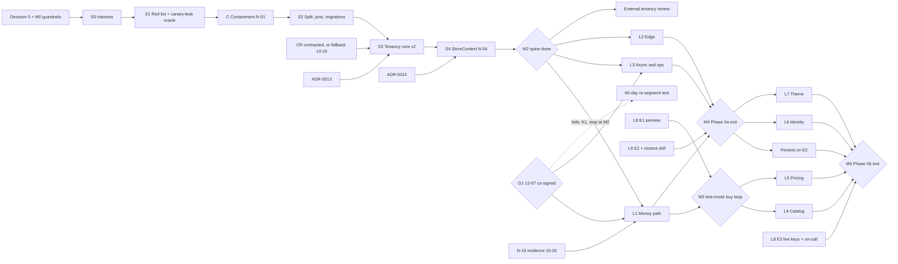

# shp0 execution playbook: how to take on the whole programme

*The execution layer for [`differentiation-strategy.md`](differentiation-strategy.md) (**the report**) and [`codebase-audit.md`](codebase-audit.md) (**the audit**): who does what, in what order, how "done" is proven, and when to stop. It merges three working plans (critical path **CP**, agent operating model **AOM**, founder track) and resolves two critiques of them (Appendix). Ground truth is `main@21b98b1`; week 0 is Monday 2026-09-28.*

*Owners: **F** founder · **A** coding-agent session (Claude Code, not the report's AI Agent principal) · **V** verifier agent · **CR** contracted security and payments reviewer · **ADV** advisor · **L** counsel · **W** WooCommerce Subscriptions freelancer · **D** designer.*

*Labels: [V] checked this session in the repository, a scratch copy of `main` or this container; [V-GH] GitHub API, 2026-09-26; [S] secondary source; [model] arithmetic on stated inputs; [assumption]; [U] unverified.*

*Capacity is unknown: git shows one committer and 40 commits on 4 days, 07-01 → 07-05 [V], and the only collaborator is one admin account [V-GH]. Every date is a [model] range for a stated mode (§4), replaced by measured data at the §4.3 checkpoints. Times are ET [assumption; set F's time zone].*

*Paths use the audit's shorthand (`db/` = `packages/db/src/`, `web/`, `act/`, `sf/`, `dash/`). Audit IDs that collide with milestone names are written "audit M1", "audit M2", "audit M4". Today's root scripts are `dev`, `build`, `typecheck` and `test` [V]; every other `pnpm` script named here is added by the step that first needs it.*

---

## 0. The approach in one screen

1. **Verification is the bottleneck, not code.** Plan in acceptance IDs verified per week, never in engineer-weeks.
2. **Commit to the next gate only,** with a cash cap and an ADV co-signer. Decision 0 (founder hours, runway, stop-loss) picks the mode (§4).
3. **Contain first, in days:** the 15 `ready-for-agent` issues, #48's `db:push` advice and the public repository are the live hazards.
4. **Controls live on the server, not in prompts.** Nothing that writes to GitHub while F is away uses F's identity; specs and acceptance tests are merged before an agent starts; an issue closes only when its spec IDs go red → green; LLM output may block but never pass.
5. **One serial spine, then lanes.** Harness → red list → containment → split → tenancy core → `StoreContext` (M2), paced by the CR, who approves every S1 change. No contract coders until data asks for them.
6. **G1 owns F's weekdays until 11-20;** lanes open only on a co-signed G1 pass (12-07).
7. **Measure from week 1** (read-out 10-09; K9 frozen 10-28; re-plan 12-07), give the environments an owner (L8), and sell by hand before automating (report §7.1).

---

## 1. This week (Sat 09-26 → Sun 10-04)

### 1.1 Owner decisions to make now

| # (report §11.2) | Decision | Recommended default | By |
|---|---|---|---|
| **0 (new)** | Commitment | A `kind:decision` issue: weekday hours 10-05 → 11-20; personal runway; cash stop-loss; cumulative caps (default **$35k to G1, $90k to M3** without outside money [assumption; F sets]); whether F wants the report's job (selling, concierge, on-call, fundraising). **≥40 h → FT; <25 h → PT; between → FT with G1 capped** (§4) | 10-02 |
| 1 | Visibility | **Private indefinitely, on GitHub Team, today.** The analysis branch has been public since 09-26 [V-GH]. `main` holds what agents obey (audit, registry, rules); the report and this playbook stay on the docs branch. | 09-26 |
| 2 | Rebuild | Staged (§3.1) | 10-02 |
| 3 | Team | Provisionally F, agents and the CR, with **no contract coders**. Final on 12-07 with lane data. | 10-02 |
| 7 | Commission | 0% on own traffic. P3, P4 and P15 become deletions. | 10-02 |
| 14 | Store-host domain | Buy a brand-neutral domain now. File the PSL request once E1 serves Stores on it, because PSL review expects a live use [U]. | 10-02 |
| 16 | Marketplace | #23, #24 and #28 go to `wontfix`; keep ADR-0003 | 09-26 |
| new | Agent identity | Machine user `shp0-agent` (Write role, **no issue write**). F is the only pusher to `main`. | 10-02 |
| new | Customer sign-in | Password sign-in off. Guest checkout with a signed Order-access token; OTP later. | 10-02 |
| new | Operator access | Allowlist **by user id**, never by email. Under D20 (no email verification), the first sign-up with that email would become Operator. | 10-02 |
| new | Toolchain | Pin `drizzle-orm` 0.36.4 and `drizzle-kit` 0.28.1 exactly, the lockfile's versions [V]. Pin Next 16.3.6 in its own PR, after the canary-leak oracle exists. | 10-02 |
| 5, 13, 17 | Charge model; worker host; tracker | Charge model provisional for test mode, final 10-26 (§5.1). Worker host: any always-on Node container in wk3. Tracker: quarantine and correction notes by 10-09. | As stated |
| 4, 6, 8–10, 19 | Funding, beachhead, card, Switch fee, Order Schedules, one-time budget | Unchanged | G1, 12-07 |

### 1.2 Ordered checklist

| # | When | Item | Owner | Done-evidence |
|---|---|---|---|---|
| 1 | Sat 09-26 | Make the repository private; move the org to GitHub Team; set the Actions spend limit above $0; confirm a cloud session can still clone it [U] | F, 30 min | `gh api repos/accidentally-awesome-labs/shp0 --jq .private` → `true`; a cloud-session clone log |
| 2 | Sat 09-26 | Move #17–#24, #26, #28 and #31–#35 [V-GH] to `needs-triage`. Close #23, #24 and #28 as `wontfix`. | F, 1 h | `gh issue list --label ready-for-agent` returns nothing |
| 3 | Mon 09-28 | Delete `"db:push"` (`packages/db/package.json:15` [V]); comment on #48 (audit M1) | A drafts, F merges | `grep -c db:push packages/db/package.json` → 0; comment link |
| 4 | Mon 09-28 | Create `shp0-agent`; **by 10-02 test whether cloud sessions can push as it** [U]. If not, implementers use the local CLI with its fine-grained PAT (contents and pull requests read-write, issues none); cloud sessions under F's identity stay interactive or read-only. | F, 1–2 h | A PR pushed by `shp0-agent` |
| 5 | Mon 09-28 | Protect `main`: PR required; 1 approval plus CODEOWNERS; dismiss stale; **last-push approval**; strict, always-run checks (each becomes required when it first passes); **include administrators**; **pushes restricted to F**; no force-push. Approvals are 0 only for bootstrap PRs until `shp0-agent` works. | F, 1 h | `gh api repos/accidentally-awesome-labs/shp0/branches/main/protection` output in the decision issue |
| 6 | 09-28 → 10-02 | Harness bootstrap PRs F-1a…F-1g (§2.2), each ≤400 lines with a planted negative fixture | A writes; F reviews (~1 h each) | Each fixture goes red (run links) |
| 7 | 09-28 → 10-02 | Post the §1.1 decisions as `kind:decision` issues | F, 3–4 h | Links |
| 8 | Mon 09-28 | Stripe test platform; three channels (sales form, support case, warm intro); the N-15 questions Q1–Q5 and the evidence rule (§5.1) | F 2 h; A drafts | Case IDs |
| 9 | 09-29 → 10-04 | **N-15a spike** on branch `spike/stripe-v2` (never merged), from a cloud environment holding only the Stripe **test** key | A (interactive until `shp0-agent` works) | Report with raw API responses and request ids |
| 10 | 09-29 → 10-02 | **G1 pre-registration** (§5.2), hashed and posted; list purchase; outreach domain warming | F 5 h; A drafts | `sha256` posted in a `kind:decision` issue |
| 11 | 09-29 → 10-04 | Working company name plus a one-page site with a founder bio, for outreach only; buy the brand-neutral Store-host domain (decision 14) | A drafts; F 2 h | Site URL; registrar receipt |
| 12 | 09-30 | CR brief to 8 contacts and 2 marketplaces; ADV outreach; 2 law-firm calls; confirm the entity, bank account and contractor template (IP assignment, confidentiality) | F, 4 h | Sent log; entity status in the Decision 0 issue |
| 13 | 09-29 → 10-02 | Desk estimate: standalone Stripe gateway vs WooPayments (report §5.3); founder calendar and hours budget; first Monday issue | A; F approves | Memo; pinned issue |
| 14 | Fri 10-02 (latest 10-06) | **M0 check** (§3.4) | F | The M0 checks (`gh api` output, fixture run links) posted to the Decision 0 issue |

**Founder load in wk0 ≈ 28–34 h** [model], against 45–65 h in the three plans summed: no red-list review, split or interview booking this week. **PT mode:** rows 1–7 now; G1 set-up in wk1–2.

---

## 2. The operating model

### 2.1 Definition of Done (every item is machine-checked)

1. **`specs/<n>.yml` is merged on `main` before `ready-for-agent`:** acceptance IDs, `tests/spec/<n>/` paths, scope globs, risk class, audit IDs, `superseded_by`. F approves it (plus the CR for S1).
2. **Every ID was red on the base for its documented symptom and is green on the head.** `redlist(id, fn, {symptom})` passes only on a matching assertion error and **hard-fails on infrastructure errors** (ECONNREFUSED, import errors, timeouts).
3. **Required checks are green,** always run, and are judged from the **base** branch (`harness-integrity`).
4. **Sign-off matches the risk class.** S1 needs the CR (security) and F (intent); S2 needs F; N needs an F skim. Any new push dismisses approvals.
5. **No existing `expect(`/`it(` is changed** without an F-applied `test-change-approved` label (`assertion-diff`).
6. **Closure guard v2 permits the close** only when the closing PR's `acceptance` check shows every spec ID red on the base and green on the head. Epics need their own IDs too.
7. **The audit ID is flipped in `docs/strategy/registry.yml`,** and any ADR or CONTEXT.md change the spec names has merged.
8. **The weekly re-audit re-runs the IDs on `main` from an empty DB,** unless the spec has `superseded_by`.

**Never evidence:** a SHA, a branch name, "all green", verifier or auditor prose, or a PR description.

### 2.2 Repository scaffolding

| Bootstrap PR | Files | Negative fixture |
|---|---|---|
| **F-1a CI-0** | **O4 fix first:** in `pnpm-workspace.yaml`, replace `onlyBuiltDependencies` with `allowBuilds: {esbuild: true, sharp: true}`. Then `.github/workflows/ci.yml`: `pnpm install --frozen-lockfile`, then `git diff --exit-code`; `pnpm -r typecheck`; the 9 pure `packages/db/tests` files; `pnpm build`; `scripts/ci/banned-patterns.sh` | A PR re-adding `db:push` goes red |
| **F-1b Closure guard v1** | `closure-guard.yml` (on `issues: closed`, plus hourly) reopens a COMPLETED close without a merged-PR closer, and a NOT_PLANNED close without `wontfix` or `superseded` | A hand-closed issue is reopened within 5 min |
| **F-1c Rules** | • `CODEOWNERS` (§2.5), PR template, issue templates, `labels.yml` • `docs/agents/{definition-of-done,sensitive-paths}.md` • a ~25-line `CLAUDE.md` addendum • `docs/agents/issue-tracker.md` switched to the GitHub MCP, because cloud sessions have no `gh` [V] | A `packages/auth/` PR requests the code owners |
| **F-1d Server guards** | • `label-guard.yml` strips founder-only labels unless `sender.login` is F, and strips `ready-for-agent` when `specs/<n>.yml` is missing. • `harness-integrity.yml` (`pull_request_target`, base code only, no secrets) fails on changes to `.github/**`, `.claude/**`, `scripts/ci/**`, `specs/**` or `tests/spec/**` that lack `harness-change` | A label added by `shp0-agent` is stripped; a PR weakening `ci.yml` fails |
| **F-1e Agent harness** | • `.claude/settings.json` denies merge, auto-merge, review-write, `db:push` and force-push. • Hooks: `session-start.sh` (install; `initdb` from `/usr/lib/postgresql/16/bin`, which is not on `PATH`, run as `postgres` because sessions run as root [V]; roles; template DB; URLs into `$CLAUDE_ENV_FILE`); `guard-bash.sh`; `stop-unpushed.sh`, **only after F-1a lands the O4 fix**, or it loops on the rewritten `pnpm-workspace.yaml`. • Skills `take-issue`, `write-spec`; agent `verifier.md`. | `pnpm db:push` is refused in-session |
| **F-1f Truth on `main`** | The audit, plus `registry.yml` (audit ID → severity → section → N-xx → acceptance IDs → status), with a schema check | A missing ID fails the check |
| **F-1g Test infrastructure** | • Replace the hard-coded DB URLs in 12 `packages/db/tests/` files (`?user=cloud_admin` ×11, `?user=default` ×1 [V]) with environment variables. • `bootstrap-roles.sql`, run **once per cluster** (roles are cluster-global). • A per-run `TEMPLATE shp0_migrated` database. • `packages/db/tests/redlist/{redlist.ts,_api.ts}`, a single adapter, so the S2 split edits one file. | With Postgres stopped, the red-list job **fails** |

**CI-0 was dry-run on a scratch copy of `main` [V].** As is, the frozen install exits 1 (`ERR_PNPM_IGNORED_BUILDS`) and writes `allowBuilds` placeholders into `pnpm-workspace.yaml`. With the fix it exits 0 on a clean tree, typecheck passes, the 9 pure files pass 82 tests and `next build` succeeds.

**Later scaffolding** (A writes, F reviews; each ships a negative fixture that goes red):
- **Wk1, before the first `ready-for-agent`:** `specs/`, `tests/spec/`, closure guard v2 (`scripts/ci/acceptance.ts`), `assertion-diff`, `scope-check`, `apps/web/tests/authz/canary-leak.ts`.
- **When first needed:** `packages/db/migrations/` with the `migrations.lock` hash manifest; `scripts/db/{migrate,rls-invariant,policy-mutation,drift-check}`; `nightly.yml` and `weekly-audit.yml` (wk2); `infra/` and `docs/runbooks/` (L8).
- **Deferred until a metric asks for it:** a dispatcher session, Stryker (pure modules only), `claims-check`, monthly drills.

### 2.3 Roles

| Role | Does | Never |
|---|---|---|
| **F** | Decisions and specs; approves intent; applies founder-only labels; the only pusher to `main`; runs G1, Stripe, hiring and cash | Counts as the security review; runs AFK agents that write under F's identity |
| **A (implementer)** | Runs as `shp0-agent`: one issue, branch `agent/<n>-<slug>`, worktree and DB. `/take-issue n`, `pnpm verify`, self-review, draft PR; subscribes and fixes CI; marks it ready and stops. Proposes follow-ups in the PR body. | Labels, closes, merges or approves; edits `specs/**` or `tests/spec/**`; holds a live key; cites a reference not on `origin` |
| **V (verifier)** | A separate session (a different model where possible) that sees the spec and diff, **never the transcript**, and writes up to 3 adversarial tests (another Store's ids, a lower principal, replay, boundaries). **A failing test is a red check**; F promotes useful ones to `tests/spec/<n>/verifier/`. | Passes anything; holds secrets (`contents: read` only) |
| **CR** | Approves all S1 code; co-authors ADR-0013–0016 and specs; break-glass merge; planted-defect drills from November | Writes code they approve |
| **ADV** | Co-signs the caps, G1 and the K-gates | — |

### 2.4 The PR pipeline

0. **Spec PR** (`kind:spec`; A drafts, F approves, plus the CR for S1): tests in `tests/spec/<n>/` are red on `main` for the stated symptoms. Then F applies `ready-for-agent`.
1. **Implement** (A): `scope-check`; a `kind:refactor` skips red-first only if its move proofs pass; the Stop hook forces a pushed branch.
2. **Self-review** (A): `/code-review`, `/security-review`, and `/simplify` on N-class only. "What I did not verify" must not be empty.
3. **Verifier** (V): adversarial tests on the head, reported as a check-run.
4. **CI:** every required check, always run, strict, with the harness judged from the base.
5. **Sign-off** on the final SHA: CR + F for S1, F for S2 and N. Stale approvals are dismissed; last-push approval is required.
6. **Merge:** F only, squash.
7. **Close:** `Fixes #n` plus closure guard v2 (red on base, green on head), or the issue is reopened.
8. **After merge:** nightly and weekly jobs (§7); escapes are attributed by bisect.

**Payments tests:** per PR, server-side PaymentIntents plus **signed synthetic webhooks**; nightly, a hosted-Checkout smoke in Actions, because Playwright's download CDN is blocked from cloud sessions (403 at the proxy [V]). Stripe objects carry a run id; each environment has its own webhook endpoint.

### 2.5 Sensitive paths and issue classes

| Class | CODEOWNERS paths | Approvers |
|---|---|---|
| **S1 code** | `packages/db/migrations/**`; `packages/db/src/{index,schema,payments,billing,customer-auth}.ts` until S2, then `packages/db/src/{tenancy,checkout,payments,ledger,billing,customers}/**`; `packages/auth/**`; `apps/web/app/{api,admin}/**`; `apps/web/app/actions/{admin,billing,cart,checkout,customers,domains,stripe}.ts`; `apps/web/app/dashboard/*/layout.tsx`; `apps/web/proxy.ts`; `apps/web/lib/{stripe,current-store,auth}.ts`; `scripts/db/**`; `apps/web/tests/authz/**` | CR (the security review) + F (intent) |
| **Harness and specs** | `.github/**`, `.claude/**`, `scripts/ci/**`, `specs/**`, `tests/spec/**`, `CLAUDE.md`, `docs/{agents,adr}/**`, `CONTEXT.md`, `pnpm-lock.yaml`, `pnpm-workspace.yaml`, `.npmrc`, `**/package.json` | F with `harness-change` (plus the CR for S1 specs) |

The plans' lists missed `apps/web/app/actions/` (D1–D3, P3) and the pre-split files that hold all tenancy code today [V]. `pnpm-workspace.yaml` is listed because `allowBuilds` decides which packages run install scripts. Braces here are shorthand: CODEOWNERS supports neither `{…}` nor `[…]`, so each path gets its own line and `[storeId]` is written `*`.

**Issue classes.**

| Class | Issues | Notes |
|---|---|---|
| Human only | N-15, N-24, N-50, N-53 | — |
| Decide first | N-48, N-51, N-52, N-54, N-56 | `needs-info` in B.4 |
| **S1** (two PRs: spec, then implementation) | N-02, N-03, N-04, N-05, N-07, N-08, N-10 (OTP), N-14, N-16, N-17, N-18, N-22, N-26 (upload and serve), N-30 (OTP and domain auth), N-34, N-35, N-38, N-39 (sanitisation), N-40, N-41, N-44, N-45, N-47, N-55 | — |
| **S2** | N-01, N-06, N-09, N-11, N-12, N-13, N-19, N-20, N-21, N-23, N-27, N-29, N-33, N-37, N-42, N-46, N-49 | N-01 is S2 only because nothing is deployed. N-33 must include an open-redirect test (D11). |
| **N** | N-25, N-28, N-31, N-32, N-36, N-43 | — |

### 2.6 Banned patterns

CI `banned-patterns` plus lint reject:

- **Schema:** `db:push` or `drizzle-kit push`; `applySchema(` outside tests; edits to a merged migration.
- **Tenancy:** `set_config('app.store_id'` outside `db/tenancy/`; `platformClient` outside its allowlist; `as StoreContext`; `TODO` inside `require*`/`authorize*`.
- **Payments:** `as` casts in payments, Stripe or tenancy paths (use `satisfies`); `application_fee_amount`; `transfer_data`.
- **Tests:** hard-coded DB URLs; `.only`; an unlinked `.skip` or `it.fails`.
- **Environment:** `process.env.` outside the env module (D15); a Next canary once pinned; new dependencies outside the weekly `deps:` PR.

### 2.7 Tracker rules

- **Labels:** the five canonical ones plus `risk:S1|S2|N`, `kind:{spec,defect,feature,refactor,decision,harness,deps}`, `lane:L0…L8`, `audit:<ID>`, `phase:*`, `cr-audit-pending`, `test-change-approved`, `harness-change`, `closure-guard:reopened`. Retire `wayfinder:*`.
- **Founder-only labels** are enforced by the label guard, not by `CLAUDE.md`.
- **Sub-issue size:** ≤400 non-test lines, one lane, at most one migration, 1–5 acceptance IDs, and no open design question.
- **ADR numbers** are pre-assigned per report §11.3 (0013–0028). **CONTEXT.md** changes only through `kind:decision` or `kind:spec` PRs.
- **Interactive vs AFK.** An interactive session acting on F's explicit instruction is F. Anything AFK that writes to GitHub is `shp0-agent`; AFK sessions under F's identity are read-only.

---

## 3. Programme structure

### 3.1 The serial spine (M0 → M2)

Dates are the FT point plan, with the CR contracted by 10-16 [model]; it puts M2 near 12-04, inside the §3.4 range.

| Step | Scope | Exit check (executable) | Class | Dates |
|---|---|---|---|---|
| **S0 Harness** | F-1a…g; part of N-03 | M0 (§3.4) | Harness | 09-28 → 10-06 |
| **S1 Red list** | `redlist()` for 23 IDs: the 25 Critical/High IDs in audit A–D, minus O1 and audit M4, which the harness covers. Via `_api.ts` or HTTP against `next start`. Builds the **canary-leak oracle** (D1, D2, D16). **Reviewing these PRs, with 3 planted defects, is the CR's paid trial.** | `pnpm test:redlist --json` lists every ID failing with its symptom; with Postgres down, the job fails | Spec | 10-05 → 10-12 |
| **C Containment** | N-01 as 5 children: `apps/web/app/dashboard/[storeId]/layout.tsx` guard (`getSession` + Membership); `requireOperator` by user id; `/admin` in the proxy matcher; manual domain verify disabled; Store status filter (D5). **Calibration run: log review minutes.** | Red-list D1, D2, D3 and D5 flip. Canary-leak finds 0 victim tokens across 6 principals. | S2 | 10-07 → 10-14 |
| **S2 Split and pins** | drizzle pinned exactly; Next 16.3.6 in its own PR. Mechanical split into `db/<domain>/` (subpath exports, no barrel). `applySchema` SQL becomes `YYYYMMDDHHmm__<lane>__<slug>.sql` migrations (the audit-M2 bootstrap-order fix, version table, `pnpm db:migrate`, roles bootstrap). Freeze ≤2 days, hotfixes included. | **Symbol-set parity** (old root exports = union of subpath exports, via ts-morph); **per-function body-hash identity**; identical per-test pass/fail IDs; `db:migrate` twice on empty PG16 (second a no-op); `drift-check` (`drizzle-kit pull` vs `schema.ts`) empty; `index.ts` gone | `kind:refactor` | 10-12 → 10-23 |
| **S3 Tenancy core v2** | N-05, N-06, N-23, N-02 roles, N-11 core (int8, `Money`), N-12 `stores.currency`. **Pool safety** (the N-13 part): `tenantClient` re-entrancy guard; pinned timeouts (acquire 2 s, statement 5 s). One generator, `app.enable_tenancy(table)`, one factory file per table. | `pnpm db:invariants` → 0 rows. **Count equality** (tables with `store_id` in `pg_catalog` = tables covered). **Policy mutation:** dropping FORCE, policy, stamp trigger or composite FK, one at a time on each of the 14 tenant tables, turns the matrix red. `claim_outbox` 5/5 under FORCE. Golden Money vectors (2,500¢ × 1.14% = 29; `formatMoney(-150)` = "-$1.50") plus a half-up property test. A 50-way add storm finishes within T while another Store's reads keep p99 < 200 ms. | S1 (ADR-0013) | 10-19 → 11-13 |
| **S4 `StoreContext`** | N-04: `#brand` class minted by `requireStoreRole`, `resolveStorefrontStore`, `systemContext`; codemod; `defineAction` + zod; `server-only` readers; 5 `platformClient` reads moved; D4 via `getSessionCookie` | **Authz canary-leak matrix:** 7 principals (none, forged, non-member, Staff, Admin, Owner, Operator) × every route in `app-paths-manifest.json` and every Server Action. 0 victim tokens in the **full streamed body** (status is not the verdict); victim row hash unchanged after actions; unclassified route fails; removing any `requireStoreRole` turns it red; red-list D1, D4, D8, D16 pass | S1 (ADR-0014) | 11-09 → 12-04 |

**CR-late fallback.** If no CR is contracted by 10-16, S3 and S4 merge on F plus V plus the mutation oracles, labelled `cr-audit-pending` and tagged `spine-v1`; a CR audit of that diff, findings closed, becomes an M2 exit. Valid only while there is no Merchant data and no live key, and never for L1 live-payment code.

**Serialisation.** `web/proxy.ts` is edited by C, then S4, then L2, in that order.

### 3.2 Lanes

Lanes open after M2, **and only on a G1 pass.** In FT mode, L1 and L3 open first and L2 follows S4. The others open as review capacity allows.

| Lane | Owns | Issues, in order | Reviewer |
|---|---|---|---|
| **L1 Money path** | `db/{cart,checkout,orders,payments,ledger,billing}/`; `web/app/api/stripe/**`; `act/{cart,checkout,stripe,billing}.ts`; `web/lib/stripe.ts`; `sf/{cart,checkout,order}/` | N-13 (remaining children) → N-14 (ADR-0017) → N-27 v0 → N-16 (ADR-0015 **account adapter**; ADR-0016) → N-17 → N-19, N-18; #20 re-scoped; N-29 | CR + F |
| **L2 Edge and platform** | `web/proxy.ts`; `web/lib/current-store.ts`; `web/next.config.mjs`; `web/app/admin/**`; `db/{stores,domains,platform}/`; `dash/domains` | N-07 → N-09 headers → N-08 core → N-22; N-33 hook | CR + F |
| **L3 Async and ops** | `apps/worker/` (new); `db/outbox/`; `web/instrumentation.ts` | #17 → N-20 → N-21 (minimal) → N-30 → #19, #18 | F (CR for N-30) |
| **L4 Catalog** | `db/{catalog,collections,search,media}/`; `sf/{listing.tsx,product}`; `web/app/collection/`; `dash/{products,collections}` | C3 quick fix → N-25 → N-26 → N-55 → N-32; N-33 pages | F (CR for N-26, N-55) |
| **L5 Pricing** | `db/{pricing,discounts,money}/`; `dash/discounts` | N-11 bps → N-27 v1 → N-28 (#31, #32) | F |
| **L6 Identity and Merchant UX** | `packages/auth/**`; `db/customers/`; `web/app/{account,(auth)}/**`; `dash/customers`; `web/lib/nav.ts` | N-35 → N-10 OTP → W2, W6 (W1 sits in N-32, W3 in N-31, W4 in N-08, W5 in L1) | CR + F |
| **L7 Theme** | `web/app/(storefront)/_theme/**` | N-31 | D + F |
| **L8 Environment (new)** | `infra/`; `docs/runbooks/` | **E1** by M3: preview (test mode, no PII, deployment protection). **E2** by M4: production-like, **PITR restore drill passed**; the pentest target. **E3** at M5: live keys, on-call. | F + CR run every secret step; A writes IaC and runbooks |
| **L0 Founder** | `tools/switch-report/`; `docs/` | G1, N-15, N-24, N-37 v0, hiring | F |

**Collision rules.** Tenancy is not a lane: each new tenant table calls `app.enable_tenancy()` and ships its own factory file. The `priceCart` v0 interface and the `StoreContext` minters are spec-locked cross-lane contracts. WIP is 2 PRs per lane; the migration hash manifest and a rebuild from empty run on every PR; dependencies go in one weekly `deps:` PR. **Migrations are squashed at M4, before the pentest,** with a schema-dump equality check.

**Human-only, always:** Stripe live mode, production DB roles, the DNS registrar and PSL, Vercel tokens, GitHub organisation settings, pentest scoping, incident response, the restore drill and the cutover runbook.

### 3.3 Dependency view

### 3.4 Milestone ladder

| M | Exit checks (scripted unless marked) | FT target |
|---|---|---|
| **M0 Safe to work** | Protection JSON shows code-owner review, dismiss-stale, last-push approval, `enforce_admins`, pushes restricted to F; no `ready-for-agent` issues; a PR authored by `shp0-agent`; every F-1 fixture red; clean tree after install in CI | 10-02 (latest 10-06) |
| **M1 Truth encoded** | Red list merged with counts by severity, each symptom matched, infra outage fails the run; D1, D2, D3, D5 green; audit and registry on `main`; #43–#60 corrected; CR contracted or fallback declared (manual) | 10-16 |
| **M2 Spine done** | S2–S4 exits; `pnpm ci:all` from an empty container; no Next canary; `spine-v1` audit closed if the fallback was used | wk7–11 (11-16 → 12-14) |
| **M3 Test-mode money loop** | `pnpm e2e:buyloop` on E1, 3 consecutive nightlies. **Stripe-side:** the retrieved account shows `dashboard:'full'` and both responsibilities `stripe` (v2), or is the connected existing account (adapter); `requires_capture` → Order `authorized` → capture → refund; `pnpm reconcile` against **balance transactions**, 0 drift; guest Order opens only with its signed token | 2027-01-25 → 03-15 |
| **M4 Phase 0a exit** | `registry.yml`: 0 open Critical/High in A–D, each green on `main`. `pnpm probe:concurrency --auths 40 --stock 1` → **1 succeeded, 39 canceled, counted in Stripe by run-id metadata**; `--adds 1000` → 0 negative stock, pinned timeouts, cross-Store p99 < 200 ms. 10⁶ Money cases nightly plus golden vectors. Isolation and authz 100% with mutation checks. 0 closures without a merged PR. Squash dump-equal. **E2 restore drill passed.** CR security review closed. N-15 evidence or K2/K2b recorded. | 2027-02-15 → 05-03 |
| **M5 Phase 0b exit** | Report §8.2, plus: pentest on E2 passed and remediated; p95 < 600 ms uncached on E2 (2k-Store fixture); axe 0 critical; E3 keys held by humans; second on-call human; the live Staff-paid Order uses **the wedge's** account path | 2027-06 → 09 |
| **M6 Cohort 1** | Report §7.1, with the per-Merchant blackout rule if adopted (§5.2); ≤4 Stores until a second on-call human exists | M5 + 2–4 wk |

---

## 4. Capacity scenarios

### 4.1 Modes

Figures are [model] and are replaced by measurement.

| | **PT** (Decision 0 under 25 weekday h) | **FT** (40 h or more) | **B** (funded, gate-tied hires; 2027 at the earliest) |
|---|---|---|---|
| F engineering hours per week | ≤8 | **≤10 until 11-20, then 15 until 12-07, then 25 after a G1 pass** | 10–15 |
| CR hours per week | Paid per review (4–8) | **16–20 for 6 weeks, then 8–12** | 8, sampling |
| Merged PRs per week (S1 in brackets) | 4–8 (1–3) | Spine 6–12 (3–6); lanes 12–20 (4–8) | 20–35 (8–14) |
| Founder spec budget, 0a | Not forecast | **50–100 h, inside the hours above** | Shared with the engineers |
| M2 | wk10–16 (12-07 → 2027-01-18) | **wk7–11 (11-16 → 12-14)** | As FT |
| G1 decision | ~2027-02-01 (16 weeks; BFCM and the holidays are dead; book leave days) | 12-07 | 12-07 |
| M4 / M5 | Not forecast; re-plan at G1 | 2027-02-15 → 05-03 / 2027-06 → 09 | wk18–26 / wk30–42 |
| Cuts beyond the report's list | Everything after M2 until G1; no pre-seed before G1 | N-10 OTP and N-55 to Phase 1 (0b is guest checkout); #35 = 3 SQL tiles; N-21 = pino, Sentry, health check; N-08 domains attached by hand; N-31 one theme; N-46 defaults. **N-45 is a single lane from M4, so Cohort 2 ≈ 2028-Q1: tell LOI signers.** | The report's list |

**Never cut:** the spine, L1, the isolation and authz oracles, the CR on S1, the E2 restore drill, the pentest, N-24, G1. **When F is over budget, shed** lane WIP first, then 0b spec writing; never G1 interviews before 11-20; S1 review moves to the CR, never drops. **Bus factor:** the CR holds break-glass merge rights on S1, with a one-page handover in `docs/runbooks/`.

### 4.2 Projection

`weeks_to_M = Σ_class(open acceptance IDs × measured human minutes per ID) ÷ weekly review minutes + external floors`

- **External floors:** N-15 evidence, PSL, the CR start, the pentest lead time, holidays.
- **Spec debt** (N-xx items without a `specs/*.yml`) is reported separately.
- **PR counts are not the unit,** because splitting PRs inflates them.

### 4.3 Week-2 re-plan rule, and the two checkpoints after it

**Fri 10-09 read-out.** Inputs are the first 15–30 merged PRs from S0, S1 and C. This calibrates N and S2 work only.

| Reading | Rule |
|---|---|
| F's delivered hours are below 80% of Decision 0 | Start the K0 count (§7.3); switch mode if it persists |
| Review wait p50 is over 1 day while agents sit idle | Buy CR hours first |
| Rework is over 40%, or verifier refutation over 35% | Stop spawning; F hardens the specs |
| CI flake is over 5%, or p50 is over 15 min | Fix the harness first |
| S0, S1 or C is not merged by 10-16 | Move M2 right by the slip and update the LOI dates |
| Fewer than 6 interviews are booked for wk2 | Add referral fees or ads |

**Do not extrapolate to S1.** S1 speed is first measured on S3, in wk3–4.

**Wed 10-28, day 30:** re-baseline K9 **once**, then freeze it; re-run report §6.6 at the measured burn (~$25–35k a month → ~300–1,000 paid Stores to break even [model]); check the caps.

**Mon 12-07, with G1:** the throughput re-plan on ~3 weeks of S1 data, the 2027 founder load (concierge cutovers, support, fundraising, N-45 review), decision 3 final, and venture or default-alive (§5.5).

---

## 5. The founder track

### 5.1 Stripe (N-15)

- **N-15a (A, days 3–7):** create a v2 account with explicit `dashboard` and responsibilities, run a direct-charge manual-capture payment, and try OAuth on an existing test Standard account; keep raw responses.
- **Acceptable evidence, defined now:** any two that agree of the docs text (URL plus retrieval date), the N-15a result, and a support-case reply. An email from a named Stripe employee is a bonus, never a precondition, including for the pre-seed.
- **Questions** (report B.4 N-15): **Q1** existing-account connect with off-session use of `cus_`/`pm_`; **Q2** v2 `full` for new and v1 OAuth for existing Merchants on one platform; **Q3** Stripe-collected fees and losses at $0 to the platform; **Q4** a data copy into a platform-created account (new `pm_` ids); **Q5** an App or restricted-key integration.
- **Decision tree, 10-26.** Q1 and Q3 yes → adopt decision 5. Q1 no, Q4 yes → Pillar 2 minus "same account" (renewals continue after a `pm_` remap). Q1 and Q4 no, Q5 yes → rewrite ADR-0015. All no → K2b. Q3 no → K2. No evidence → LOIs stay conditional and Cell A cannot pass. **Likeliest branch, pre-decided: "allowed but v1-OAuth only / not recommended" [S]**: connection becomes an adapter (`createV2Account` | `connectExistingV1`); the saga targets "an `acct_` with charges enabled"; Q4 is the fallback; L1 grows 20–40% [assumption]; the M5 live Order uses the wedge's path.
- **Key boundary.** The test key lives only in a dedicated cloud environment used by L1 and the spike; V holds none; **live keys never enter any environment where agents run.**

### 5.2 Gate G1 (10-05 → 12-07)

**Pre-registration, hashed by 10-02**, fixes two cells (**A:** WooCommerce Subscriptions stores with ≥200 subscribers on the standalone Stripe gateway, 25–30 interviews; **B:** standalone-Stripe stores at $20k–$150k without subscriptions, 12–15), the thresholds below, the ADV as co-signer, and the waiver rule: **at most one threshold, by at most 20% relative, with the red-team memo attached unedited.**

| # | Threshold |
|---|---|
| T1 (absorbs T4) | ≥15 LOIs or deposits, from ≥3 channels, ≥5 of them with a deposit, and ≥8 from Cell A. **An LOI counts only if the Merchant's own planned move date is on or after the scenario cutover date.** Each census row records that date and the trigger. |
| T2 | ≥20% standalone Stripe in a **desk sample** of ≥300 detected stores |
| T3 | ≥30% put continuity in their top 3, and ≥20% raise it unprompted |
| T5 | ≥50% pass the fit check |
| T6 | ≥60% of signers accept the scenario cutover window in writing |
| Price | Falsification only: fail if ≥40% of Cell B say no on price |

**Calendar.** Warm interviews from 10-05; CASL- and CAN-SPAM-compliant batches of 150 / 300 / 450 on 10-13 / 10-20 / 11-03; first censuses only after the CR reviews the SELECT-only N-37 v0 script (~10-14); **data freeze 11-20**; 11-23 → 12-04, A builds the gate packet and a second A session writes a "fail" memo; **co-signed decision 12-07**.

**Paid Switch Report.** A destination-neutral exit-readiness audit, $300–500, credited to the Switch fee, offered from batch 2. A builds it, W delivers it, F spends ≤5 h a week; it counts toward T1 only alongside a signed LOI.

**Outcomes**

| Result | Response |
|---|---|
| A and B pass | Open L1 and L3. Write the N-45 spec, ADR-0028 and the auto-renewal memo. |
| Only B passes | The wedge becomes standalone-Stripe leavers without subscriptions; N-45 moves to Phase 2. |
| Neither passes | **K1:** stop at M2; pay the CR per review; book no pentest and raise no pre-seed; run a 60-day re-segment test (Cell B / N-53) with its own pre-registered gate and a ~$15k cap. If that also fails, stop. |

**Proposed for the LOIs, decided at G1: a per-Merchant blackout.** Cutover is allowed until mid-October when October–December is under about 30% of the Merchant's annual GMV and they opt in with the 30-day rollback.

**Yield rule.** G1 owns F's weekdays until 11-20. Interviews run Tuesday to Thursday, 11:00–17:00 ET; review happens before 11:00.

### 5.3 Legal minimums, staged (L drafts, F signs)

| Before | Items |
|---|---|
| **First outreach (wk1–2)** | Entity and bank account; contractor agreements; CASL/CAN-SPAM practice; privacy notice; recording and census consent; LOI and deposit template |
| **First live account (E3)** | Platform ToS and privacy policy |
| **M5** | Merchant ToS, AUP, DPA and sub-processors, breach runbook, insurance, QSA consult |
| **G1 pass** | Auto-renewal memo before the N-45 spec freezes |

Budget about $25–60k in legal and compliance to M5 [assumption], staged as above.

### 5.4 Hiring and contracting (F owns each)

| When | Role | Trigger or terms |
|---|---|---|
| wk0 → 10-16 | **CR** | Paid trial on the S1 red list; 16–20 h/week for 6 weeks, then 8–12; $150–250/h [assumption]; break-glass merge rights; fallback if not hired by 10-16. **To G1 this costs about $17–38k [model],** so at the top of the rate range the CR alone reaches the default $35k cap. F sets the cap knowing this, or accepts 1–3 weeks of M2 slip. |
| wk1 | **L** | Fixed fees |
| wk1–2 | **ADV** (pulled forward) | 0.25–0.5% [assumption]; co-signs caps and gates |
| wk2–3 | **W** | 5–10 h/week |
| During G1 | **Commercial co-founder or partner search** (a WooCommerce Subscriptions agency owner) | Conversations only |
| At M2 | **External tenancy/RLS review** | For M2 + 2–4 wk; $5–15k [assumption] |
| When M5 is known to ±2 wk | **Pentest** on E2 | Retest included |
| Protected-path merges under 5/week for 3 weeks, within the cap | **Reviewer-engineer** | Scenario B |
| M4 | Woo migration engineer; D | — |
| M5 − 4 wk | Second on-call human | Otherwise Cohort 1 is capped at 4 Stores |

### 5.5 Funding by gate

| Evidence | Unlocks |
|---|---|
| Now | Own funds within the caps; 2–3 **no-ask angel temperature checks** in wk2–4 |
| **G1 co-signed + M2 exits + N-15 evidence**: all absolute, none of them "on time" | Open a $0.6–1.2M pre-seed [assumption]; aim to close by M3 |
| M5 + Cohort 1 reconciled | Seed-1 or bridge |
| Phase 1 exit metrics | Seed |

At G1, choose venture or default-alive. **K9 is keyed to runway:** if projected M4 falls later than runway minus 3 months, cut scope or raise before building further.

---

## 6. First 30 days, and the 90-day outline

| Week | Engineering (A, V, CR) | Founder (F) | Exit (evidence) |
|---|---|---|---|
| **wk0** 09-28 → 10-04 | F-1a…g; `db:push` deleted; N-15a; desk estimate | §1 in full | **M0** on 10-02 (latest 10-06) |
| **wk1** 10-05 → 10-11 | Specs as code, closure guard v2, `assertion-diff`; **S1 red list** (the CR trial); C begins | 5–6 warm interviews; CR interviews; L engaged; correction notes posted; ADV meeting; **Friday read-out** | Read-out posted |
| **wk2** 10-12 → 10-18 (Monday is Canadian Thanksgiving) | Finish C; S2 pins, split, migrations and roles; `nightly.yml` and `weekly-audit.yml` | Batch 1 on 10-13; 6 interviews; the CR reviews the census script; **CR hired by 10-16, or fallback**; angel check | **M1** on 10-16 |
| **wk3** 10-19 → 10-25 | S3 generator, invariants, count equality, pool guard, Money vectors (reviewed by the CR) | Batch 2; 9 interviews; paid Switch Report offered; ADR-0013 signed off; worker host chosen; angel check | S2 exit checks green |
| **wk4** 10-26 → 11-01 | S3 policy-mutation tests; S4 specs and ADR-0014 drafted | **N-15 decision on 10-26**; **day-30 checkpoint on 10-28**; 5–8 interviews | `pnpm db:invariants` → 0 rows on `main` |

**90-day outline**

- **wk5–8 (11-02 → 11-29):** S3 exits 11-13; S4 runs 11-09 → 12-04; the CR surge ends ~11-20. Batch 3 on 11-03; interviews close at the **11-20 freeze**; then the gate packet and red-team memo while F and the CR write the L1 specs and ADR-0015/0016/0017. Book the tenancy review.
- **wk9–10 (11-30 → 12-13):** M2 (range 11-16 → 12-14). **12-07:** co-signed G1 decision and re-plan; on a pass, open L1, L3 and the pre-seed if its conditions hold; on a fail, K1.
- **wk11–13 (12-14 → 01-03):** L1 N-13 → N-14; L3 #17 → N-20; L8 E1 preview; tenancy review. Holiday capacity 30–50% lower [assumption].

---

## 7. Cadence and metrics

### 7.1 Weekly ritual

**Monday, 45 minutes, owned by F. The CR joins every other week.**

- **Weekly audit.** `weekly-audit.yml` (`43 10 * * 1`, UTC) runs from an empty DB on `main`: red-list burn-down by severity; the acceptance IDs of **every closed issue** (except `superseded_by`); closures without a merged PR; who applied founder-only labels; `agent/*` branches with no PR; PRs older than 5 days.
- **The Monday issue.** `scripts/ci/metrics.ts` posts **one** pinned "Week NN" issue: engineering, G1 funnel by cell and channel, cash against the caps, F and CR hours, decisions and K-gates due. LLM commentary goes in a separately labelled section.
- **Weekly Routine** (fresh read-only cloud session, `CRON_TZ=<F time zone> 52 6 * * 1`) re-verifies 2 random issues closed last week. F reads its transcript at the ritual and files any `needs-triage` issue. It may block, never pass.
- **Nightly:** concurrency probes, Stripe test mode, hosted-Checkout smoke, EXPLAIN gate, 10⁶ Money cases.
- **Wednesday, 30 min (F):** decision log; one-way doors wait 24 h for a red-team comment from A.

### 7.2 Factory metrics

| Metric | Source | Alarm → action |
|---|---|---|
| **Acceptance IDs flipped per week, by severity** | `registry.yml` diffs | Flat for 2 weeks → re-plan |
| **Human minutes per ID** | PR timelines (review requested → approved), with self-logs as a check | Rising → the specs are thin |
| Review wait, p50 | PR timelines | Over 1 day → add CR hours or cut streams |
| Rework rate; verifier refutation rate | Review rounds; the verifier check | Over 40% or over 35% → harden specs. Under 5% refutation for 3 weeks → drill the verifier |
| **Escaped defects** | **Attributed by bisect to a post-M0 PR.** Legacy CR and pentest findings go on the burn-down instead. | **Any S1 escape freezes its lane** until a new check exists |
| Spec debt | N-xx items without a spec | Growing while lanes sit idle → more F spec time |
| CI flake rate; CI p50 | Actions API | Over 5%, or over 15 min → fix the harness |
| Cost per merged PR | Actions minutes (Team includes about 3,000/month [U]); verifier runs ($1–10/PR [assumption]); sessions | Over the tool cap → run V on S1/S2 only |
| F hours by bucket | Self-log vs Decision 0 | K0 |

**Break-glass for a flaky required check:** a founder `kind:decision` issue opens an exception of at most 48 h, and it is logged in the Monday issue.

### 7.3 Gate reviews

| Gate | When | Rule |
|---|---|---|
| M0, M1 | 10-02, 10-16 | Script output only |
| K2, K2b | 10-26 | The §5.1 evidence rule |
| K9 | 10-28 | Frozen from this date; keyed to runway |
| **G1** | **12-07** | ADV co-signs; waiver rule (§5.2) |
| **K0 (new)** | Weekly | F's hours below Decision 0 for 3 weeks, or fewer than 4 interviews a week in wk2–7 → PT mode |
| K1 | On a G1 fail | Stop at M2 (§5.2) |
| M2–M5 | On completion | Claimed with check-run links in a `kind:decision` issue; the CR co-signs M2 and M4 |

---

## 8. Where this playbook departs from the report

| Report | Playbook | Why |
|---|---|---|
| Engineer-weeks, "3 engineers" (§8) | Verified acceptance IDs per week; Decision 0 modes | Team size is unknown; git shows one committer [V] |
| Option (a), two contract coders | CR first; a reviewer-engineer on a gate | Review is the constraint |
| `RB --> CI` (§8.6) | Harness and red list come first | Agent output is trusted only through tests |
| All-hands rebuild; split "in the same move" (§8.1, §9.8) | Split → generated tenancy core → domain v2 in lanes | One huge diff repeats O1 |
| `packages/core` (§9.8) | Deferred to N-41 | Avoids a second whole-repository move |
| Private "until containment ships" | Private indefinitely; strategy kept off `main` | The strategy is exposed, not only the code |
| "AI agents may not close issues"; two-person review (§9.8) | Machine identity, server guards, closure guard v2; the CR is the security reviewer and F certifies intent | The only collaborator is one admin account; agent sessions act as it, and it accepted #43–#60 [V-GH] |
| N-01 `ready-for-agent`; email operator allowlist | Red list first; allowlist by user id | D20 |
| N-10 password hardening in 0a | Passwords off; signed Order tokens; OTP later | OTP deletes that code |
| N-15 as a week-4 item | N-15a in days; the evidence rule; an account adapter | The docs point existing accounts to v1 OAuth [S] |
| Decision 14: file the PSL request now | Buy now; file once E1 serves Stores | PSL review expects a live use [U] |
| G1 over weeks 1–10; five census thresholds (§7.1) | Front-loaded, freeze 11-20, two cells, move-date rule, co-signed; T2 on a desk sample, T4 folded into T1's Cell A quota, T6 and a price falsifier added | BFCM; LOIs measure patience |
| K1: Phase 0 continues | Stop at M2, then a capped re-segment test | No spending without demand |
| K9 fixed at week 29 | Frozen on 10-28, keyed to runway | Calibrated to 5 engineers |
| Phase 0b exit ~2027-05-10 | M5 2027-06 → 09 in FT mode [model] | Review-paced spine and lanes open only after G1 |
| Raise about $4M (decision 4) | Staged; venture vs default-alive at G1 | Lean burn is a fraction of $110k a month [model] |
| No cutovers Sep–Dec (§10.1) | Per-Merchant rule, proposed at G1 | An assumption that costs a quarter, more so with a later M5 |
| Pentest at the 0b exit | Tenancy review at M2; pentest on E2; squash at M4 | Test the artifact that ships |
| B.4 labels | N-03, N-04, N-10, N-17, N-18, N-22, N-26, N-30, N-35, N-39 and N-55 are S1 | Destructive, XSS or auth surfaces |
| On-call across 5 engineers | ≤4 Stores until a second on-call human | One on-call human cannot give a 30-minute P1 response around the clock |

---

## 9. How Claude can help, in order

Under F's identity Claude works **interactively only** and never applies founder-only labels or closes issues; AFK work that writes waits for `shp0-agent`. Owner A; evidence is the row named.

1. Decision 0, the §1.1 decision issues, the founder calendar and the desk estimate (§1.2 rows 7, 13).
2. The `db:push` removal, then F-1a…F-1g with fixtures, F-1e via the `session-start-hook` skill (rows 3, 6).
3. The #43–#60 correction notes (report B.1), the O1 postmortem, the B.4 backlog as `needs-triage` epics and `specs/<n>.yml` for S0–S4 and N-01 (M1).
4. The red list, the canary-leak oracle and N-01 (S1 and C exits).
5. The N-15a spike and the G1 kit: pre-registration hash, interview guide, census fields, SELECT-only script, LOI draft, CASL-compliant copy (rows 9, 10).
6. `metrics.ts`, `weekly-audit.yml`, the weekly Routine (§7.1), and the 10-28 inputs: the §6.6 re-run and a build-vs-buy note on hosting an open-source engine.

Claude cannot sign contracts, hold live keys, change organisation billing, or talk to Merchants.

---

## Appendix: how the critiques were resolved

Engineering FF1–FF5 map to §1.2 rows 4–5 and F-1d, §2.1, the §3 exit checks, the CR surge and fallback, and L8; plan conflicts go CP's way. Operator points map to Decision 0, K0, the co-signed gates and caps, the §6.6 re-run, and the move-date rule.

**Rejected or modified**

1. **"No S1 work before the CR": modified.** The harness, red list and S2 split proceed, verified by fixtures and move proofs; S3 and S4 wait for the CR or the written fallback.
2. **"Defer spec-lock and `dor-check`": partly rejected.** Specs as code are the core anti-O1 control and cost days; the label guard replaces `dor-check`. The dispatcher, Stryker, `claims-check` and drills are deferred.
3. **"A paid Switch Report counts as a T1 deposit": modified.** It shows willingness to pay to leave Woo, not demand for shp0, so it counts only alongside a signed LOI.
4. **"Pre-seed only after 0 Critical/High and a green buy loop": modified.** That is effectively M4, after own funds run out; the raise opens on G1 + M2 + N-15 evidence.
5. **"CR at 16–24 h/week for wk2–8": capped at 16–20 h for 6 weeks** inside the cash cap (§5.4).
6. **"Founder review at 15 h/week until 12-07": ≤10 h until 11-20 wins,** because G1 is the higher-value unknown.
7. **"A 16-week G1 in PT mode": kept;** with the dead weeks it lands around 2027-02-01.
8. **"Per-Merchant blackout now": deferred to G1,** because it is an LOI term.
